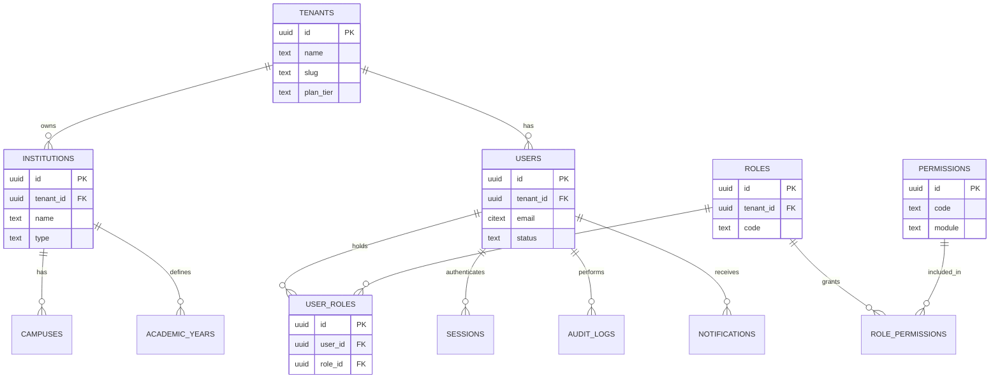
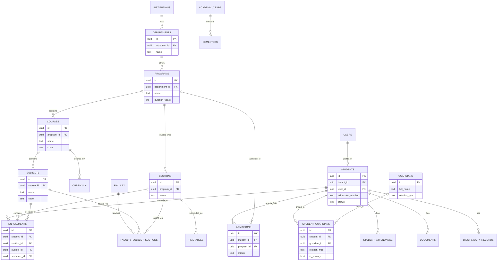
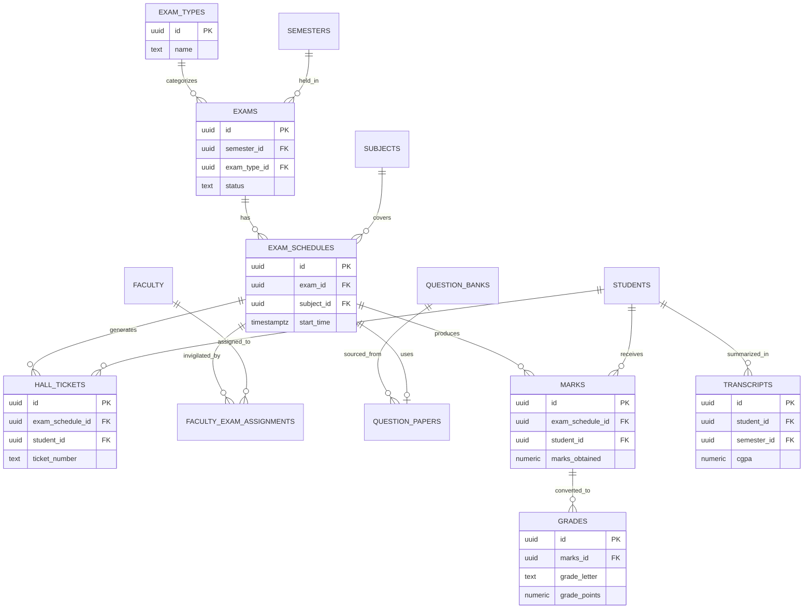
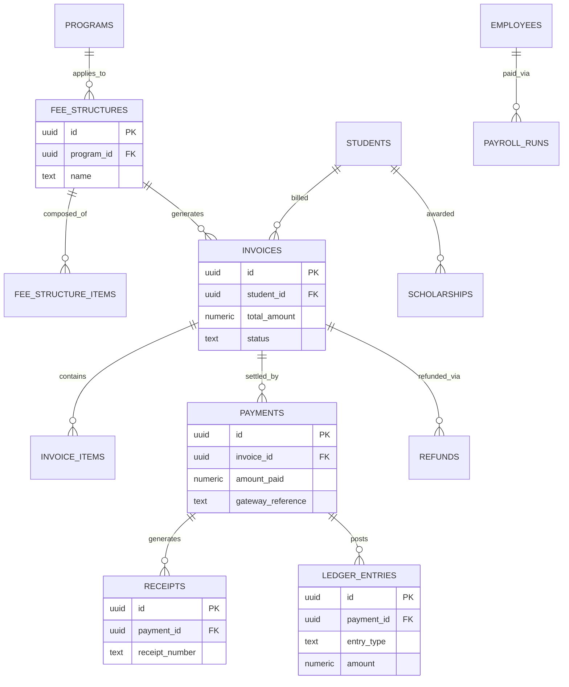

# Sutram — Database Design Document

**Document 3 of the Sutram Design Documentation Set**
**Company:** Pragyaan Labs
**Product:** Sutram — AI-powered, multi-tenant Education Operating System
**Status:** Draft v1.0
**Audience:** Backend engineering, platform/DBA, API design, data engineering, security/compliance

---

## 0. Purpose and Scope

This document defines the physical and logical data model for Sutram across all modules: Tenancy/Auth/RBAC, Student, Faculty, Academic, Examination, Finance/Fees, Library, Hostel, Transport, HR, Placement, Research, Communication, AI/Analytics, Settings, and Audit. It is the single source of truth for table structures referenced by the API Design document (Document 4) and the Backend Architecture document (Document 5).

Primary datastore: **PostgreSQL 15+** (OLTP system of record). Supporting stores: **Redis** (cache, sessions, rate limiting, queues), **S3-compatible object storage** (documents, media, backups), and a future read-optimized analytics store (out of scope here; AI/Analytics module tables below cover the OLTP side only — e.g., materialized snapshot tables — not the warehouse).

---

## 1. Multi-Tenancy Strategy

### 1.1 Decision

**Sutram uses a shared database, shared schema, discriminator-column multi-tenancy model**: every tenant-scoped table carries a mandatory `tenant_id UUID NOT NULL` column, enforced at the database level with **PostgreSQL Row-Level Security (RLS) policies**, and at the application level via a mandatory tenant-scoping middleware/ORM guard.

- One PostgreSQL database (or a small number of horizontally sharded databases at extreme scale — see 1.4) serves all tenants.
- One schema (`public`, or a small set of logically named schemas by module, e.g., `academic`, `finance` — **not** per-tenant) holds all tables.
- Every tenant-scoped table has `tenant_id` as the first column after `id`, is indexed, and is covered by an RLS policy `USING (tenant_id = current_setting('app.current_tenant_id')::uuid)`.
- The application sets `SET LOCAL app.current_tenant_id = '<uuid>'` at the start of every request-scoped transaction (via connection middleware), so RLS transparently filters every query — a defense-in-depth backstop against application-layer bugs that forget a `WHERE tenant_id = ...` clause.

### 1.2 Alternatives Considered

| Approach | Description | Pros | Cons | Verdict |
|---|---|---|---|---|
| **Shared DB, shared schema + `tenant_id` + RLS** (chosen) | One schema, discriminator column, RLS enforced | Lowest operational overhead; single set of migrations; simplest connection pooling (PgBouncer-friendly); cheap to run thousands of small tenants; easy cross-tenant analytics/reporting for Pragyaan Labs' own ops; horizontal scaling via read replicas/sharding by `tenant_id` range later | Requires strict discipline (RLS + app guard) to prevent cross-tenant leaks; noisy-neighbor risk (one tenant's heavy query can affect others) mitigated via connection/resource limits and query timeouts | **Selected** — best fit for a SaaS product with a long tail of small/medium institutions and a growing number of large ones |
| **Shared DB, schema-per-tenant** | One database, N schemas (`tenant_<id>.students`, etc.) | Strong logical isolation; per-tenant backup/restore is easier; simpler mental model for "is this tenant's data separate" | Migrations must run N times (schema drift risk at scale); connection pooling gets awkward (search_path switching or N pool entries); Postgres has practical limits (~thousands of schemas before catalog bloat and slow `pg_dump`/introspection); harder to do cross-tenant platform analytics | Rejected for default tier; **kept as an option for a small number of very large customers who explicitly pay for stronger isolation without full DB isolation** |
| **Database-per-tenant** | Separate physical/logical DB per tenant | Maximum isolation, easiest "right to be forgotten" (drop the DB), independent scaling/backup/restore per tenant, straightforward for regulatory data residency | Highest operational cost (connection pools, migrations, monitoring × N); expensive at hundreds/thousands of small tenants; slow to provision at self-serve signup speed | Rejected as default; **reserved as an enterprise/regulatory add-on tier** |

### 1.3 Why the chosen approach wins for Sutram

- Sutram's buyer base spans small coaching institutes (hundreds of students) to large universities (100k+ students). A shared-schema model keeps per-tenant marginal cost near zero, which is essential for a self-serve/low-friction sales motion at the small end, while still scaling comfortably for large tenants because Postgres handles billions of rows in a well-indexed, `tenant_id`-partitioned table without difficulty.
- RLS gives us the safety of per-tenant isolation without the operational tax of N schemas or N databases.
- A single schema means **one migration pipeline, one connection pool, one set of ORM models** — directly simplifying the Backend Architecture (Document 5) and reducing the surface area for the API layer.
- Native partitioning (Postgres declarative partitioning by `tenant_id` hash, or by `tenant_id` + `created_at` range for high-volume tables like `audit_logs`, `student_attendance`, `ai_predictions`) is available later without a schema redesign.

### 1.4 When we revisit this decision

- **Large enterprise/university-system customers** (e.g., a state university system with statutory data-residency or independent-DR requirements, or a customer contractually requiring physical data segregation) — offer an **isolated deployment tier**: same schema/codebase, but provisioned into a dedicated database (or dedicated Postgres cluster/region). Because every table already carries `tenant_id` and all data-access code is tenant-scoped, migrating such a tenant to an isolated database is a data-migration/export-import exercise, not a schema redesign.
- **Noisy-neighbor incidents** at scale — if a handful of very large tenants dominate I/O, they get moved to dedicated read replicas or a dedicated shard (sharding by `tenant_id` hash across N physical databases, with a thin tenant-routing layer), while remaining schema-compatible.
- **Regulatory data residency** (e.g., an institution required to keep data in a specific country) — provision a regional database using the same shared-schema pattern, with a tenant→region routing table at the platform layer.
- **Row count thresholds** — if any single shared table crosses ~500M–1B rows and query latency degrades, convert that table to native Postgres partitioning by `tenant_id` (hash) or time (range) without changing the logical schema.

---

## 2. Naming Conventions

| Rule | Convention | Example |
|---|---|---|
| Case style | `snake_case` for all tables, columns, indexes, constraints | `student_fees`, `fee_structure_id` |
| Table name plurality | **Plural**, noun-based | `students`, `invoices`, `hostels` |
| Junction/many-to-many tables | Plural, both sides named, alphabetical-ish or logical order | `role_permissions`, `student_guardians`, `faculty_subject_sections` |
| Primary key | Every table has a single-column surrogate key `id UUID PRIMARY KEY DEFAULT gen_random_uuid()` | `id` |
| Foreign key column name | `{referenced_table_singular}_id` | `student_id` → `students.id`; `tenant_id` → `tenants.id`; `role_id` → `roles.id` |
| Self-referencing FK | `parent_{table_singular}_id` | `parent_department_id` |
| Tenant column | `tenant_id UUID NOT NULL REFERENCES tenants(id)`, always the **first non-id column**, always indexed, always covered by RLS | `tenant_id` |
| Audit/timestamp columns | Every table (except pure lookup/reference tables) has `created_at`, `updated_at`, and `deleted_at` (soft delete) | `created_at TIMESTAMPTZ NOT NULL DEFAULT now()` |
| Soft delete | `deleted_at TIMESTAMPTZ NULL` — `NULL` = active row; non-null = soft-deleted. No hard deletes on business data (see §8) | `deleted_at` |
| Actor tracking | `created_by UUID NULL REFERENCES users(id)`, `updated_by UUID NULL REFERENCES users(id)` on tables with meaningful write provenance (financial, academic-record, audit-sensitive tables) | `created_by`, `updated_by` |
| Boolean columns | Prefixed `is_`/`has_`, default explicit | `is_active BOOLEAN NOT NULL DEFAULT true` |
| Enum-like columns | Stored as constrained `TEXT` with a `CHECK` constraint (or native Postgres `ENUM` type where the value set is very stable and small) — `TEXT + CHECK` preferred for easier zero-downtime evolution | `status TEXT NOT NULL CHECK (status IN ('draft','active','closed'))` |
| Money columns | `NUMERIC(14,2)` (never `FLOAT`), always paired with an explicit `currency CHAR(3)` (ISO 4217) where currency could vary | `amount NUMERIC(14,2) NOT NULL`, `currency CHAR(3) NOT NULL DEFAULT 'INR'` |
| Indexes | `idx_{table}_{column(s)}`; unique constraints `uq_{table}_{column(s)}`; foreign keys `fk_{table}_{column}` | `idx_students_tenant_id`, `uq_users_tenant_id_email` |
| JSON/flexible data | `JSONB`, suffixed `_meta` or `_data` | `custom_fields JSONB`, `settings JSONB` |
| Code/short-identifier columns | `code` (unique per tenant), for things like course codes, fee-head codes | `code TEXT NOT NULL` |

**Uniqueness note**: because the platform is multi-tenant, "globally unique" business identifiers (student roll number, employee code, invoice number, etc.) are actually only **unique per tenant**. All such uniqueness constraints are composite: `UNIQUE (tenant_id, <business_key>)`.

---

## 3. Core Shared / Platform Tables

These tables are tenant-aware where noted; `tenants` itself and a few global reference tables are the only exceptions to the `tenant_id` rule (a tenant cannot have a `tenant_id` referencing itself in a useful way).

### 3.1 `tenants`

The root entity. One row per customer (an institution group / legal SaaS customer — note: one `tenant` can own multiple `institutions`, e.g., a trust running 3 colleges — see §3.9).

```sql
CREATE TABLE tenants (
    id                  UUID PRIMARY KEY DEFAULT gen_random_uuid(),
    name                TEXT NOT NULL,
    slug                TEXT NOT NULL,                         -- subdomain / URL-safe identifier
    plan_tier           TEXT NOT NULL DEFAULT 'standard'
                            CHECK (plan_tier IN ('trial','standard','professional','enterprise','isolated')),
    status              TEXT NOT NULL DEFAULT 'active'
                            CHECK (status IN ('trial','active','suspended','cancelled')),
    isolation_mode      TEXT NOT NULL DEFAULT 'shared'
                            CHECK (isolation_mode IN ('shared','dedicated_schema','dedicated_db')), -- see §1.4
    region              TEXT NOT NULL DEFAULT 'in-mumbai',      -- data residency / routing hint
    primary_contact_email TEXT NOT NULL,
    billing_email       TEXT,
    settings            JSONB NOT NULL DEFAULT '{}',            -- feature flags, branding, locale defaults
    trial_ends_at       TIMESTAMPTZ,
    created_at          TIMESTAMPTZ NOT NULL DEFAULT now(),
    updated_at          TIMESTAMPTZ NOT NULL DEFAULT now(),
    deleted_at          TIMESTAMPTZ,
    CONSTRAINT uq_tenants_slug UNIQUE (slug)
);
CREATE INDEX idx_tenants_status ON tenants(status) WHERE deleted_at IS NULL;
```

### 3.2 `users`

Platform-wide login identity. One `users` row per human per tenant (a person active in two tenants — e.g., a guest faculty at two colleges under different tenants — gets two `users` rows; cross-tenant identity federation is out of scope for v1).

```sql
CREATE TABLE users (
    id                  UUID PRIMARY KEY DEFAULT gen_random_uuid(),
    tenant_id           UUID NOT NULL REFERENCES tenants(id),
    email               CITEXT NOT NULL,
    phone               TEXT,
    password_hash       TEXT,                                  -- NULL if SSO-only
    auth_provider       TEXT NOT NULL DEFAULT 'password'
                            CHECK (auth_provider IN ('password','google','microsoft','saml_sso','otp')),
    status              TEXT NOT NULL DEFAULT 'active'
                            CHECK (status IN ('invited','active','locked','disabled')),
    mfa_enabled         BOOLEAN NOT NULL DEFAULT false,
    mfa_secret          TEXT,
    last_login_at       TIMESTAMPTZ,
    failed_login_count  SMALLINT NOT NULL DEFAULT 0,
    profile_photo_url   TEXT,
    locale              TEXT NOT NULL DEFAULT 'en-IN',
    timezone            TEXT NOT NULL DEFAULT 'Asia/Kolkata',
    created_at          TIMESTAMPTZ NOT NULL DEFAULT now(),
    updated_at          TIMESTAMPTZ NOT NULL DEFAULT now(),
    deleted_at          TIMESTAMPTZ,
    CONSTRAINT uq_users_tenant_email UNIQUE (tenant_id, email)
);
CREATE INDEX idx_users_tenant_id ON users(tenant_id) WHERE deleted_at IS NULL;
CREATE INDEX idx_users_status ON users(tenant_id, status);
```

`users` is the login identity; it is linked 1:1 (optionally) to a `students` row, `faculty` row, `employees` row, etc. via a nullable FK on those tables (`user_id`) — see per-module sections. A `Guest` role user has no linked profile table row.

### 3.3 `roles`

```sql
CREATE TABLE roles (
    id                  UUID PRIMARY KEY DEFAULT gen_random_uuid(),
    tenant_id           UUID REFERENCES tenants(id),            -- NULL = system-defined global role template
    name                TEXT NOT NULL,                          -- e.g. 'Principal', 'HOD', 'Accountant'
    code                TEXT NOT NULL,                          -- machine key, e.g. 'PRINCIPAL'
    description         TEXT,
    is_system_role      BOOLEAN NOT NULL DEFAULT false,         -- platform-seeded, not tenant-editable
    created_at          TIMESTAMPTZ NOT NULL DEFAULT now(),
    updated_at          TIMESTAMPTZ NOT NULL DEFAULT now(),
    deleted_at          TIMESTAMPTZ,
    CONSTRAINT uq_roles_tenant_code UNIQUE (tenant_id, code)
);
```

Seeded system roles (v1 role catalog, `is_system_role = true`, `tenant_id = NULL` template cloned per tenant on provisioning): `SUPER_ADMIN`, `INSTITUTION_OWNER`, `INSTITUTION_ADMIN`, `PRINCIPAL`, `DEAN`, `REGISTRAR`, `HOD`, `FACULTY`, `TEACHING_ASSISTANT`, `RESEARCHER`, `ACCOUNTANT`, `HR_MANAGER`, `HOSTEL_WARDEN`, `LIBRARIAN`, `PLACEMENT_OFFICER`, `TRANSPORT_MANAGER`, `STUDENT`, `PARENT`, `GUEST`.

### 3.4 `permissions`

```sql
CREATE TABLE permissions (
    id                  UUID PRIMARY KEY DEFAULT gen_random_uuid(),
    code                TEXT NOT NULL,                          -- e.g. 'fees.invoice.create'
    module               TEXT NOT NULL,                          -- e.g. 'finance'
    description          TEXT,
    created_at           TIMESTAMPTZ NOT NULL DEFAULT now(),
    CONSTRAINT uq_permissions_code UNIQUE (code)
);
```

Permissions are global (platform-defined), following a `{module}.{resource}.{action}` code convention (e.g., `student.record.view`, `exam.marks.upload`, `finance.invoice.void`).

### 3.5 `role_permissions` (junction, many-to-many)

```sql
CREATE TABLE role_permissions (
    id                  UUID PRIMARY KEY DEFAULT gen_random_uuid(),
    tenant_id           UUID NOT NULL REFERENCES tenants(id),
    role_id             UUID NOT NULL REFERENCES roles(id),
    permission_id       UUID NOT NULL REFERENCES permissions(id),
    created_at          TIMESTAMPTZ NOT NULL DEFAULT now(),
    CONSTRAINT uq_role_permissions UNIQUE (role_id, permission_id)
);
CREATE INDEX idx_role_permissions_role_id ON role_permissions(role_id);
```

### 3.6 `user_roles` (junction, many-to-many — a user can hold multiple roles, e.g., HOD who also teaches)

```sql
CREATE TABLE user_roles (
    id                  UUID PRIMARY KEY DEFAULT gen_random_uuid(),
    tenant_id           UUID NOT NULL REFERENCES tenants(id),
    user_id             UUID NOT NULL REFERENCES users(id),
    role_id             UUID NOT NULL REFERENCES roles(id),
    institution_id      UUID REFERENCES institutions(id),       -- role scoped to one institution, if applicable
    campus_id           UUID REFERENCES campuses(id),           -- role scoped to one campus, if applicable
    assigned_at         TIMESTAMPTZ NOT NULL DEFAULT now(),
    assigned_by         UUID REFERENCES users(id),
    valid_from          DATE,
    valid_until         DATE,
    created_at          TIMESTAMPTZ NOT NULL DEFAULT now(),
    updated_at          TIMESTAMPTZ NOT NULL DEFAULT now(),
    deleted_at          TIMESTAMPTZ,
    CONSTRAINT uq_user_roles UNIQUE (user_id, role_id, institution_id, campus_id)
);
CREATE INDEX idx_user_roles_user_id ON user_roles(user_id);
CREATE INDEX idx_user_roles_tenant_id ON user_roles(tenant_id);
```

### 3.7 `sessions`

Server-side session/refresh-token record backing JWT/refresh-token auth; short-lived access tokens are stateless JWTs, not stored — `sessions` tracks refresh tokens and device metadata. Hot-path lookups (active session validation) are cached in Redis; Postgres is the durable/audit copy.

```sql
CREATE TABLE sessions (
    id                  UUID PRIMARY KEY DEFAULT gen_random_uuid(),
    tenant_id           UUID NOT NULL REFERENCES tenants(id),
    user_id             UUID NOT NULL REFERENCES users(id),
    refresh_token_hash  TEXT NOT NULL,
    device_info         JSONB,                                  -- UA, device id, app version
    ip_address          INET,
    issued_at           TIMESTAMPTZ NOT NULL DEFAULT now(),
    expires_at          TIMESTAMPTZ NOT NULL,
    revoked_at          TIMESTAMPTZ,
    last_seen_at        TIMESTAMPTZ,
    CONSTRAINT uq_sessions_token UNIQUE (refresh_token_hash)
);
CREATE INDEX idx_sessions_user_id ON sessions(user_id);
CREATE INDEX idx_sessions_expires_at ON sessions(expires_at);
```

### 3.8 `audit_logs`

Append-only, high-volume, partitioned by month on `created_at`. See §8.

```sql
CREATE TABLE audit_logs (
    id                  UUID PRIMARY KEY DEFAULT gen_random_uuid(),
    tenant_id           UUID NOT NULL REFERENCES tenants(id),
    actor_user_id       UUID REFERENCES users(id),
    actor_role          TEXT,
    action               TEXT NOT NULL,                          -- e.g. 'UPDATE', 'DELETE', 'LOGIN', 'EXPORT'
    entity_type          TEXT NOT NULL,                          -- e.g. 'students', 'invoices'
    entity_id             UUID,
    before_data           JSONB,
    after_data             JSONB,
    ip_address            INET,
    user_agent             TEXT,
    request_id             UUID,                                 -- correlation id to API/trace logs
    created_at             TIMESTAMPTZ NOT NULL DEFAULT now()
) PARTITION BY RANGE (created_at);
CREATE INDEX idx_audit_logs_tenant_entity ON audit_logs(tenant_id, entity_type, entity_id);
CREATE INDEX idx_audit_logs_actor ON audit_logs(tenant_id, actor_user_id);
CREATE INDEX idx_audit_logs_created_at ON audit_logs(created_at);
```

### 3.9 `institutions`

A tenant may operate multiple legal/branded institutions (e.g., a trust running an engineering college + a school).

```sql
CREATE TABLE institutions (
    id                  UUID PRIMARY KEY DEFAULT gen_random_uuid(),
    tenant_id           UUID NOT NULL REFERENCES tenants(id),
    name                TEXT NOT NULL,
    type                TEXT NOT NULL
                            CHECK (type IN ('school','college','university','coaching_institute','research_lab')),
    affiliation_board   TEXT,                                   -- e.g. 'CBSE', 'State University X', 'UGC'
    registration_number TEXT,
    address              JSONB,
    logo_url              TEXT,
    contact_email          TEXT,
    contact_phone          TEXT,
    website                TEXT,
    is_active               BOOLEAN NOT NULL DEFAULT true,
    created_at              TIMESTAMPTZ NOT NULL DEFAULT now(),
    updated_at              TIMESTAMPTZ NOT NULL DEFAULT now(),
    deleted_at               TIMESTAMPTZ
);
CREATE INDEX idx_institutions_tenant_id ON institutions(tenant_id) WHERE deleted_at IS NULL;
```

### 3.10 `campuses`

```sql
CREATE TABLE campuses (
    id                  UUID PRIMARY KEY DEFAULT gen_random_uuid(),
    tenant_id           UUID NOT NULL REFERENCES tenants(id),
    institution_id      UUID NOT NULL REFERENCES institutions(id),
    name                TEXT NOT NULL,
    code                TEXT NOT NULL,
    address              JSONB,
    is_main_campus       BOOLEAN NOT NULL DEFAULT false,
    created_at            TIMESTAMPTZ NOT NULL DEFAULT now(),
    updated_at            TIMESTAMPTZ NOT NULL DEFAULT now(),
    deleted_at             TIMESTAMPTZ,
    CONSTRAINT uq_campuses_institution_code UNIQUE (institution_id, code)
);
CREATE INDEX idx_campuses_tenant_id ON campuses(tenant_id);
```

### 3.11 `academic_years`

```sql
CREATE TABLE academic_years (
    id                  UUID PRIMARY KEY DEFAULT gen_random_uuid(),
    tenant_id           UUID NOT NULL REFERENCES tenants(id),
    institution_id      UUID NOT NULL REFERENCES institutions(id),
    name                TEXT NOT NULL,                          -- '2026-2027'
    start_date          DATE NOT NULL,
    end_date            DATE NOT NULL,
    is_current           BOOLEAN NOT NULL DEFAULT false,
    created_at            TIMESTAMPTZ NOT NULL DEFAULT now(),
    updated_at            TIMESTAMPTZ NOT NULL DEFAULT now(),
    deleted_at             TIMESTAMPTZ,
    CONSTRAINT uq_academic_years UNIQUE (institution_id, name),
    CONSTRAINT ck_academic_years_dates CHECK (end_date > start_date)
);
CREATE INDEX idx_academic_years_tenant_id ON academic_years(tenant_id);
CREATE UNIQUE INDEX uq_academic_years_current ON academic_years(institution_id) WHERE is_current = true;
```

### 3.12 `notifications`

Platform-wide notification/inbox record (in-app; SMS/email/push dispatch tracked in Communication module's `communication_logs` — see §5.12).

```sql
CREATE TABLE notifications (
    id                  UUID PRIMARY KEY DEFAULT gen_random_uuid(),
    tenant_id           UUID NOT NULL REFERENCES tenants(id),
    recipient_user_id   UUID NOT NULL REFERENCES users(id),
    title                TEXT NOT NULL,
    body                  TEXT NOT NULL,
    category               TEXT NOT NULL DEFAULT 'general'
                            CHECK (category IN ('general','fee','exam','attendance','hostel','transport','placement','system')),
    priority               TEXT NOT NULL DEFAULT 'normal' CHECK (priority IN ('low','normal','high','urgent')),
    action_url              TEXT,
    is_read                 BOOLEAN NOT NULL DEFAULT false,
    read_at                  TIMESTAMPTZ,
    created_at                TIMESTAMPTZ NOT NULL DEFAULT now()
);
CREATE INDEX idx_notifications_recipient ON notifications(tenant_id, recipient_user_id, is_read);
CREATE INDEX idx_notifications_created_at ON notifications(created_at);
```

### 3.13 Row-Level Security example (applied to every tenant-scoped table)

```sql
ALTER TABLE students ENABLE ROW LEVEL SECURITY;
CREATE POLICY tenant_isolation_students ON students
    USING (tenant_id = current_setting('app.current_tenant_id')::uuid)
    WITH CHECK (tenant_id = current_setting('app.current_tenant_id')::uuid);
```

This pattern is applied identically across all ~120 tenant-scoped tables in this document via a migration template/macro, not hand-written per table.

---

## 4. Core Entity-Relationship Diagram

Given the breadth of the schema (13 modules, 100+ tables), the ER model is split into **four linked diagrams**: (A) Tenancy/Auth/RBAC core, (B) Student/Academic core, (C) Examination core, (D) Finance core. Cross-diagram references are noted by matching entity names.

### 4.A Tenancy, Auth & RBAC Core



### 4.B Student & Academic Core



### 4.C Examination Core



### 4.D Finance Core



---

## 5. Per-Module Table Definitions

All tables below implicitly include `tenant_id UUID NOT NULL REFERENCES tenants(id)` (indexed, RLS-protected), `created_at`, `updated_at`, `deleted_at` per the naming conventions in §2, even where omitted from the SQL for brevity in "secondary entity" lists. Primary entities are given full DDL.

### 5.1 Student Module

#### `students` (primary)

```sql
CREATE TABLE students (
    id                    UUID PRIMARY KEY DEFAULT gen_random_uuid(),
    tenant_id             UUID NOT NULL REFERENCES tenants(id),
    user_id               UUID REFERENCES users(id),              -- login account (created at admission confirmation)
    institution_id        UUID NOT NULL REFERENCES institutions(id),
    admission_id          UUID REFERENCES admissions(id),
    admission_number       TEXT NOT NULL,
    roll_number             TEXT,
    first_name               TEXT NOT NULL,
    last_name                 TEXT,
    date_of_birth              DATE NOT NULL,
    gender                       TEXT CHECK (gender IN ('male','female','other','prefer_not_to_say')),
    blood_group                   TEXT,
    nationality                     TEXT DEFAULT 'Indian',
    category                         TEXT,                          -- reservation category, if applicable
    photo_url                          TEXT,
    contact_email                        CITEXT,
    contact_phone                          TEXT,
    address                                  JSONB,
    current_program_id                        UUID REFERENCES programs(id),
    current_section_id                          UUID REFERENCES sections(id),
    current_semester_id                           UUID REFERENCES semesters(id),
    status                                          TEXT NOT NULL DEFAULT 'active'
                              CHECK (status IN ('active','on_leave','suspended','graduated','dropped_out','transferred','alumni')),
    enrollment_date            DATE NOT NULL,
    graduation_date              DATE,
    custom_fields                  JSONB NOT NULL DEFAULT '{}',
    created_at                       TIMESTAMPTZ NOT NULL DEFAULT now(),
    updated_at                         TIMESTAMPTZ NOT NULL DEFAULT now(),
    deleted_at                           TIMESTAMPTZ,
    CONSTRAINT uq_students_tenant_admission_number UNIQUE (tenant_id, admission_number)
);
CREATE INDEX idx_students_tenant_id ON students(tenant_id) WHERE deleted_at IS NULL;
CREATE INDEX idx_students_program_section ON students(current_program_id, current_section_id);
CREATE INDEX idx_students_status ON students(tenant_id, status);
CREATE INDEX idx_students_name_trgm ON students USING gin (first_name gin_trgm_ops, last_name gin_trgm_ops); -- fuzzy search
```

#### `guardians` (primary)

```sql
CREATE TABLE guardians (
    id                  UUID PRIMARY KEY DEFAULT gen_random_uuid(),
    tenant_id           UUID NOT NULL REFERENCES tenants(id),
    user_id             UUID REFERENCES users(id),               -- optional parent-portal login
    full_name           TEXT NOT NULL,
    occupation           TEXT,
    annual_income          NUMERIC(14,2),
    contact_email             CITEXT,
    contact_phone               TEXT NOT NULL,
    address                       JSONB,
    id_proof_type                   TEXT,
    id_proof_number                   TEXT,
    created_at                          TIMESTAMPTZ NOT NULL DEFAULT now(),
    updated_at                            TIMESTAMPTZ NOT NULL DEFAULT now(),
    deleted_at                              TIMESTAMPTZ
);
CREATE INDEX idx_guardians_tenant_id ON guardians(tenant_id);
```

#### `student_guardians` (junction, many-to-many — a student can have multiple guardians; a guardian can have multiple wards)

```sql
CREATE TABLE student_guardians (
    id                  UUID PRIMARY KEY DEFAULT gen_random_uuid(),
    tenant_id           UUID NOT NULL REFERENCES tenants(id),
    student_id          UUID NOT NULL REFERENCES students(id),
    guardian_id         UUID NOT NULL REFERENCES guardians(id),
    relation_type       TEXT NOT NULL CHECK (relation_type IN ('father','mother','legal_guardian','sibling','other')),
    is_primary_contact   BOOLEAN NOT NULL DEFAULT false,
    is_fee_payer            BOOLEAN NOT NULL DEFAULT false,
    is_emergency_contact       BOOLEAN NOT NULL DEFAULT false,
    created_at                    TIMESTAMPTZ NOT NULL DEFAULT now(),
    updated_at                      TIMESTAMPTZ NOT NULL DEFAULT now(),
    deleted_at                        TIMESTAMPTZ,
    CONSTRAINT uq_student_guardians UNIQUE (student_id, guardian_id)
);
CREATE INDEX idx_student_guardians_student ON student_guardians(student_id);
CREATE INDEX idx_student_guardians_guardian ON student_guardians(guardian_id);
CREATE UNIQUE INDEX uq_student_guardians_primary ON student_guardians(student_id) WHERE is_primary_contact = true;
```

#### `admissions` (primary)

```sql
CREATE TABLE admissions (
    id                  UUID PRIMARY KEY DEFAULT gen_random_uuid(),
    tenant_id           UUID NOT NULL REFERENCES tenants(id),
    institution_id      UUID NOT NULL REFERENCES institutions(id),
    program_id          UUID NOT NULL REFERENCES programs(id),
    academic_year_id    UUID NOT NULL REFERENCES academic_years(id),
    applicant_name       TEXT NOT NULL,
    applicant_email         CITEXT,
    applicant_phone           TEXT,
    application_number         TEXT NOT NULL,
    status                       TEXT NOT NULL DEFAULT 'submitted'
                            CHECK (status IN ('submitted','under_review','entrance_scheduled','shortlisted','offered','accepted','rejected','withdrawn','enrolled')),
    entrance_score               NUMERIC(6,2),
    quota                          TEXT,                          -- 'management', 'merit', 'reservation category', etc.
    application_data                 JSONB NOT NULL DEFAULT '{}',   -- form responses
    decision_at                        TIMESTAMPTZ,
    decided_by                           UUID REFERENCES users(id),
    created_at                             TIMESTAMPTZ NOT NULL DEFAULT now(),
    updated_at                               TIMESTAMPTZ NOT NULL DEFAULT now(),
    deleted_at                                 TIMESTAMPTZ,
    CONSTRAINT uq_admissions_tenant_appno UNIQUE (tenant_id, application_number)
);
CREATE INDEX idx_admissions_tenant_id ON admissions(tenant_id);
CREATE INDEX idx_admissions_status ON admissions(tenant_id, status);
```

#### Secondary/supporting entities — Student module

| Table | Purpose |
|---|---|
| `documents` | Uploaded student documents (transfer certificate, ID proof, marksheets) with `entity_type`/`entity_id` polymorphic linkage, S3 object key, verification status. |
| `student_attendance` | Per-subject/per-day attendance record (`student_id`, `subject_id`, `date`, `status`, `marked_by`); high volume, partitioned by month. |
| `student_fees` | Denormalized per-student fee summary/ledger pointer (links to `invoices`/`payments` in Finance module) used for dashboard queries. |
| `certificates` | Issued certificates (bonafide, transfer, character, provisional degree) with template reference and digitally signed PDF S3 key. |
| `hostel_allocations` | See Hostel module §5.7 (`room_allocations`) — student-facing pointer/summary. |
| `transport_passes` | See Transport module §5.9. |
| `disciplinary_records` | Incident log: `student_id`, `incident_type`, `description`, `severity`, `action_taken`, `reported_by`, `date`. |
| `alumni` | Post-graduation record: `student_id`, `graduation_year`, `current_employer`, `current_designation`, `linkedin_url`, `contact_email`, opt-in flags for alumni communications. |
| `id_cards` | Issued ID card record: `student_id`/`employee_id` polymorphic, `card_number`, `issued_date`, `valid_until`, `qr_code_data`. |

### 5.2 Faculty Module

#### `faculty` (primary)

```sql
CREATE TABLE faculty (
    id                  UUID PRIMARY KEY DEFAULT gen_random_uuid(),
    tenant_id           UUID NOT NULL REFERENCES tenants(id),
    user_id             UUID REFERENCES users(id),
    employee_id          UUID REFERENCES employees(id),          -- HR linkage (payroll, leave)
    institution_id       UUID NOT NULL REFERENCES institutions(id),
    department_id           UUID REFERENCES departments(id),
    employee_code              TEXT NOT NULL,
    first_name                    TEXT NOT NULL,
    last_name                       TEXT,
    designation                       TEXT NOT NULL,               -- 'Professor', 'Assistant Professor', 'TA'
    qualification                       TEXT,
    specialization                        TEXT,
    date_of_joining                         DATE NOT NULL,
    date_of_leaving                           DATE,
    employment_type                             TEXT NOT NULL DEFAULT 'full_time'
                             CHECK (employment_type IN ('full_time','part_time','visiting','contract')),
    contact_email               CITEXT,
    contact_phone                  TEXT,
    photo_url                        TEXT,
    status                              TEXT NOT NULL DEFAULT 'active'
                             CHECK (status IN ('active','on_leave','suspended','resigned','retired')),
    created_at                            TIMESTAMPTZ NOT NULL DEFAULT now(),
    updated_at                              TIMESTAMPTZ NOT NULL DEFAULT now(),
    deleted_at                                TIMESTAMPTZ,
    CONSTRAINT uq_faculty_tenant_code UNIQUE (tenant_id, employee_code)
);
CREATE INDEX idx_faculty_tenant_id ON faculty(tenant_id) WHERE deleted_at IS NULL;
CREATE INDEX idx_faculty_department ON faculty(department_id);
```

#### `faculty_subject_sections` (junction, many-to-many — faculty ↔ subjects ↔ sections)

```sql
CREATE TABLE faculty_subject_sections (
    id                  UUID PRIMARY KEY DEFAULT gen_random_uuid(),
    tenant_id           UUID NOT NULL REFERENCES tenants(id),
    faculty_id          UUID NOT NULL REFERENCES faculty(id),
    subject_id          UUID NOT NULL REFERENCES subjects(id),
    section_id          UUID NOT NULL REFERENCES sections(id),
    semester_id          UUID NOT NULL REFERENCES semesters(id),
    role                    TEXT NOT NULL DEFAULT 'primary' CHECK (role IN ('primary','co_faculty','lab_instructor')),
    created_at                TIMESTAMPTZ NOT NULL DEFAULT now(),
    updated_at                  TIMESTAMPTZ NOT NULL DEFAULT now(),
    deleted_at                    TIMESTAMPTZ,
    CONSTRAINT uq_faculty_subject_section UNIQUE (faculty_id, subject_id, section_id, semester_id, role)
);
CREATE INDEX idx_fss_faculty ON faculty_subject_sections(faculty_id);
CREATE INDEX idx_fss_subject_section ON faculty_subject_sections(subject_id, section_id);
```

#### Secondary/supporting entities — Faculty module

| Table | Purpose |
|---|---|
| `faculty_attendance` | Daily biometric/manual attendance for faculty; partitioned by month. |
| `faculty_leaves` | Leave applications: type, dates, status, approver — mirrors `employee_leaves` but faculty-specific workflow (substitute-arrangement linkage). |
| `faculty_payroll` | Faculty-specific payroll extension (teaching load allowance, honorarium); FK to `employee_payroll`. |
| `publications` | Shared with Research module (§5.11) via `author_id` polymorphic link to `faculty` or `researchers`. |
| `faculty_performance` | Appraisal cycle results: `faculty_id`, `review_period`, `student_feedback_score`, `peer_score`, `research_score`, `overall_rating`, `reviewed_by`. |

### 5.3 Academic Module

#### `departments` (primary)

```sql
CREATE TABLE departments (
    id                  UUID PRIMARY KEY DEFAULT gen_random_uuid(),
    tenant_id           UUID NOT NULL REFERENCES tenants(id),
    institution_id      UUID NOT NULL REFERENCES institutions(id),
    name                TEXT NOT NULL,
    code                TEXT NOT NULL,
    hod_faculty_id       UUID REFERENCES faculty(id),
    created_at              TIMESTAMPTZ NOT NULL DEFAULT now(),
    updated_at                TIMESTAMPTZ NOT NULL DEFAULT now(),
    deleted_at                  TIMESTAMPTZ,
    CONSTRAINT uq_departments_institution_code UNIQUE (institution_id, code)
);
CREATE INDEX idx_departments_tenant_id ON departments(tenant_id);
```

#### `programs` (primary)

```sql
CREATE TABLE programs (
    id                  UUID PRIMARY KEY DEFAULT gen_random_uuid(),
    tenant_id           UUID NOT NULL REFERENCES tenants(id),
    department_id       UUID NOT NULL REFERENCES departments(id),
    name                TEXT NOT NULL,                          -- 'B.Tech Computer Science'
    code                TEXT NOT NULL,
    level               TEXT NOT NULL CHECK (level IN ('school_grade','diploma','undergraduate','postgraduate','doctoral','certificate')),
    duration_years        NUMERIC(3,1) NOT NULL,
    total_semesters          SMALLINT,
    created_at                  TIMESTAMPTZ NOT NULL DEFAULT now(),
    updated_at                    TIMESTAMPTZ NOT NULL DEFAULT now(),
    deleted_at                      TIMESTAMPTZ,
    CONSTRAINT uq_programs_department_code UNIQUE (department_id, code)
);
CREATE INDEX idx_programs_tenant_id ON programs(tenant_id);
```

#### `courses` (primary — a "course" here means a structured offering within a program, e.g. a year/stream; distinct from `subjects` which are individual taught units)

```sql
CREATE TABLE courses (
    id                  UUID PRIMARY KEY DEFAULT gen_random_uuid(),
    tenant_id           UUID NOT NULL REFERENCES tenants(id),
    program_id          UUID NOT NULL REFERENCES programs(id),
    name                TEXT NOT NULL,
    code                TEXT NOT NULL,
    description          TEXT,
    created_at              TIMESTAMPTZ NOT NULL DEFAULT now(),
    updated_at                TIMESTAMPTZ NOT NULL DEFAULT now(),
    deleted_at                  TIMESTAMPTZ,
    CONSTRAINT uq_courses_program_code UNIQUE (program_id, code)
);
```

#### `subjects` (primary)

```sql
CREATE TABLE subjects (
    id                  UUID PRIMARY KEY DEFAULT gen_random_uuid(),
    tenant_id           UUID NOT NULL REFERENCES tenants(id),
    course_id           UUID NOT NULL REFERENCES courses(id),
    name                TEXT NOT NULL,
    code                TEXT NOT NULL,
    credits             NUMERIC(3,1) NOT NULL DEFAULT 0,
    subject_type          TEXT NOT NULL DEFAULT 'core' CHECK (subject_type IN ('core','elective','lab','project','audit')),
    semester_number          SMALLINT,
    created_at                  TIMESTAMPTZ NOT NULL DEFAULT now(),
    updated_at                    TIMESTAMPTZ NOT NULL DEFAULT now(),
    deleted_at                      TIMESTAMPTZ,
    CONSTRAINT uq_subjects_course_code UNIQUE (course_id, code)
);
CREATE INDEX idx_subjects_tenant_id ON subjects(tenant_id);
```

#### `curricula` (primary — versioned curriculum mapping subjects to a program/batch)

```sql
CREATE TABLE curricula (
    id                  UUID PRIMARY KEY DEFAULT gen_random_uuid(),
    tenant_id           UUID NOT NULL REFERENCES tenants(id),
    program_id          UUID NOT NULL REFERENCES programs(id),
    version              TEXT NOT NULL,                          -- 'v2026'
    effective_academic_year_id UUID NOT NULL REFERENCES academic_years(id),
    status               TEXT NOT NULL DEFAULT 'draft' CHECK (status IN ('draft','active','archived')),
    created_at              TIMESTAMPTZ NOT NULL DEFAULT now(),
    updated_at                TIMESTAMPTZ NOT NULL DEFAULT now(),
    deleted_at                  TIMESTAMPTZ,
    CONSTRAINT uq_curricula_program_version UNIQUE (program_id, version)
);
```

#### `timetables` (primary)

```sql
CREATE TABLE timetables (
    id                  UUID PRIMARY KEY DEFAULT gen_random_uuid(),
    tenant_id           UUID NOT NULL REFERENCES tenants(id),
    section_id          UUID NOT NULL REFERENCES sections(id),
    subject_id          UUID NOT NULL REFERENCES subjects(id),
    faculty_id          UUID NOT NULL REFERENCES faculty(id),
    semester_id          UUID NOT NULL REFERENCES semesters(id),
    day_of_week           SMALLINT NOT NULL CHECK (day_of_week BETWEEN 1 AND 7),
    start_time              TIME NOT NULL,
    end_time                  TIME NOT NULL,
    room                        TEXT,
    created_at                    TIMESTAMPTZ NOT NULL DEFAULT now(),
    updated_at                      TIMESTAMPTZ NOT NULL DEFAULT now(),
    deleted_at                        TIMESTAMPTZ,
    CONSTRAINT ck_timetables_time CHECK (end_time > start_time)
);
CREATE INDEX idx_timetables_section ON timetables(section_id, day_of_week);
CREATE INDEX idx_timetables_faculty ON timetables(faculty_id, day_of_week);
```

#### `sections` (primary)

```sql
CREATE TABLE sections (
    id                  UUID PRIMARY KEY DEFAULT gen_random_uuid(),
    tenant_id           UUID NOT NULL REFERENCES tenants(id),
    program_id          UUID NOT NULL REFERENCES programs(id),
    name                TEXT NOT NULL,                          -- 'A', 'B', 'CSE-2027-A'
    batch_year            SMALLINT NOT NULL,
    max_strength             SMALLINT,
    class_teacher_faculty_id  UUID REFERENCES faculty(id),
    created_at                  TIMESTAMPTZ NOT NULL DEFAULT now(),
    updated_at                    TIMESTAMPTZ NOT NULL DEFAULT now(),
    deleted_at                      TIMESTAMPTZ,
    CONSTRAINT uq_sections_program_name_batch UNIQUE (program_id, name, batch_year)
);
```

#### `semesters` (primary)

```sql
CREATE TABLE semesters (
    id                  UUID PRIMARY KEY DEFAULT gen_random_uuid(),
    tenant_id           UUID NOT NULL REFERENCES tenants(id),
    academic_year_id    UUID NOT NULL REFERENCES academic_years(id),
    program_id          UUID NOT NULL REFERENCES programs(id),
    number                SMALLINT NOT NULL,
    name                    TEXT NOT NULL,
    start_date                DATE NOT NULL,
    end_date                    DATE NOT NULL,
    created_at                    TIMESTAMPTZ NOT NULL DEFAULT now(),
    updated_at                      TIMESTAMPTZ NOT NULL DEFAULT now(),
    deleted_at                        TIMESTAMPTZ,
    CONSTRAINT uq_semesters_program_number UNIQUE (program_id, academic_year_id, number)
);
```

#### `enrollments` (junction, many-to-many — students ↔ subjects, per semester)

```sql
CREATE TABLE enrollments (
    id                  UUID PRIMARY KEY DEFAULT gen_random_uuid(),
    tenant_id           UUID NOT NULL REFERENCES tenants(id),
    student_id          UUID NOT NULL REFERENCES students(id),
    section_id          UUID NOT NULL REFERENCES sections(id),
    subject_id          UUID NOT NULL REFERENCES subjects(id),
    semester_id          UUID NOT NULL REFERENCES semesters(id),
    status                  TEXT NOT NULL DEFAULT 'enrolled' CHECK (status IN ('enrolled','dropped','completed','failed')),
    enrolled_at                TIMESTAMPTZ NOT NULL DEFAULT now(),
    CONSTRAINT uq_enrollments UNIQUE (student_id, subject_id, semester_id)
);
CREATE INDEX idx_enrollments_student ON enrollments(student_id);
CREATE INDEX idx_enrollments_subject_semester ON enrollments(subject_id, semester_id);
```

### 5.4 Examination Module

#### `exam_types` (primary — lookup)

```sql
CREATE TABLE exam_types (
    id                  UUID PRIMARY KEY DEFAULT gen_random_uuid(),
    tenant_id           UUID NOT NULL REFERENCES tenants(id),
    name                TEXT NOT NULL,                          -- 'Mid-Term', 'End-Term', 'Unit Test'
    weightage_percent      NUMERIC(5,2),
    created_at                TIMESTAMPTZ NOT NULL DEFAULT now(),
    deleted_at                  TIMESTAMPTZ
);
```

#### `exams` (primary)

```sql
CREATE TABLE exams (
    id                  UUID PRIMARY KEY DEFAULT gen_random_uuid(),
    tenant_id           UUID NOT NULL REFERENCES tenants(id),
    institution_id       UUID NOT NULL REFERENCES institutions(id),
    exam_type_id            UUID NOT NULL REFERENCES exam_types(id),
    semester_id                UUID NOT NULL REFERENCES semesters(id),
    name                          TEXT NOT NULL,
    status                          TEXT NOT NULL DEFAULT 'scheduled'
                             CHECK (status IN ('draft','scheduled','ongoing','completed','results_published','cancelled')),
    start_date                       DATE NOT NULL,
    end_date                           DATE NOT NULL,
    created_at                           TIMESTAMPTZ NOT NULL DEFAULT now(),
    updated_at                             TIMESTAMPTZ NOT NULL DEFAULT now(),
    deleted_at                               TIMESTAMPTZ
);
CREATE INDEX idx_exams_tenant_id ON exams(tenant_id);
CREATE INDEX idx_exams_semester ON exams(semester_id);
```

#### `exam_schedules` (primary — one row per subject-exam sitting)

```sql
CREATE TABLE exam_schedules (
    id                  UUID PRIMARY KEY DEFAULT gen_random_uuid(),
    tenant_id           UUID NOT NULL REFERENCES tenants(id),
    exam_id             UUID NOT NULL REFERENCES exams(id),
    subject_id          UUID NOT NULL REFERENCES subjects(id),
    section_id          UUID NOT NULL REFERENCES sections(id),
    question_paper_id     UUID REFERENCES question_papers(id),
    start_time               TIMESTAMPTZ NOT NULL,
    end_time                   TIMESTAMPTZ NOT NULL,
    room                         TEXT,
    max_marks                      NUMERIC(6,2) NOT NULL,
    passing_marks                    NUMERIC(6,2) NOT NULL,
    created_at                         TIMESTAMPTZ NOT NULL DEFAULT now(),
    updated_at                           TIMESTAMPTZ NOT NULL DEFAULT now(),
    deleted_at                             TIMESTAMPTZ,
    CONSTRAINT uq_exam_schedules UNIQUE (exam_id, subject_id, section_id)
);
CREATE INDEX idx_exam_schedules_exam ON exam_schedules(exam_id);
```

#### `faculty_exam_assignments` (junction — invigilation/evaluation duty)

```sql
CREATE TABLE faculty_exam_assignments (
    id                  UUID PRIMARY KEY DEFAULT gen_random_uuid(),
    tenant_id           UUID NOT NULL REFERENCES tenants(id),
    exam_schedule_id    UUID NOT NULL REFERENCES exam_schedules(id),
    faculty_id          UUID NOT NULL REFERENCES faculty(id),
    role                    TEXT NOT NULL CHECK (role IN ('invigilator','evaluator','paper_setter','moderator')),
    created_at                TIMESTAMPTZ NOT NULL DEFAULT now(),
    CONSTRAINT uq_faculty_exam_assignments UNIQUE (exam_schedule_id, faculty_id, role)
);
```

#### `hall_tickets` (primary)

```sql
CREATE TABLE hall_tickets (
    id                  UUID PRIMARY KEY DEFAULT gen_random_uuid(),
    tenant_id           UUID NOT NULL REFERENCES tenants(id),
    exam_id             UUID NOT NULL REFERENCES exams(id),
    student_id          UUID NOT NULL REFERENCES students(id),
    ticket_number         TEXT NOT NULL,
    eligibility_status       TEXT NOT NULL DEFAULT 'eligible' CHECK (eligibility_status IN ('eligible','blocked_fee_due','blocked_attendance','blocked_disciplinary')),
    pdf_url                     TEXT,
    issued_at                     TIMESTAMPTZ,
    created_at                      TIMESTAMPTZ NOT NULL DEFAULT now(),
    deleted_at                        TIMESTAMPTZ,
    CONSTRAINT uq_hall_tickets UNIQUE (tenant_id, ticket_number)
);
CREATE INDEX idx_hall_tickets_student ON hall_tickets(student_id);
```

#### `question_banks` (primary)

```sql
CREATE TABLE question_banks (
    id                  UUID PRIMARY KEY DEFAULT gen_random_uuid(),
    tenant_id           UUID NOT NULL REFERENCES tenants(id),
    subject_id          UUID NOT NULL REFERENCES subjects(id),
    created_by            UUID REFERENCES users(id),
    created_at               TIMESTAMPTZ NOT NULL DEFAULT now(),
    deleted_at                 TIMESTAMPTZ
);
```

`question_bank_items` (secondary): individual questions — `question_bank_id`, `question_text`, `question_type` (mcq/descriptive/numerical), `difficulty_level`, `marks`, `correct_answer`, `tags JSONB`.

#### `question_papers` (primary)

```sql
CREATE TABLE question_papers (
    id                  UUID PRIMARY KEY DEFAULT gen_random_uuid(),
    tenant_id           UUID NOT NULL REFERENCES tenants(id),
    subject_id          UUID NOT NULL REFERENCES subjects(id),
    question_bank_id    UUID REFERENCES question_banks(id),
    title                TEXT NOT NULL,
    total_marks            NUMERIC(6,2) NOT NULL,
    status                    TEXT NOT NULL DEFAULT 'draft' CHECK (status IN ('draft','approved','locked','used')),
    file_url                    TEXT,                             -- S3 key of generated/uploaded paper
    approved_by                   UUID REFERENCES users(id),
    created_at                      TIMESTAMPTZ NOT NULL DEFAULT now(),
    updated_at                        TIMESTAMPTZ NOT NULL DEFAULT now(),
    deleted_at                          TIMESTAMPTZ
);
```

#### `marks` (primary)

```sql
CREATE TABLE marks (
    id                  UUID PRIMARY KEY DEFAULT gen_random_uuid(),
    tenant_id           UUID NOT NULL REFERENCES tenants(id),
    exam_schedule_id    UUID NOT NULL REFERENCES exam_schedules(id),
    student_id          UUID NOT NULL REFERENCES students(id),
    marks_obtained       NUMERIC(6,2),
    is_absent              BOOLEAN NOT NULL DEFAULT false,
    is_malpractice            BOOLEAN NOT NULL DEFAULT false,
    evaluated_by                 UUID REFERENCES faculty(id),
    evaluated_at                    TIMESTAMPTZ,
    status                             TEXT NOT NULL DEFAULT 'pending'
                             CHECK (status IN ('pending','evaluated','moderated','published','revaluation_requested','revalued')),
    created_at                              TIMESTAMPTZ NOT NULL DEFAULT now(),
    updated_at                                TIMESTAMPTZ NOT NULL DEFAULT now(),
    deleted_at                                  TIMESTAMPTZ,
    CONSTRAINT uq_marks UNIQUE (exam_schedule_id, student_id)
);
CREATE INDEX idx_marks_student ON marks(student_id);
CREATE INDEX idx_marks_exam_schedule ON marks(exam_schedule_id);
```

#### `grades` (primary)

```sql
CREATE TABLE grades (
    id                  UUID PRIMARY KEY DEFAULT gen_random_uuid(),
    tenant_id           UUID NOT NULL REFERENCES tenants(id),
    marks_id             UUID NOT NULL REFERENCES marks(id),
    grade_letter          TEXT NOT NULL,                          -- 'A+', 'B', 'F'
    grade_points             NUMERIC(3,2) NOT NULL,
    grading_scheme_version      TEXT NOT NULL DEFAULT 'v1',
    created_at                     TIMESTAMPTZ NOT NULL DEFAULT now(),
    CONSTRAINT uq_grades_marks UNIQUE (marks_id)
);
```

#### `transcripts` (primary)

```sql
CREATE TABLE transcripts (
    id                  UUID PRIMARY KEY DEFAULT gen_random_uuid(),
    tenant_id           UUID NOT NULL REFERENCES tenants(id),
    student_id          UUID NOT NULL REFERENCES students(id),
    semester_id          UUID REFERENCES semesters(id),           -- NULL = cumulative/final transcript
    sgpa                    NUMERIC(4,2),
    cgpa                        NUMERIC(4,2),
    total_credits_earned            NUMERIC(6,1),
    status                             TEXT NOT NULL DEFAULT 'generated' CHECK (status IN ('generated','verified','issued')),
    pdf_url                              TEXT,
    generated_at                           TIMESTAMPTZ NOT NULL DEFAULT now(),
    CONSTRAINT uq_transcripts_student_semester UNIQUE (student_id, semester_id)
);
CREATE INDEX idx_transcripts_student ON transcripts(student_id);
```

### 5.5 Finance Module

#### `fee_structures` (primary)

```sql
CREATE TABLE fee_structures (
    id                  UUID PRIMARY KEY DEFAULT gen_random_uuid(),
    tenant_id           UUID NOT NULL REFERENCES tenants(id),
    program_id          UUID NOT NULL REFERENCES programs(id),
    academic_year_id    UUID NOT NULL REFERENCES academic_years(id),
    name                TEXT NOT NULL,
    total_amount           NUMERIC(14,2) NOT NULL,
    currency                  CHAR(3) NOT NULL DEFAULT 'INR',
    status                       TEXT NOT NULL DEFAULT 'active' CHECK (status IN ('draft','active','archived')),
    created_at                     TIMESTAMPTZ NOT NULL DEFAULT now(),
    updated_at                       TIMESTAMPTZ NOT NULL DEFAULT now(),
    deleted_at                         TIMESTAMPTZ
);
```

`fee_structure_items` (secondary): line items per structure — `fee_structure_id`, `fee_head` (tuition/lab/library/hostel/exam), `amount`, `is_optional`, `due_date_offset_days`.

#### `invoices` (primary)

```sql
CREATE TABLE invoices (
    id                  UUID PRIMARY KEY DEFAULT gen_random_uuid(),
    tenant_id           UUID NOT NULL REFERENCES tenants(id),
    student_id          UUID NOT NULL REFERENCES students(id),
    fee_structure_id    UUID REFERENCES fee_structures(id),
    invoice_number         TEXT NOT NULL,
    total_amount              NUMERIC(14,2) NOT NULL,
    amount_paid                  NUMERIC(14,2) NOT NULL DEFAULT 0,
    amount_due                      NUMERIC(14,2) GENERATED ALWAYS AS (total_amount - amount_paid) STORED,
    currency                          CHAR(3) NOT NULL DEFAULT 'INR',
    due_date                            DATE NOT NULL,
    status                                 TEXT NOT NULL DEFAULT 'unpaid'
                             CHECK (status IN ('unpaid','partially_paid','paid','overdue','waived','cancelled')),
    created_at                                TIMESTAMPTZ NOT NULL DEFAULT now(),
    updated_at                                  TIMESTAMPTZ NOT NULL DEFAULT now(),
    deleted_at                                    TIMESTAMPTZ,
    CONSTRAINT uq_invoices_tenant_number UNIQUE (tenant_id, invoice_number)
);
CREATE INDEX idx_invoices_student ON invoices(student_id);
CREATE INDEX idx_invoices_status ON invoices(tenant_id, status);
CREATE INDEX idx_invoices_due_date ON invoices(due_date) WHERE status IN ('unpaid','partially_paid','overdue');
```

`invoice_items` (secondary): per-fee-head breakdown of an invoice — `invoice_id`, `fee_head`, `amount`.

#### `payments` (primary)

```sql
CREATE TABLE payments (
    id                  UUID PRIMARY KEY DEFAULT gen_random_uuid(),
    tenant_id           UUID NOT NULL REFERENCES tenants(id),
    invoice_id          UUID NOT NULL REFERENCES invoices(id),
    student_id          UUID NOT NULL REFERENCES students(id),
    amount_paid          NUMERIC(14,2) NOT NULL,
    currency                CHAR(3) NOT NULL DEFAULT 'INR',
    payment_method             TEXT NOT NULL CHECK (payment_method IN ('card','netbanking','upi','wallet','cash','cheque','bank_transfer')),
    gateway                      TEXT,                             -- 'razorpay','stripe','payu', etc.
    gateway_reference               TEXT,
    gateway_status                     TEXT,
    status                                TEXT NOT NULL DEFAULT 'pending'
                             CHECK (status IN ('pending','success','failed','refunded')),
    paid_at                                TIMESTAMPTZ,
    created_at                               TIMESTAMPTZ NOT NULL DEFAULT now(),
    updated_at                                 TIMESTAMPTZ NOT NULL DEFAULT now(),
    CONSTRAINT uq_payments_gateway_reference UNIQUE (gateway, gateway_reference)
);
CREATE INDEX idx_payments_invoice ON payments(invoice_id);
CREATE INDEX idx_payments_student ON payments(student_id);
CREATE INDEX idx_payments_status ON payments(tenant_id, status);
```

`receipts` (secondary): `payment_id`, `receipt_number` (unique per tenant), `pdf_url`, `issued_at`.
`ledger_entries` (secondary): double-entry style posting — `payment_id`/`refund_id` polymorphic ref, `account_head`, `entry_type` (debit/credit), `amount`, `posted_at` — feeds the institution's general ledger view.

#### Secondary/supporting entities — Finance module (remaining)

| Table | Purpose |
|---|---|
| `scholarships` | Awarded scholarship/waiver: `student_id`, `scholarship_type`, `amount_or_percent`, `academic_year_id`, `approved_by`, `status`. |
| `refunds` | `invoice_id`, `payment_id`, `amount`, `reason`, `status`, `processed_at`. |
| `payroll_runs` | Monthly payroll batch: `institution_id`, `pay_period_month`, `status` (draft/processed/paid), `total_amount`, `processed_by`. |
| `payroll_run_items` | Per-employee line in a run: `payroll_run_id`, `employee_id`, `gross_pay`, `deductions`, `net_pay`. |
| `expenses` | Institutional expense record: `department_id`, `category`, `amount`, `vendor`, `approved_by`, `status`. |
| `budgets` | `department_id`, `academic_year_id`, `category`, `allocated_amount`, `spent_amount`. |

### 5.6 Library Module

#### `books` (primary — catalog/title level)

```sql
CREATE TABLE books (
    id                  UUID PRIMARY KEY DEFAULT gen_random_uuid(),
    tenant_id           UUID NOT NULL REFERENCES tenants(id),
    isbn                TEXT,
    title                TEXT NOT NULL,
    author                 TEXT,
    publisher                 TEXT,
    edition                     TEXT,
    category                      TEXT,
    subject_id                      UUID REFERENCES subjects(id),
    cover_image_url                    TEXT,
    created_at                             TIMESTAMPTZ NOT NULL DEFAULT now(),
    updated_at                               TIMESTAMPTZ NOT NULL DEFAULT now(),
    deleted_at                                 TIMESTAMPTZ
);
CREATE INDEX idx_books_title_trgm ON books USING gin (title gin_trgm_ops);
CREATE INDEX idx_books_tenant_id ON books(tenant_id);
```

#### `book_copies` (primary — physical/accession-level inventory)

```sql
CREATE TABLE book_copies (
    id                  UUID PRIMARY KEY DEFAULT gen_random_uuid(),
    tenant_id           UUID NOT NULL REFERENCES tenants(id),
    book_id             UUID NOT NULL REFERENCES books(id),
    accession_number     TEXT NOT NULL,
    barcode                 TEXT,
    shelf_location             TEXT,
    condition                    TEXT NOT NULL DEFAULT 'good' CHECK (condition IN ('good','damaged','lost','under_repair')),
    status                          TEXT NOT NULL DEFAULT 'available' CHECK (status IN ('available','issued','reserved','lost','retired')),
    created_at                         TIMESTAMPTZ NOT NULL DEFAULT now(),
    deleted_at                            TIMESTAMPTZ,
    CONSTRAINT uq_book_copies_accession UNIQUE (tenant_id, accession_number)
);
CREATE INDEX idx_book_copies_book_id ON book_copies(book_id);
CREATE INDEX idx_book_copies_status ON book_copies(tenant_id, status);
```

#### `issues` (primary — a checkout event; "returns" are an update to the same row, see below)

```sql
CREATE TABLE issues (
    id                  UUID PRIMARY KEY DEFAULT gen_random_uuid(),
    tenant_id           UUID NOT NULL REFERENCES tenants(id),
    book_copy_id        UUID NOT NULL REFERENCES book_copies(id),
    borrower_type        TEXT NOT NULL CHECK (borrower_type IN ('student','faculty','staff')),
    borrower_id           UUID NOT NULL,                          -- polymorphic: students.id / faculty.id / employees.id
    issued_at               TIMESTAMPTZ NOT NULL DEFAULT now(),
    due_date                  DATE NOT NULL,
    returned_at                  TIMESTAMPTZ,
    status                          TEXT NOT NULL DEFAULT 'issued' CHECK (status IN ('issued','returned','overdue','lost')),
    issued_by                          UUID REFERENCES users(id),
    created_at                            TIMESTAMPTZ NOT NULL DEFAULT now(),
    updated_at                              TIMESTAMPTZ NOT NULL DEFAULT now()
);
CREATE INDEX idx_issues_book_copy ON issues(book_copy_id);
CREATE INDEX idx_issues_borrower ON issues(tenant_id, borrower_type, borrower_id);
CREATE INDEX idx_issues_status ON issues(tenant_id, status) WHERE status IN ('issued','overdue');
```

#### Secondary/supporting entities — Library module

| Table | Purpose |
|---|---|
| `returns` | Optional normalized return-event log if issue mutation history is needed beyond `issues.returned_at`; `issue_id`, `returned_at`, `condition_on_return`, `received_by`. |
| `fines` | `issue_id`, `amount`, `reason` (overdue/damage/lost), `status` (pending/paid/waived), links to `payments` for settlement. |
| `digital_resources` | E-books/journals/media: `title`, `resource_type`, `subject_id`, `file_url` or `external_url`, `access_level`. |
| `book_reservations` | Hold requests when all copies are checked out: `book_id`, `borrower_id`, `requested_at`, `status`. |

### 5.7 Hostel Module

#### `hostels` (primary)

```sql
CREATE TABLE hostels (
    id                  UUID PRIMARY KEY DEFAULT gen_random_uuid(),
    tenant_id           UUID NOT NULL REFERENCES tenants(id),
    campus_id           UUID NOT NULL REFERENCES campuses(id),
    name                TEXT NOT NULL,
    type                TEXT NOT NULL CHECK (type IN ('boys','girls','co_ed','staff')),
    warden_faculty_or_employee_id UUID,                          -- polymorphic pointer to faculty/employees
    total_capacity        INTEGER,
    created_at                TIMESTAMPTZ NOT NULL DEFAULT now(),
    updated_at                  TIMESTAMPTZ NOT NULL DEFAULT now(),
    deleted_at                    TIMESTAMPTZ
);
```

#### `rooms` (primary)

```sql
CREATE TABLE rooms (
    id                  UUID PRIMARY KEY DEFAULT gen_random_uuid(),
    tenant_id           UUID NOT NULL REFERENCES tenants(id),
    hostel_id           UUID NOT NULL REFERENCES hostels(id),
    room_number          TEXT NOT NULL,
    floor                   TEXT,
    capacity                  SMALLINT NOT NULL DEFAULT 1,
    room_type                    TEXT NOT NULL DEFAULT 'shared' CHECK (room_type IN ('single','shared','dormitory')),
    status                          TEXT NOT NULL DEFAULT 'available' CHECK (status IN ('available','full','under_maintenance')),
    created_at                         TIMESTAMPTZ NOT NULL DEFAULT now(),
    updated_at                            TIMESTAMPTZ NOT NULL DEFAULT now(),
    deleted_at                               TIMESTAMPTZ,
    CONSTRAINT uq_rooms_hostel_number UNIQUE (hostel_id, room_number)
);
```

#### `room_allocations` (primary)

```sql
CREATE TABLE room_allocations (
    id                  UUID PRIMARY KEY DEFAULT gen_random_uuid(),
    tenant_id           UUID NOT NULL REFERENCES tenants(id),
    room_id             UUID NOT NULL REFERENCES rooms(id),
    student_id          UUID NOT NULL REFERENCES students(id),
    academic_year_id    UUID NOT NULL REFERENCES academic_years(id),
    bed_number             TEXT,
    allocated_at              TIMESTAMPTZ NOT NULL DEFAULT now(),
    vacated_at                  TIMESTAMPTZ,
    status                         TEXT NOT NULL DEFAULT 'active' CHECK (status IN ('active','vacated','transferred')),
    created_at                        TIMESTAMPTZ NOT NULL DEFAULT now(),
    updated_at                          TIMESTAMPTZ NOT NULL DEFAULT now(),
    CONSTRAINT uq_room_allocations_active UNIQUE (student_id, academic_year_id)
);
CREATE INDEX idx_room_allocations_room ON room_allocations(room_id);
```

#### Secondary/supporting entities — Hostel module

| Table | Purpose |
|---|---|
| `mess_plans` | Meal plan options: `hostel_id`, `plan_name`, `monthly_cost`, `meal_types JSONB`. |
| `mess_subscriptions` | `student_id`, `mess_plan_id`, `start_date`, `end_date`, `status`. |
| `visitor_logs` | `hostel_id`, `student_id`, `visitor_name`, `visitor_relation`, `check_in_at`, `check_out_at`, `id_proof_verified`. |
| `maintenance_requests` | `room_id`, `reported_by`, `issue_type`, `description`, `status` (open/in_progress/resolved), `resolved_at`. |

### 5.8 Transport Module

#### `vehicles` (primary)

```sql
CREATE TABLE vehicles (
    id                  UUID PRIMARY KEY DEFAULT gen_random_uuid(),
    tenant_id           UUID NOT NULL REFERENCES tenants(id),
    campus_id           UUID NOT NULL REFERENCES campuses(id),
    registration_number  TEXT NOT NULL,
    vehicle_type          TEXT NOT NULL CHECK (vehicle_type IN ('bus','van','car')),
    capacity                 SMALLINT NOT NULL,
    gps_device_id               TEXT,
    status                         TEXT NOT NULL DEFAULT 'active' CHECK (status IN ('active','under_maintenance','decommissioned')),
    created_at                        TIMESTAMPTZ NOT NULL DEFAULT now(),
    updated_at                          TIMESTAMPTZ NOT NULL DEFAULT now(),
    deleted_at                             TIMESTAMPTZ,
    CONSTRAINT uq_vehicles_reg_number UNIQUE (tenant_id, registration_number)
);
```

#### `drivers` (primary)

```sql
CREATE TABLE drivers (
    id                  UUID PRIMARY KEY DEFAULT gen_random_uuid(),
    tenant_id           UUID NOT NULL REFERENCES tenants(id),
    employee_id          UUID REFERENCES employees(id),
    full_name              TEXT NOT NULL,
    license_number            TEXT NOT NULL,
    license_expiry               DATE,
    contact_phone                   TEXT,
    status                             TEXT NOT NULL DEFAULT 'active' CHECK (status IN ('active','on_leave','inactive')),
    created_at                            TIMESTAMPTZ NOT NULL DEFAULT now(),
    deleted_at                               TIMESTAMPTZ
);
```

#### `routes` (primary)

```sql
CREATE TABLE routes (
    id                  UUID PRIMARY KEY DEFAULT gen_random_uuid(),
    tenant_id           UUID NOT NULL REFERENCES tenants(id),
    campus_id           UUID NOT NULL REFERENCES campuses(id),
    vehicle_id           UUID REFERENCES vehicles(id),
    driver_id               UUID REFERENCES drivers(id),
    name                       TEXT NOT NULL,
    monthly_fee                   NUMERIC(10,2),
    status                            TEXT NOT NULL DEFAULT 'active' CHECK (status IN ('active','inactive')),
    created_at                           TIMESTAMPTZ NOT NULL DEFAULT now(),
    updated_at                             TIMESTAMPTZ NOT NULL DEFAULT now(),
    deleted_at                                TIMESTAMPTZ
);
```

#### `route_stops` (primary)

```sql
CREATE TABLE route_stops (
    id                  UUID PRIMARY KEY DEFAULT gen_random_uuid(),
    tenant_id           UUID NOT NULL REFERENCES tenants(id),
    route_id            UUID NOT NULL REFERENCES routes(id),
    stop_name            TEXT NOT NULL,
    sequence_number         SMALLINT NOT NULL,
    latitude                   NUMERIC(9,6),
    longitude                     NUMERIC(9,6),
    pickup_time                      TIME,
    drop_time                          TIME,
    CONSTRAINT uq_route_stops_sequence UNIQUE (route_id, sequence_number)
);
```

#### `transport_passes` (primary)

```sql
CREATE TABLE transport_passes (
    id                  UUID PRIMARY KEY DEFAULT gen_random_uuid(),
    tenant_id           UUID NOT NULL REFERENCES tenants(id),
    student_id           UUID REFERENCES students(id),
    employee_id             UUID REFERENCES employees(id),        -- staff transport use
    route_id                   UUID NOT NULL REFERENCES routes(id),
    stop_id                       UUID NOT NULL REFERENCES route_stops(id),
    academic_year_id                 UUID NOT NULL REFERENCES academic_years(id),
    valid_from                          DATE NOT NULL,
    valid_until                            DATE,
    status                                    TEXT NOT NULL DEFAULT 'active' CHECK (status IN ('active','expired','cancelled')),
    created_at                                  TIMESTAMPTZ NOT NULL DEFAULT now(),
    updated_at                                    TIMESTAMPTZ NOT NULL DEFAULT now(),
    CONSTRAINT ck_transport_passes_holder CHECK (student_id IS NOT NULL OR employee_id IS NOT NULL)
);
CREATE INDEX idx_transport_passes_student ON transport_passes(student_id);
```

#### Secondary/supporting entities — Transport module

| Table | Purpose |
|---|---|
| `vehicle_attendance` | Boarding/alighting scan log: `transport_pass_id`, `vehicle_id`, `event_type` (boarded/alighted), `stop_id`, `recorded_at` — feeds parent notifications. |
| `vehicle_maintenance_logs` | `vehicle_id`, `service_date`, `description`, `cost`, `next_service_due`. |

### 5.9 HR Module

#### `employees` (primary — superset covering all non-teaching and teaching staff; `faculty` extends this for academic-specific fields)

```sql
CREATE TABLE employees (
    id                  UUID PRIMARY KEY DEFAULT gen_random_uuid(),
    tenant_id           UUID NOT NULL REFERENCES tenants(id),
    user_id             UUID REFERENCES users(id),
    institution_id       UUID NOT NULL REFERENCES institutions(id),
    department_id            UUID REFERENCES departments(id),
    employee_code                TEXT NOT NULL,
    first_name                      TEXT NOT NULL,
    last_name                          TEXT,
    designation                           TEXT NOT NULL,
    employee_type                            TEXT NOT NULL CHECK (employee_type IN ('teaching','non_teaching','administrative','support')),
    date_of_joining                             DATE NOT NULL,
    date_of_leaving                                DATE,
    reporting_manager_id                              UUID REFERENCES employees(id),
    contact_email                                        CITEXT,
    contact_phone                                           TEXT,
    bank_account_number                                        TEXT,
    bank_ifsc                                                    TEXT,
    status                                                          TEXT NOT NULL DEFAULT 'active'
                             CHECK (status IN ('active','on_leave','suspended','resigned','terminated','retired')),
    created_at                                                        TIMESTAMPTZ NOT NULL DEFAULT now(),
    updated_at                                                          TIMESTAMPTZ NOT NULL DEFAULT now(),
    deleted_at                                                            TIMESTAMPTZ,
    CONSTRAINT uq_employees_tenant_code UNIQUE (tenant_id, employee_code)
);
CREATE INDEX idx_employees_tenant_id ON employees(tenant_id) WHERE deleted_at IS NULL;
CREATE INDEX idx_employees_department ON employees(department_id);
```

#### Secondary/supporting entities — HR module

| Table | Purpose |
|---|---|
| `recruitment_postings` | Open positions: `department_id`, `title`, `description`, `status` (open/closed), `posted_by`. |
| `applications` (HR context) | Candidate applications: `posting_id`, `candidate_name`, `resume_url`, `status` (applied/shortlisted/interviewed/offered/rejected). *(Note: `applications` also appears in Placement §5.10 for student job applications — these are distinct tables: `hr_applications` vs `placement_applications` to avoid naming collision — see §6 note.)* |
| `employee_leaves` | `employee_id`, `leave_type`, `start_date`, `end_date`, `status`, `approved_by`. |
| `employee_payroll` | Salary structure: `employee_id`, `basic_pay`, `allowances JSONB`, `deductions JSONB`, `effective_from`. |
| `performance_reviews` | `employee_id`, `review_period`, `rating`, `reviewer_id`, `comments`. |

### 5.10 Placement Module

#### `companies` (primary)

```sql
CREATE TABLE companies (
    id                  UUID PRIMARY KEY DEFAULT gen_random_uuid(),
    tenant_id           UUID NOT NULL REFERENCES tenants(id),
    name                TEXT NOT NULL,
    industry             TEXT,
    website                 TEXT,
    contact_person             TEXT,
    contact_email                 CITEXT,
    contact_phone                    TEXT,
    created_at                          TIMESTAMPTZ NOT NULL DEFAULT now(),
    deleted_at                             TIMESTAMPTZ
);
```

#### `job_postings` (primary)

```sql
CREATE TABLE job_postings (
    id                  UUID PRIMARY KEY DEFAULT gen_random_uuid(),
    tenant_id           UUID NOT NULL REFERENCES tenants(id),
    company_id           UUID NOT NULL REFERENCES companies(id),
    title                    TEXT NOT NULL,
    description                 TEXT,
    job_type                       TEXT NOT NULL CHECK (job_type IN ('full_time','internship','contract')),
    eligible_program_ids               UUID[],                       -- array of programs.id, or normalize to a junction table at scale
    min_cgpa                              NUMERIC(4,2),
    ctc_offered                              NUMERIC(14,2),
    application_deadline                        DATE,
    status                                         TEXT NOT NULL DEFAULT 'open' CHECK (status IN ('open','closed','cancelled')),
    created_at                                        TIMESTAMPTZ NOT NULL DEFAULT now(),
    updated_at                                          TIMESTAMPTZ NOT NULL DEFAULT now(),
    deleted_at                                             TIMESTAMPTZ
);
CREATE INDEX idx_job_postings_company ON job_postings(company_id);
```

#### `placement_applications` (primary — student applications to job postings)

```sql
CREATE TABLE placement_applications (
    id                  UUID PRIMARY KEY DEFAULT gen_random_uuid(),
    tenant_id           UUID NOT NULL REFERENCES tenants(id),
    job_posting_id       UUID NOT NULL REFERENCES job_postings(id),
    student_id              UUID NOT NULL REFERENCES students(id),
    resume_url                 TEXT,
    status                        TEXT NOT NULL DEFAULT 'applied'
                             CHECK (status IN ('applied','shortlisted','interview_scheduled','offered','rejected','withdrawn')),
    applied_at                      TIMESTAMPTZ NOT NULL DEFAULT now(),
    CONSTRAINT uq_placement_applications UNIQUE (job_posting_id, student_id)
);
CREATE INDEX idx_placement_applications_student ON placement_applications(student_id);
```

#### `interviews` (primary)

```sql
CREATE TABLE interviews (
    id                  UUID PRIMARY KEY DEFAULT gen_random_uuid(),
    tenant_id           UUID NOT NULL REFERENCES tenants(id),
    placement_application_id UUID NOT NULL REFERENCES placement_applications(id),
    round_number          SMALLINT NOT NULL DEFAULT 1,
    scheduled_at             TIMESTAMPTZ,
    mode                        TEXT CHECK (mode IN ('online','offline')),
    result                          TEXT CHECK (result IN ('pending','pass','fail')),
    feedback                           TEXT,
    created_at                            TIMESTAMPTZ NOT NULL DEFAULT now()
);
```

#### `offers` (primary)

```sql
CREATE TABLE offers (
    id                  UUID PRIMARY KEY DEFAULT gen_random_uuid(),
    tenant_id           UUID NOT NULL REFERENCES tenants(id),
    placement_application_id UUID NOT NULL REFERENCES placement_applications(id),
    ctc_offered            NUMERIC(14,2) NOT NULL,
    designation                TEXT,
    joining_date                  DATE,
    offer_letter_url                 TEXT,
    status                              TEXT NOT NULL DEFAULT 'issued' CHECK (status IN ('issued','accepted','declined','rescinded')),
    created_at                             TIMESTAMPTZ NOT NULL DEFAULT now(),
    updated_at                               TIMESTAMPTZ NOT NULL DEFAULT now()
);
```

### 5.11 Research Module

#### `research_projects` (primary)

```sql
CREATE TABLE research_projects (
    id                  UUID PRIMARY KEY DEFAULT gen_random_uuid(),
    tenant_id           UUID NOT NULL REFERENCES tenants(id),
    title                TEXT NOT NULL,
    principal_investigator_faculty_id UUID NOT NULL REFERENCES faculty(id),
    department_id            UUID REFERENCES departments(id),
    status                       TEXT NOT NULL DEFAULT 'proposed'
                             CHECK (status IN ('proposed','ongoing','completed','discontinued')),
    start_date                      DATE,
    end_date                           DATE,
    abstract                              TEXT,
    created_at                               TIMESTAMPTZ NOT NULL DEFAULT now(),
    updated_at                                 TIMESTAMPTZ NOT NULL DEFAULT now(),
    deleted_at                                    TIMESTAMPTZ
);
```

#### `funding_grants` (primary)

```sql
CREATE TABLE funding_grants (
    id                  UUID PRIMARY KEY DEFAULT gen_random_uuid(),
    tenant_id           UUID NOT NULL REFERENCES tenants(id),
    research_project_id UUID NOT NULL REFERENCES research_projects(id),
    funding_agency        TEXT NOT NULL,
    amount_sanctioned        NUMERIC(14,2) NOT NULL,
    currency                    CHAR(3) NOT NULL DEFAULT 'INR',
    sanctioned_date                DATE,
    status                             TEXT NOT NULL DEFAULT 'active' CHECK (status IN ('applied','active','closed')),
    created_at                            TIMESTAMPTZ NOT NULL DEFAULT now()
);
```

#### `research_groups` (primary)

```sql
CREATE TABLE research_groups (
    id                  UUID PRIMARY KEY DEFAULT gen_random_uuid(),
    tenant_id           UUID NOT NULL REFERENCES tenants(id),
    name                TEXT NOT NULL,
    lead_faculty_id       UUID NOT NULL REFERENCES faculty(id),
    department_id            UUID REFERENCES departments(id),
    created_at                  TIMESTAMPTZ NOT NULL DEFAULT now(),
    deleted_at                     TIMESTAMPTZ
);
```

`research_group_members` (secondary junction): `research_group_id`, `member_type` (faculty/student), `member_id`, `role`.

#### `publications` (primary — shared by Faculty and Research modules)

```sql
CREATE TABLE publications (
    id                  UUID PRIMARY KEY DEFAULT gen_random_uuid(),
    tenant_id           UUID NOT NULL REFERENCES tenants(id),
    research_project_id UUID REFERENCES research_projects(id),
    title                TEXT NOT NULL,
    publication_type       TEXT NOT NULL CHECK (publication_type IN ('journal','conference','book_chapter','patent_related')),
    journal_or_venue           TEXT,
    doi                            TEXT,
    publication_date                  DATE,
    citation_count                       INTEGER DEFAULT 0,
    created_at                              TIMESTAMPTZ NOT NULL DEFAULT now(),
    deleted_at                                 TIMESTAMPTZ
);
```

`publication_authors` (secondary junction): `publication_id`, `author_type` (faculty/student/external), `author_id`, `author_order`.

#### `patents` (primary)

```sql
CREATE TABLE patents (
    id                  UUID PRIMARY KEY DEFAULT gen_random_uuid(),
    tenant_id           UUID NOT NULL REFERENCES tenants(id),
    research_project_id UUID REFERENCES research_projects(id),
    title                TEXT NOT NULL,
    application_number      TEXT,
    filing_date                DATE,
    status                        TEXT NOT NULL DEFAULT 'filed' CHECK (status IN ('filed','published','granted','rejected')),
    created_at                       TIMESTAMPTZ NOT NULL DEFAULT now()
);
```

### 5.12 Communication Module

#### `messages` (primary — direct/group messaging)

```sql
CREATE TABLE messages (
    id                  UUID PRIMARY KEY DEFAULT gen_random_uuid(),
    tenant_id           UUID NOT NULL REFERENCES tenants(id),
    sender_user_id       UUID NOT NULL REFERENCES users(id),
    conversation_id          UUID NOT NULL,                       -- groups messages into a thread
    body                         TEXT NOT NULL,
    attachment_urls                 JSONB DEFAULT '[]',
    created_at                         TIMESTAMPTZ NOT NULL DEFAULT now(),
    deleted_at                            TIMESTAMPTZ
);
CREATE INDEX idx_messages_conversation ON messages(conversation_id, created_at);
```

`conversation_participants` (secondary): `conversation_id`, `user_id`, `joined_at`, `last_read_at`.

#### `announcements` (primary)

```sql
CREATE TABLE announcements (
    id                  UUID PRIMARY KEY DEFAULT gen_random_uuid(),
    tenant_id           UUID NOT NULL REFERENCES tenants(id),
    institution_id       UUID NOT NULL REFERENCES institutions(id),
    title                    TEXT NOT NULL,
    body                        TEXT NOT NULL,
    audience_scope                 TEXT NOT NULL CHECK (audience_scope IN ('all','students','faculty','parents','staff','department','section')),
    audience_ref_id                    UUID,                       -- department_id/section_id if scoped
    published_by                          UUID REFERENCES users(id),
    published_at                             TIMESTAMPTZ,
    expires_at                                  TIMESTAMPTZ,
    created_at                                     TIMESTAMPTZ NOT NULL DEFAULT now(),
    deleted_at                                        TIMESTAMPTZ
);
CREATE INDEX idx_announcements_institution ON announcements(institution_id, published_at);
```

#### `communication_templates` (primary)

```sql
CREATE TABLE communication_templates (
    id                  UUID PRIMARY KEY DEFAULT gen_random_uuid(),
    tenant_id           UUID NOT NULL REFERENCES tenants(id),
    name                TEXT NOT NULL,
    channel               TEXT NOT NULL CHECK (channel IN ('email','sms','push','in_app','whatsapp')),
    event_trigger            TEXT NOT NULL,                       -- 'fee_due','exam_result_published', etc.
    subject                      TEXT,
    body_template                   TEXT NOT NULL,                -- supports {{variable}} interpolation
    is_active                          BOOLEAN NOT NULL DEFAULT true,
    created_at                            TIMESTAMPTZ NOT NULL DEFAULT now(),
    updated_at                              TIMESTAMPTZ NOT NULL DEFAULT now(),
    CONSTRAINT uq_comm_templates UNIQUE (tenant_id, name, channel)
);
```

`communication_logs` (secondary): actual dispatch record for `notifications` §3.12 fan-out — `template_id`, `channel`, `recipient_user_id`, `status` (queued/sent/delivered/failed), `provider_reference`, `sent_at`.

### 5.13 AI / Analytics Module

#### `ai_predictions` (primary)

```sql
CREATE TABLE ai_predictions (
    id                  UUID PRIMARY KEY DEFAULT gen_random_uuid(),
    tenant_id           UUID NOT NULL REFERENCES tenants(id),
    subject_type          TEXT NOT NULL CHECK (subject_type IN ('student','faculty','course','institution')),
    subject_id               UUID NOT NULL,                       -- polymorphic
    prediction_type              TEXT NOT NULL,                   -- 'dropout_risk','grade_forecast','placement_readiness'
    model_name                       TEXT NOT NULL,
    model_version                       TEXT NOT NULL,
    prediction_value                       JSONB NOT NULL,        -- flexible payload (score, class, confidence intervals)
    confidence_score                          NUMERIC(5,4),
    generated_at                                 TIMESTAMPTZ NOT NULL DEFAULT now(),
    valid_until                                     TIMESTAMPTZ
);
CREATE INDEX idx_ai_predictions_subject ON ai_predictions(tenant_id, subject_type, subject_id);
CREATE INDEX idx_ai_predictions_type ON ai_predictions(tenant_id, prediction_type, generated_at);
```

#### `risk_scores` (primary — specialized, high-read-frequency projection of `ai_predictions` for dashboards)

```sql
CREATE TABLE risk_scores (
    id                  UUID PRIMARY KEY DEFAULT gen_random_uuid(),
    tenant_id           UUID NOT NULL REFERENCES tenants(id),
    student_id           UUID NOT NULL REFERENCES students(id),
    risk_category            TEXT NOT NULL CHECK (risk_category IN ('academic','attendance','financial','dropout','wellbeing')),
    risk_level                   TEXT NOT NULL CHECK (risk_level IN ('low','medium','high','critical')),
    score                            NUMERIC(5,2) NOT NULL,
    contributing_factors                JSONB,
    computed_at                             TIMESTAMPTZ NOT NULL DEFAULT now(),
    CONSTRAINT uq_risk_scores_current UNIQUE (student_id, risk_category, computed_at)
);
CREATE INDEX idx_risk_scores_student ON risk_scores(student_id);
CREATE INDEX idx_risk_scores_level ON risk_scores(tenant_id, risk_level) WHERE risk_level IN ('high','critical');
```

#### `analytics_snapshots` (primary — pre-aggregated rollups for dashboard performance, refreshed on a schedule)

```sql
CREATE TABLE analytics_snapshots (
    id                  UUID PRIMARY KEY DEFAULT gen_random_uuid(),
    tenant_id           UUID NOT NULL REFERENCES tenants(id),
    institution_id       UUID REFERENCES institutions(id),
    snapshot_type            TEXT NOT NULL,                       -- 'attendance_summary','fee_collection_summary', etc.
    scope_ref_id                 UUID,                            -- department/program/section id if scoped
    period_start                    DATE NOT NULL,
    period_end                          DATE NOT NULL,
    metrics                                JSONB NOT NULL,        -- computed KPI payload
    generated_at                              TIMESTAMPTZ NOT NULL DEFAULT now()
);
CREATE INDEX idx_analytics_snapshots_type ON analytics_snapshots(tenant_id, snapshot_type, period_start);
```

---

## 6. Key Relationships & Cardinality Notes

| Relationship | Cardinality | Mechanism | Notes |
|---|---|---|---|
| Student ↔ Guardian | **Many-to-many** | `student_guardians` junction | A student can have 2+ guardians (father, mother, legal guardian); a guardian can have multiple wards (siblings). `is_primary_contact` is enforced unique-per-student via a partial unique index so exactly one primary guardian exists at a time. |
| Student ↔ Course/Subject (enrollment) | **Many-to-many, semester-scoped** | `enrollments` junction | A student enrolls in many subjects per semester; a subject has many enrolled students. The composite unique `(student_id, subject_id, semester_id)` prevents duplicate enrollment while allowing re-enrollment across semesters (e.g., subject repeat/backlog) since `semester_id` differs. |
| Faculty ↔ Subject ↔ Section | **Many-to-many-to-many** | `faculty_subject_sections` junction | One faculty teaches many subject/section combinations; one subject/section can (rarely) have co-faculty. `role` column (`primary`/`co_faculty`/`lab_instructor`) disambiguates multiple faculty on the same subject-section. This junction is also the source table `timetables` and `faculty_exam_assignments` FK back into for consistency checks (a faculty should only be assigned exam duty for subjects/sections they are linked to, enforced at the application layer, not a DB constraint, to allow guest invigilators). |
| Exam ↔ Marks ↔ Student | **One exam_schedule → many marks (one per student); one student → many marks (one per exam_schedule they sit)** | `marks` table with FK to both `exam_schedules` and `students`, unique on `(exam_schedule_id, student_id)` | `marks` is the fact table at the finest grain (one row per student per subject-exam sitting). `grades` is a 1:1 derived table from `marks` (one grade per marks row) computed by a grading-scheme function. `transcripts` aggregates many `marks`/`grades` rows per student per semester into `sgpa`, and across semesters into `cgpa`. |
| Role ↔ Permission | **Many-to-many** | `role_permissions` junction | A role has many permissions; a permission belongs to many roles. `permissions` is tenant-agnostic (global catalog); `roles` and `role_permissions` are tenant-scoped so each tenant can customize which permissions a given role code carries (e.g., a tenant may strip `finance.invoice.void` from its `ACCOUNTANT` role). |
| User ↔ Role | **Many-to-many, optionally scoped** | `user_roles` junction with optional `institution_id`/`campus_id` | Supports a user holding different roles at different institutions/campuses under the same tenant (e.g., HOD at one campus, Faculty at another), and time-bounded role assignments (`valid_from`/`valid_until`) for term-limited positions like Dean. |
| Student ↔ Hostel Room | **One active allocation per student per academic year** | `room_allocations` with `UNIQUE(student_id, academic_year_id)` | A room has many allocations (many students/beds); historical allocations are preserved (not deleted) when a student is reallocated — new row inserted, old row's `vacated_at`/`status` updated. |
| Student ↔ Transport Route | **One active pass per student, route has many pass holders** | `transport_passes` | A student may hold multiple *historical* passes (route changes across years) but the application enforces one active pass per academic year at the service layer. |
| Employee ↔ Faculty | **One-to-one (optional)** | `faculty.employee_id → employees.id` | Not every employee is faculty (e.g., librarian, accountant are `employees` only); every `faculty` row has a corresponding `employees` row for payroll/HR purposes, linked via `faculty.employee_id`. This lets HR/payroll logic operate uniformly over `employees` while academic logic uses the richer `faculty` table. |
| Tenant ↔ Institution | **One-to-many** | `institutions.tenant_id` | Supports a single SaaS customer (trust/society) operating multiple branded institutions under one billing/tenant relationship. |

---

## 7. Indexing Strategy

**General principles:**
1. **Every `tenant_id` column is indexed** (either standalone or as the leading column of a composite index) — this is the single most important index in a multi-tenant system, since essentially every query filters by tenant (directly or via RLS).
2. **Every foreign key is indexed** — Postgres does not auto-index FKs; without this, cascading deletes/updates and join queries degrade badly at scale. Applies to all `{table}_id` columns referenced above.
3. **Composite indexes lead with `tenant_id`** where a query always filters by tenant plus one other high-selectivity column (e.g., `idx_students_status` is `(tenant_id, status)`, not just `(status)`), so the index is useful and small per-tenant.
4. **Partial indexes** for common "active row" filters to keep indexes small and fast: `WHERE deleted_at IS NULL`, `WHERE status IN (...)` (e.g., `idx_invoices_due_date` only indexes unpaid/overdue invoices, not the full historical table).
5. **Unique composite indexes** enforce tenant-scoped business-key uniqueness (`(tenant_id, admission_number)`, `(tenant_id, employee_code)`, `(tenant_id, invoice_number)`) rather than assuming global uniqueness.
6. **Full-text / fuzzy-search columns** use `pg_trgm` GIN indexes for name/title search-as-you-type UX: `students.first_name`/`last_name`, `books.title`, `guardians.full_name`, `employees.first_name`. For richer search (multi-field, ranked), a `tsvector` generated column with a GIN index is added per table as search requirements mature (e.g., `books` combining title+author+ISBN).
7. **Time-series / high-volume tables** (`audit_logs`, `student_attendance`, `faculty_attendance`, `ai_predictions`, `vehicle_attendance`, `messages`) are **range-partitioned by month on their timestamp column**, with local indexes per partition — this keeps individual indexes small, makes retention/archival a cheap `DETACH PARTITION` instead of a slow `DELETE`, and keeps autovacuum manageable.
8. **JSONB columns** used for filtering (not just storage), like `students.custom_fields` or `ai_predictions.prediction_value`, get targeted **GIN indexes** (`jsonb_path_ops`) only when a specific key is queried frequently — not indexed by default to avoid write-amplification on rarely-queried flexible fields.
9. **Foreign-key-heavy junction tables** (`enrollments`, `faculty_subject_sections`, `user_roles`, `role_permissions`) get indexes on **both sides** of the join (not just the unique composite), since queries commonly go "give me all X for this Y" in either direction.
10. **Avoid over-indexing write-heavy fact tables**: `marks`, `payments`, and `student_attendance` carry only the indexes needed for known query patterns (student lookup, status filtering, date-range) — extra indexes on rarely-filtered columns are deferred until real query patterns from production/APM justify them.

**Representative index inventory (non-exhaustive, one row per pattern):**

| Pattern | Example |
|---|---|
| Tenant + status composite | `idx_students_status ON students(tenant_id, status)` |
| Tenant + business key uniqueness | `uq_students_tenant_admission_number UNIQUE (tenant_id, admission_number)` |
| FK indexes | `idx_enrollments_student ON enrollments(student_id)`, `idx_marks_student ON marks(student_id)` |
| Partial index (active rows only) | `idx_book_copies_status ON book_copies(tenant_id, status)` combined with checking `status = 'available'` in queries |
| Trigram fuzzy search | `idx_students_name_trgm USING gin (first_name gin_trgm_ops, last_name gin_trgm_ops)` |
| Time-range partition + local index | `audit_logs` partitioned monthly, `idx_audit_logs_created_at` local to each partition |
| Composite for reporting queries | `idx_analytics_snapshots_type ON analytics_snapshots(tenant_id, snapshot_type, period_start)` |

---

## 8. Data Retention, Soft-Delete & Audit Strategy

### 8.1 Soft delete as the default

- Every business table (students, faculty, invoices, marks, etc.) uses `deleted_at TIMESTAMPTZ NULL` rather than hard `DELETE`. Application queries default to `WHERE deleted_at IS NULL` (enforced via ORM default scope / view layer), and RLS policies can additionally exclude soft-deleted rows for non-privileged roles.
- **Rationale**: academic and financial records are subject to institutional and regulatory record-keeping obligations (exam results, transcripts, financial ledgers must be retrievable for years, sometimes decades, after the fact — accreditation audits, alumni transcript requests, tax audits). Hard deletes would violate this.
- Hard deletes are reserved for: (a) genuinely transient data (expired `sessions`, stale `notifications` past a TTL), and (b) explicit right-to-erasure/DSAR requests under applicable data protection law, executed via a controlled, audited purge procedure — never an ad hoc `DELETE`.

### 8.2 Cascading soft-delete semantics

- Soft-deleting a parent (e.g., a `students` row, on withdrawal with full data purge request) does **not** cascade automatically to financial/academic history (`invoices`, `marks`, `transcripts`) — those remain queryable for compliance/reporting even if the student profile is deleted, linked by the immutable `student_id` UUID. A dedicated `anonymize_student(student_id)` procedure handles PII scrubbing (name, contact, address replaced with redaction tokens) while preserving the row and its foreign-key-linked historical facts, for right-to-erasure compliance without breaking referential/reporting integrity.
- Purely operational relationship tables (`user_roles`, `enrollments`, `room_allocations`) soft-delete or status-transition (`vacated`, `dropped`) independently — they don't cascade-delete their parent, and their parent's soft-delete doesn't retroactively delete them (history is preserved by design).

### 8.3 Audit logging

- `audit_logs` (§3.8) captures **every** create/update/delete/critical-read (e.g., bulk export, mark revaluation, fee waiver approval) across sensitive tables, with `before_data`/`after_data` JSONB snapshots, actor, IP, and a `request_id` correlating to the API/tracing layer (Document 5 defines the tracing scheme).
- Written via a combination of (a) an application-layer audit interceptor for all mutating API calls (captures business context like "why" a change was made), and (b) Postgres triggers on a designated set of high-sensitivity tables (`marks`, `grades`, `payments`, `invoices`, `user_roles`, `students`) as a defense-in-depth backstop that cannot be bypassed by a buggy or malicious service-layer code path.
- `audit_logs` is **append-only** at the database privilege level (application's DB role has `INSERT` but not `UPDATE`/`DELETE` on this table); only a separate, highly restricted archival/retention job can move old partitions to cold storage.

### 8.4 Retention policy

| Data class | Examples | Retention | Mechanism |
|---|---|---|---|
| Core academic record | `students`, `marks`, `grades`, `transcripts`, `certificates` | Indefinite (or per-institution statutory minimum, typically 10+ years) | Soft-delete only; never purged automatically |
| Financial record | `invoices`, `payments`, `receipts`, `ledger_entries`, `payroll_runs` | Per local tax/audit law (commonly 7-8 years minimum) | Soft-delete; partitioned by year for older data, archived to cold object storage after the statutory window while remaining queryable on demand |
| Operational/high-volume | `student_attendance`, `faculty_attendance`, `vehicle_attendance`, `messages` | 3-5 years hot in Postgres, older partitions archived to S3 (Parquet) and detached | Monthly partitioning + scheduled `DETACH PARTITION` + export job |
| Audit trail | `audit_logs` | Minimum 3 years hot, 7+ years cold-archived (compliance-driven, configurable per tenant) | Monthly partitions; cold partitions exported to S3 with checksum, then dropped from primary DB |
| Session/security | `sessions` | 90 days, or until explicit revoke/expiry | Hard delete via scheduled cleanup job (no compliance value in retaining) |
| Ephemeral | `notifications` (read, >180 days old) | 180 days | Hard delete via scheduled cleanup job |
| AI/analytics | `ai_predictions`, `risk_scores`, `analytics_snapshots` | 2 years hot; superseded predictions retained for model-drift analysis, older ones archived | Partition/archive; `valid_until` marks staleness |

### 8.5 Tenant offboarding

- On tenant cancellation, data is soft-marked (`tenants.status = 'cancelled'`) and retained for a contractual grace period (default 90 days) to allow export/reactivation, after which a controlled purge job (not a raw `DELETE FROM ... WHERE tenant_id = ...` against production, but a reviewed, logged, backed-up-first procedure) removes the tenant's rows across all tables, driven off the `tenant_id` foreign key graph.

---

## 9. Cross-References to Other Design Documents

- **Document 4 (API Design)** maps each table/entity here to REST/GraphQL resources and DTOs; enum `CHECK` constraint value sets in this document are the authoritative source for API-layer validation schemas.
- **Document 5 (Backend Architecture)** defines the service/microservice boundaries that own each table group (e.g., a "Finance Service" owning `invoices`/`payments`/`payroll_*`), the connection-pooling and RLS session-variable wiring described in §1 and §3.13, and the migration tooling that applies the RLS-policy template to every new tenant-scoped table.
- **Document 6 (Security & Compliance)**, if separate, expands on §8's retention/audit strategy with concrete regulatory mappings (e.g., India's DPDP Act, GDPR where applicable for international campuses).

---

*End of Document 3 — Database Design.*
