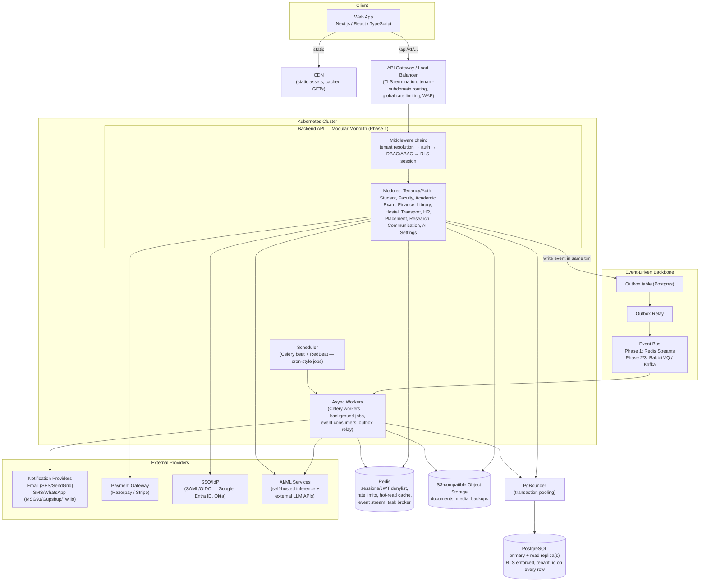
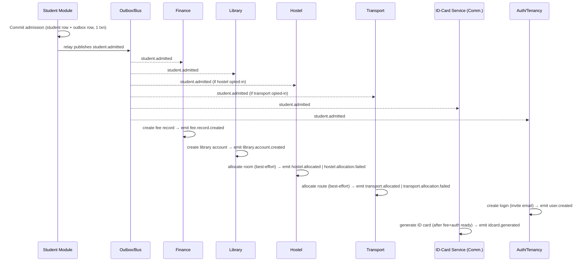
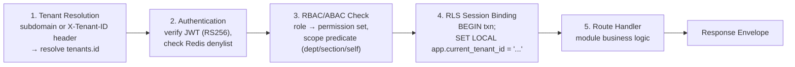
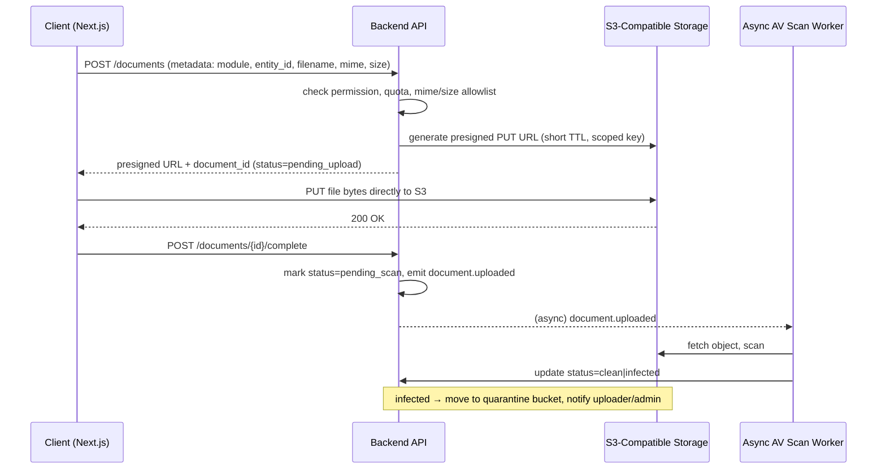

# Sutram — Document 8: Backend Architecture

**Company:** Pragyaan Labs
**Product:** Sutram — AI-powered, Multi-Tenant Education Operating System
**Document owner:** Platform/Backend Engineering
**Status:** Draft v1.0 — baseline for Phase 1 implementation
**Scope:** Full web application backend (native mobile app out of scope for this revision; all decisions below are API-first and client-agnostic so a future mobile client consumes the same REST API without backend rework)
**Depends on:** Document 3 (Database Design), Document 4 (RBAC & Security Architecture)

---

## Table of Contents

1. [Architectural Style Decision](#1-architectural-style-decision)
2. [High-Level Architecture](#2-high-level-architecture)
3. [Tech Stack Decision](#3-tech-stack-decision)
4. [Service / Module Breakdown](#4-service--module-breakdown)
5. [Event-Driven Backbone](#5-event-driven-backbone)
6. [Multi-Tenancy Enforcement at the Backend Layer](#6-multi-tenancy-enforcement-at-the-backend-layer)
7. [Caching Strategy](#7-caching-strategy)
8. [File / Document Handling](#8-file--document-handling)
9. [Background Jobs & Scheduling](#9-background-jobs--scheduling)
10. [Observability](#10-observability)
11. [Scalability Path](#11-scalability-path)
12. [Third-Party Integrations](#12-third-party-integrations)

---

## 1. Architectural Style Decision

### 1.1 Decision

**Sutram Phase 1 ships as a modular monolith: a single deployable backend service, internally decomposed into well-isolated modules that mirror the bounded contexts already established in the Database Design document (Document 3), with a small number of modules — Finance, Communication/Notifications, and AI/Analytics — identified up front as the first candidates for extraction into standalone services in Phase 2/3.**

A modular monolith means:

- **One codebase, one deployable, one running process family** (horizontally scaled — many identical pods, not many different services) for Phase 1.
- Internally, the codebase is organized as independent **modules** (Python packages), each owning its own tables, its own service/business-logic layer, and its own router. Modules **do not** reach into each other's database tables or ORM models directly.
- Cross-module reads happen either through (a) a well-defined internal Python interface (a thin "public API" exposed by the module, analogous to a package's `__init__.py` surface) for synchronous needs, or (b) the internal **event bus** (Section 5) for asynchronous, decoupled needs.
- This internal discipline is what makes the "monolith → microservices" move later a **refactor, not a rewrite** (the Strangler Fig path, detailed in Section 11.4) — the module boundary already looks like a service boundary; only the transport changes (in-process call → network call).

### 1.2 Why not microservices from day one

| Concern | Microservices-from-day-1 | Modular monolith (chosen) |
|---|---|---|
| Team size at launch | Pragyaan Labs is a small engineering team pre-PMF. Microservices require a team per service (or one team firefighting N services) to keep pace with independent deploys, on-call, and version skew. | One team ships one service. No inter-service contract negotiation, no version-skew debugging, no distributed deploy choreography. |
| Operational complexity | N services × (CI/CD pipeline, container image, K8s deployment, service mesh entry, log stream, on-call runbook, health dashboard) — this is real cost even with good tooling. | One CI/CD pipeline, one image, one Helm chart, one log stream to reason about. |
| Distributed-systems failure modes | Network partitions, partial failures, distributed transactions, cascading timeouts, eventual-consistency bugs — all present from commit #1, before there is a single paying enterprise tenant to justify the cost. | In-process calls are either "worked" or "raised an exception" — no network, no partial failure, no need for circuit breakers or sagas for 90% of interactions. |
| Iteration speed on product-market fit | Every schema/API change that crosses a service boundary needs coordinated deploys or careful versioning — this is exactly the wrong drag on a product still finding its shape (new modules, e.g. Research, Placement, are still being validated with early customers). | Cross-module changes are a single PR, single deploy, single transaction where needed. Fast iteration is the priority while requirements are still moving. |
| Data consistency | Admission Flow (student.admitted → fee/library/hostel/transport/id-card/auth) touching 6 services requires a distributed saga with compensations from day one. | The same flow can use real DB transactions for the parts that must be atomic, and the lighter event-driven saga pattern (Section 5) only where it's actually needed — introduced deliberately, not by default. |
| Cost at low tenant volume | N services running (even at minimum replica counts) means paying infrastructure cost for isolation that has no scaling justification yet. | One right-sized deployment scales to a meaningful number of institutions before infra cost or blast-radius arguments favor splitting. |

**Verdict:** microservices-from-day-one is solving problems Sutram does not have yet (independent team scaling, independent deploy cadence, wildly divergent scaling profiles across modules) at a cost Sutram cannot yet afford (distributed-systems complexity, multiplied ops surface, slower iteration during the phase where the product is still being validated).

### 1.3 Why not "monolith forever" either

A monolith-forever posture is explicitly rejected too, because Sutram's own roadmap creates real divergence pressure that a single deployable cannot absorb indefinitely:

- **Finance** has a materially different compliance profile (PCI-DSS-adjacent handling of payment references, stricter audit/segregation-of-duties requirements, potential requirement for a dedicated, more locked-down data store or network segment) than, say, the Academic module.
- **Communication/Notifications** is I/O-bound and bursty in a completely different way than the rest of the API (a bulk "fee due reminder" run fans out to tens of thousands of SMS/WhatsApp/email sends; a slow third-party provider should never be able to degrade the login endpoint).
- **AI/Analytics** is compute-bound in a way the rest of the platform is not — GPU/accelerator scheduling, long-running inference jobs, and model-serving infrastructure have entirely different capacity-planning, cost-allocation, and scaling triggers (queue depth / GPU utilization) than request-latency-driven API pods.

Left inside the monolith indefinitely, these three modules would eventually **force the whole deployable to be sized, deployed, and scaled around their worst-case behavior** — a noisy AI batch job or a bulk notification run degrading exam-result publishing is not acceptable at enterprise scale. Section 11 defines concrete, metric-based triggers for when each of these three modules graduates out.

### 1.4 Bounded contexts (modules) — mapped to the DB module list

Every module below corresponds 1:1 to the module groupings already used in the Database Design document (Document 3) and the RBAC role/permission catalog (Document 4), so schema ownership, permission-module strings (`module:resource:action`), and backend module boundaries stay in lockstep.

| # | Bounded context / module | Owns (DB tables, per Doc 3) | Phase 1 |
|---|---|---|---|
| 1 | **Tenancy / Auth / RBAC** | `tenants`, `users`, `roles`, `permissions`, `role_permissions`, sessions/refresh-token records | Monolith module (shared kernel — see 4.1) |
| 2 | **Student** | `students`, guardian links, admissions/application records | Monolith module |
| 3 | **Faculty** | `faculty`, department/section assignments | Monolith module |
| 4 | **Academic** | departments, courses, subjects, sections, academic calendar, attendance | Monolith module |
| 5 | **Examination** | exam schedules, marks entry, grading, results/transcripts | Monolith module |
| 6 | **Finance** (Fees + Accounting + Payroll approval) | fee structures, invoices, payments, ledgers, budget | Monolith module — **first extraction candidate** |
| 7 | **Library** | catalog, circulation, fines | Monolith module |
| 8 | **Hostel** | rooms, allocation, occupancy, discipline logs | Monolith module |
| 9 | **Transport** | routes, vehicles, driver assignment, student allocation | Monolith module |
| 10 | **HR** | employee records, contracts, leave, payroll disbursement, recruitment | Monolith module |
| 11 | **Placement** | companies, drives, eligibility, offers | Monolith module |
| 12 | **Research** | projects, grants, publications | Monolith module |
| 13 | **Communication / Notifications** | message templates, delivery logs, channel config | Monolith module — **first extraction candidate** |
| 14 | **AI / Analytics** | model configs, prediction/insight snapshots, embeddings (`pgvector`) | Monolith module — **first extraction candidate** |
| 15 | **Settings / Institution** | tenant settings, module enablement, branding, feature flags | Monolith module (shared kernel — see 4.1) |
| — | **Audit** (cross-cutting) | `audit_logs` | Shared library used by all modules, not a module with its own API surface |

---

## 2. High-Level Architecture

### 2.1 Component diagram



### 2.2 Request-path summary

1. Browser talks to Next.js frontend; static assets and cacheable GETs are served via **CDN**.
2. All API calls hit `/api/v1/...` at the **API Gateway/Load Balancer**, which terminates TLS, resolves the tenant subdomain, applies global rate limiting/WAF rules, and forwards to the backend pods.
3. Inside the backend, the **middleware chain** (Section 6) resolves tenant → authenticates → authorizes → sets the Postgres RLS session variable, before the request reaches a module's route handler.
4. Module handlers read/write **PostgreSQL** (via PgBouncer), read/write **Redis** for cache/session/rate-limit needs, and read/write **S3** for file operations.
5. State changes that other modules care about are written to the **outbox table in the same DB transaction** as the business change, then relayed onto the **event bus**, consumed by async **workers** that execute side effects (Section 5).
6. **Workers** also run scheduled jobs (Section 9) and call out to **external providers** (notification channels, payment gateway, AI/ML services).

---

## 3. Tech Stack Decision

### 3.1 Language / API framework

**Decision: Python 3.12 + FastAPI.**

| Criterion | FastAPI (Python) | NestJS (Node/TypeScript) | Spring Boot (Java) |
|---|---|---|---|
| Async I/O | Native `async`/`await`, ASGI (Uvicorn/Gunicorn workers) — well suited to an I/O-heavy, multi-tenant CRUD+reporting workload | Native async via Node event loop | Async possible (WebFlux) but not the idiomatic default; more ceremony |
| Typing & validation | Pydantic v2 models double as request/response schema **and** runtime validation **and** OpenAPI schema source — directly produces the standard API envelope defined for `/api/v1` | TypeScript types + `class-validator`/DTOs — similar strength, and matches the Next.js frontend's language | Strong static typing, but verbose for rapid iteration |
| Auto-generated API docs | OpenAPI/Swagger generated automatically from route + Pydantic types, zero extra annotation burden — directly feeds a generated TypeScript client for the Next.js frontend | Achievable via `@nestjs/swagger` decorators, more manual annotation | Achievable via springdoc, more ceremony |
| AI/ML ecosystem fit | **Decisive factor.** AI/Analytics is a first-class module (Document 3 §"AI/Analytics"), not a bolt-on — Python has the native ecosystem (pandas, scikit-learn, PyTorch, HuggingFace, LangChain-style RAG tooling, `pgvector` client libraries) that the AI module needs directly, without a polyglot service boundary forced in from day one | Would require calling out to a Python service for any real ML work — reintroducing a service boundary (and its complexity) earlier than Section 1's phasing calls for | Same polyglot problem as Node |
| Team/ecosystem maturity | Mature async Postgres driver (`asyncpg`), mature background-job story (Celery), huge library surface for the domain (document parsing, OCR, PDF generation for report cards/transcripts) | Excellent ecosystem, but weaker specifically for the AI-heavy modules | Excellent for large enterprise back offices, heavier and slower to iterate for an early-stage product |

**Why FastAPI wins for Sutram specifically:** the tie-breaker is that AI/Analytics is one of the three named future microservices and a core product differentiator (not an add-on), and it is far cheaper to build that module in the same language as everything else during Phase 1 (avoiding a second stack until the extraction genuinely happens in Phase 2/3) than to run a polyglot stack from day one. NestJS remains a credible alternative if the org later prioritizes "one language across frontend and backend" over "one language across backend and AI" — noted here as the explicit runner-up rather than silently dismissed.

### 3.2 ORM & migrations

- **ORM: SQLAlchemy 2.0 (async style, `asyncpg` driver).** Chosen over Django ORM (Django's sync-first ORM and monolithic-framework opinions fight the async/modular-monolith design) and over raw SQL-only (SQLAlchemy Core is still available per-module for reporting-heavy queries where the ORM adds no value). Pydantic schemas remain the API-facing DTOs, kept deliberately separate from SQLAlchemy models so a module's internal persistence shape can change without breaking its public contract.
- **Migrations: Alembic.** One migration history for the whole database (matches the single-schema, `tenant_id`-discriminated model from Document 3). Autogenerate is used to draft migrations, every migration is hand-reviewed before merge, and the expand/contract pattern is mandatory for any breaking column/table change (add nullable → backfill → make non-null/drop old, across separate deploys) so rolling K8s deploys never run old code against a migrated-out column.
- Per-module Alembic branch labels are used so each module's schema history is independently readable even though all migrations apply to one physical database — this is the "migration seam" that keeps a future extracted service's data migration story tractable.

### 3.3 Task queue & background jobs

Two distinct queueing needs exist and use different tools, on purpose (see Section 5 for why they are not the same system):

| Need | Tool (Phase 1) | Why |
|---|---|---|
| **Background jobs** (send an email, generate a PDF transcript, run a nightly rollup, retry a failed webhook) | **Celery**, Redis as broker + result backend | Most mature Python task-queue ecosystem: retries with backoff, chains/chords for multi-step jobs, priority queues, per-queue concurrency tuning, and a battle-tested scheduler (`celery beat`, run via **RedBeat** for a Redis-backed distributed lock so multiple beat-capable pods don't double-fire cron jobs). Arq (asyncio-native, lighter-weight) was considered and is a reasonable alternative for teams wanting a smaller footprint, but Celery's ecosystem maturity (monitoring via Flower, wide provider/backend support, easier path to a RabbitMQ broker later) wins for a team that will lean on background jobs heavily across 14+ modules. |
| **Domain event bus** (`student.admitted`, `fee.paid`, `exam.result.published` driving cross-module side effects) | **Postgres outbox + Redis Streams** | Deliberately *not* Celery — domain events are business facts other modules react to, not "do a task" instructions; keeping them on a separate, replayable, at-least-once stream (Section 5) avoids conflating "retry this HTTP call" semantics with "this business event happened" semantics. Graduates to **RabbitMQ or Kafka** in Phase 2/3 once the event bus needs cross-service (not just cross-module) delivery. |

- **Worker deployment:** Celery workers run as their own Kubernetes Deployment (separate from API pods) so a burst of background work (e.g., 50,000 fee-reminder sends) scales independently of, and never starves, request-serving API pods — this is the first, cheapest instance of "the monolith's deployable already scales its pieces independently," well before any module needs a full network-service split.
- **Idempotency:** every task and event handler is written to be safely re-run (Section 5.4, Section 9.3) since Celery and Redis Streams both provide at-least-once, not exactly-once, delivery.

---

## 4. Service / Module Breakdown

### 4.1 Shared kernel vs. business modules

**Tenancy/Auth/RBAC** and **Settings/Institution** are treated as a **shared kernel**: nearly every other module depends on them synchronously on the hot path (every request needs tenant resolution, permission checks, and tenant-level module-enablement flags). They are never extraction candidates in the same sense as Finance/Communication/AI — if they were pulled out first, every remaining module would take a network hop on every single request, which is the opposite of what extraction should buy. They stay in the monolith indefinitely (or, at true hyperscale, become a very low-latency, colocated "platform service" rather than a conventional microservice — noted here as an out-of-scope-for-now future concern).

### 4.2 Per-module breakdown

| Module | Responsibility | Key entities owned | Phase | Interaction pattern with other modules |
|---|---|---|---|---|
| **Tenancy/Auth/RBAC** | Tenant lifecycle, login/session/token issuance, role & permission resolution | `tenants`, `users`, `roles`, `permissions`, refresh tokens | Shared kernel — stays in monolith | Sync (in-process call, not even HTTP): every module calls it to resolve `current_user`/scope on every request. Emits `user.created`, `tenant.provisioned` events. |
| **Student** | Student profile & lifecycle, admissions/application intake | `students`, `admission_applications`, guardian links | Phase 1 monolith module | Emits `student.admitted`, `student.enrolled`, `student.updated`. Sync reads exposed to Academic/Exam/Finance for profile lookups. |
| **Faculty** | Faculty/staff academic profile, department/section assignment | `faculty`, assignment records | Phase 1 monolith module | Sync reads by Academic/Exam (who teaches what). Emits `faculty.assigned`. |
| **Academic** | Departments, courses, subjects, sections, calendar, attendance | `departments`, `courses`, `subjects`, `sections`, `attendance` | Phase 1 monolith module | Sync reads by Exam/Communication. Emits `attendance.marked`, `term.started`. |
| **Examination** | Exam scheduling, marks entry, grading, results/transcripts | exam schedules, marks, results | Phase 1 monolith module | Consumes Academic/Student data via sync read. Emits `exam.result.published` → triggers Communication, AI/Analytics. |
| **Finance** | Fee structures, invoicing, payment collection/reconciliation, ledgers, budget, payroll approval | `fee_structures`, `invoices`, `payments`, `ledger_entries` | Phase 1 monolith module — **first extraction candidate** (Section 11.1) | Consumes `student.admitted` (async) to auto-create fee records. Calls Payment Gateway (sync, external). Emits `fee.paid`, `fee.overdue`. |
| **Library** | Catalog, circulation, fines | `books`, `loans`, `fines` | Phase 1 monolith module | Consumes `student.admitted` (async) to auto-create a library account. |
| **Hostel** | Room allocation, occupancy, discipline logs | `hostels`, `rooms`, `allocations` | Phase 1 monolith module | Consumes `student.admitted` (async, opt-in allocation). |
| **Transport** | Routes, vehicles, driver assignment, student route allocation | `routes`, `vehicles`, `allocations` | Phase 1 monolith module | Consumes `student.admitted` (async, opt-in allocation). |
| **HR** | Employee records, contracts, leave, payroll disbursement, recruitment | `employees`, `contracts`, `leave_requests`, `payroll_runs` | Phase 1 monolith module | Sync reads by Faculty (linked profile). Emits `payroll.run.completed` → Finance, Communication. |
| **Placement** | Company/drive management, eligibility, offer tracking | `companies`, `drives`, `applications`, `offers` | Phase 1 monolith module | Sync reads Student academic records for eligibility screening. |
| **Research** | Research projects, grants, publications | `projects`, `grants`, `publications` | Phase 1 monolith module | Mostly self-contained; sync reads Faculty/Student for authorship. |
| **Communication** | Templated notifications across email/SMS/WhatsApp/in-app, delivery tracking | `message_templates`, `message_log` | Phase 1 monolith module — **first extraction candidate** (Section 11.1) | Purely **async**: consumes events from every other module (`fee.paid`, `exam.result.published`, `student.admitted`, ...) and calls external providers (Section 12). Never called synchronously by other modules on their request path. |
| **AI/Analytics** | Predictive insights, dashboards, document AI (Section 8.3), model-backed features | model configs, prediction snapshots, embeddings | Phase 1 monolith module — **first extraction candidate** (Section 11.1) | Mostly **async**: consumes domain events to build snapshots/embeddings; exposes a small sync read API for dashboard queries. Calls internal/external AI/ML services. |
| **Settings/Institution** | Tenant configuration, module enablement, branding, feature flags | `tenant_settings`, `tenant_module_config` | Shared kernel — stays in monolith | Sync (in-process): read by every module to check module enablement and tenant config on the hot path; cached in Redis (Section 7). |
| **Audit** *(cross-cutting)* | Immutable audit trail of sensitive actions | `audit_logs` | Shared library, no independent API | Written to synchronously (same transaction) by every module for audited actions, per Document 4 §9. |

**Reading the table as an extraction roadmap:** the three modules marked "first extraction candidate" are precisely the ones whose *interaction pattern is already almost entirely async* (Communication, AI/Analytics) or whose *compliance boundary is already naturally separable* (Finance, which primarily consumes one inbound event and emits outbound events, with the payment-gateway call being its own external network hop already). This is not a coincidence — it is why they were chosen as the Phase 2/3 targets: the network hop an extraction introduces lands on an interaction that was already asynchronous or already external, not on a hot synchronous path.

---

## 5. Event-Driven Backbone

### 5.1 Phase 1: Transactional outbox + Redis Streams

Domain events must never be "fire and hope" — if a module commits a business change (e.g., a student is admitted) but the process crashes before publishing the corresponding event, downstream modules (fee, library, hostel, transport, id-card, auth) silently never find out. Sutram uses the **transactional outbox pattern** to close this gap without needing a distributed transaction:

1. When a module makes a business change, it writes the domain row change **and** a row into an `outbox_events` table **in the same Postgres transaction**. Either both commit or neither does — no possibility of "state changed but event lost."
2. A lightweight **outbox relay** process (a Celery worker with a tight polling loop, or `LISTEN/NOTIFY` for lower latency) reads new, unpublished `outbox_events` rows in order and publishes them onto a **Redis Stream** (one stream per event type or a small number of topic streams, e.g. `events:student`, `events:fee`), then marks them published.
3. Consumers are Celery workers subscribed via **Redis Streams consumer groups**, which give at-least-once delivery with durable offsets (unlike plain Redis Pub/Sub, which silently drops messages for offline subscribers) — this is the specific reason Streams, not bare Pub/Sub, is the Phase 1 implementation of "Redis pub/sub" as an event medium.
4. Failed consumers retry with backoff; messages that fail repeatedly land in a **dead-letter stream** (`events:dead-letter`) for manual/automated inspection rather than being dropped or blocking the stream.

This is intentionally the simplest thing that gives correctness (no lost events) without standing up a message broker cluster before there is load to justify it.

### 5.2 Phase 2/3: Graduating to RabbitMQ / Kafka

The trigger to graduate is **not a calendar date**, it is one of:

- A module is extracted into its own deployable (Section 11.1) — at that point events must cross a real network/process boundary, and Redis Streams' single-instance durability and lack of cross-cluster replication become a real limitation.
- Event volume/throughput exceeds what a Redis instance can comfortably serve alongside its cache/session/rate-limit duties (at which point Redis Streams would need its own dedicated cluster anyway — a good moment to instead adopt a purpose-built broker).
- A consumer needs guarantees Redis Streams doesn't give cleanly at scale (e.g., strict ordering guarantees per partition key across a multi-service consumer landscape, or long-term event retention/replay for audit/analytics — Kafka's log-retention model fits better than Streams' bounded-length trimming).

**RabbitMQ** is the pragmatic first step if the need is "reliable routing/queuing across now-separate services" (topic exchanges map naturally onto the existing `module.entity.action` event names). **Kafka** is the step if the need is "high-throughput event log with replay, used by multiple independent consumers including analytics/AI pipelines." Either can sit behind the same internal publish/subscribe interface the application code already uses, so this migration is an infrastructure swap behind a stable interface, not an application rewrite.

### 5.3 Event schema convention

Every event uses a fixed envelope (CloudEvents-inspired):

```json
{
  "event_id": "uuid",
  "event_type": "student.admitted",
  "event_version": 1,
  "tenant_id": "uuid",
  "occurred_at": "2026-07-31T09:12:00Z",
  "source_module": "student",
  "correlation_id": "uuid",
  "causation_id": "uuid | null",
  "actor": { "user_id": "uuid", "role": "registrar" },
  "payload": { "...": "event-specific fields" }
}
```

- **`event_type`** follows the `module.entity.action` dot-notation already established for events like `student.admitted`, `fee.paid`, `exam.result.published`.
- **`tenant_id`** is mandatory on every event — consumers must never process an event without tenant context, and must set the same RLS session variable (Section 6) before touching the database in a handler.
- **`event_version`** allows payload evolution: consumers check the version and handle old + new shape during a migration window; breaking payload changes bump the version rather than mutate the meaning of an existing one in place.
- **`correlation_id`** ties every event in one saga (e.g., one admission) together for tracing; **`causation_id`** points at the event that directly caused this one, giving a reconstructible causal chain for debugging.

### 5.4 The Admission Flow as an event-driven saga



- **Choreography, not central orchestration, for Phase 1.** Each consumer reacts to `student.admitted` independently and emits its own follow-on event. This fits a modular monolith well (all consumers are in-process, low coordination overhead) and avoids building a saga-orchestrator component before there are enough steps/failure modes to justify one. The event schema (correlation/causation IDs) is deliberately orchestrator-ready: a Phase 2/3 **admission-saga-orchestrator** can be introduced later by simply subscribing to the same events without changing what any existing consumer does.
- **Idempotency:** every consumer keys its side effect on `(tenant_id, event_id)` (or a natural key like `student_id` for "create once" operations) and upserts/no-ops on redelivery — required because Redis Streams (Phase 1) and RabbitMQ/Kafka (Phase 2/3) are at-least-once, not exactly-once.
- **Compensation / partial-failure handling:**
  - *Hostel/Transport allocation* are explicitly modeled as **best-effort, non-blocking** steps (a student is validly "admitted" even with no hostel bed available yet) — failure emits `hostel.allocation.failed`, which surfaces as an actionable task in the Hostel Warden's queue rather than rolling back the admission.
  - *Fee record creation* and *Auth login creation* are treated as **required** steps. If Finance fails to create the fee record (e.g., no active fee structure configured for the tenant/program), it emits `fee.record.creation_failed`, which (a) is surfaced to Registrar/Admin as a blocking exception queue item, and (b) suppresses `idcard.generated` (ID-Card generation is gated on both `fee.record.created` and `user.created` succeeding) — this is the saga's compensation: instead of an automated rollback of the admission itself (which would be more disruptive than useful — the student *is* admitted), failure is turned into a visible, actionable remediation task with clear ownership.
  - Every step writes a row to a `saga_step_log` (or reuses `audit_logs`) keyed by `correlation_id`, so an admin/support view can show "Admission for student X: fee ✅, library ✅, hostel ⚠ pending, auth ✅, id-card ⏳ blocked-on-hostel" — full saga-state visibility without a dedicated orchestrator engine.
  - A scheduled reconciliation job (Section 9) periodically scans for admissions with incomplete required steps past an SLA window and alerts, catching any event that was silently dropped despite the outbox/at-least-once design (defense in depth, not primary correctness mechanism).

---

## 6. Multi-Tenancy Enforcement at the Backend Layer

### 6.1 Middleware chain

Every request passes through a fixed, ordered middleware chain before reaching a handler — mirroring the layered authorization model defined in Document 4 §1.3 (`allow = has_role_permission(...) AND module_enabled_for_tenant(...) AND scope_predicate_matches(...) AND row.tenant_id == request.tenant_id`):



1. **Tenant resolution** — the tenant is resolved from the subdomain (e.g., `stmarys.sutram.app`) or an explicit `X-Tenant-ID` header (service-to-service/testing use), and cross-checked against the `tenant_id` claim already embedded in the JWT once authenticated, so a stolen token cannot be replayed against a different tenant's subdomain.
2. **Authentication** — JWT signature verification (RS256), expiry check, and a Redis denylist lookup for revoked/rotated tokens (per the foundational auth decisions: 15-min access tokens, 7–30d refresh with rotation + reuse detection).
3. **RBAC/ABAC check** — resolves the caller's effective permission set and scope attributes (department/section/self, per Document 4) against the permission string required by the route (`module:resource:action`), and against `tenant_module_config` (is this module even enabled for this tenant).
4. **RLS session binding** — the single most important multi-tenancy control at the data layer: at the start of the request's database transaction, the application issues `SET LOCAL app.current_tenant_id = '<uuid>'`. Postgres RLS policies (`USING (tenant_id = current_setting('app.current_tenant_id')::uuid)`, per Document 3 §1.1) then transparently filter every query the handler issues — a backstop against an application-layer bug that forgets a `WHERE tenant_id = ...` clause. **`SET LOCAL` is deliberately used over plain `SET`**: it is scoped to the current transaction and automatically reset at `COMMIT`/`ROLLBACK`, which is what makes this safe to use under connection pooling (6.2) — a plain `SET` would leak the tenant context to whichever unrelated request next reuses that pooled connection.
5. Only after all four gates pass does the request reach the module's route handler.

### 6.2 Connection pooling considerations (PgBouncer)

- Sutram runs **PgBouncer in transaction pooling mode** between the API/worker pods and PostgreSQL, so a large pod fleet doesn't exhaust Postgres's native connection limit (each Postgres connection is comparatively expensive; PgBouncer multiplexes many logical app connections onto a smaller pool of real backend connections).
- Transaction-mode pooling is exactly why step 4 above uses `SET LOCAL` inside the request's transaction rather than a session-level setting: transaction pooling means the physical connection can be handed to a *different* logical client between transactions, so any tenant context set outside the transaction boundary would be a cross-tenant data leak waiting to happen. `SET LOCAL` is safe under transaction pooling by construction — it cannot outlive the transaction it was set in.
- Prepared statements and session-level features that don't cooperate with transaction pooling (e.g., advisory locks held across transactions, `LISTEN/NOTIFY` for the outbox relay) are routed through a **separate, session-pooling-mode PgBouncer pool** reserved for the relay/worker processes that need them, so the main request-serving pool stays in the more scalable transaction mode.

### 6.3 Noisy-neighbor mitigation

- **Per-request `statement_timeout`** (tiered by plan: shorter for `trial`/`standard`, more headroom for `enterprise`) so one tenant's runaway report query cannot monopolize a shared Postgres backend indefinitely.
- **Connection pool ceilings per tenant tier** at the PgBouncer layer (or an application-level semaphore keyed by `tenant_id` for particularly hot endpoints) so a single very active tenant cannot starve the shared connection pool that every other tenant also depends on.
- **Query cost / row-limit guardrails** on report-style endpoints (pagination enforced server-side, no unbounded exports on the synchronous request path — large exports are pushed to the background-job system, Section 9, and delivered via a presigned S3 link, Section 8).
- **Rate limiting** (Section 7.1) at both the gateway (coarse, per-tenant/IP) and application layer (fine-grained, per-endpoint) using Redis counters.
- At the point a specific large tenant's load becomes measurably disruptive to others despite the above (identified via the per-tenant query-time metrics in Section 10), the escalation path is the **isolation tiers already defined in Document 3 §1.4** (dedicated schema → dedicated database) — this is a data-layer decision, not a backend-architecture one, and the two documents are intentionally aligned here.

---

## 7. Caching Strategy

Redis serves four distinct purposes; each uses a distinct key namespace and TTL policy so they can be reasoned about (and, later, split onto separate Redis instances/clusters) independently.

| Purpose | Key pattern | TTL / eviction | Notes |
|---|---|---|---|
| **Sessions / refresh-token metadata** | `session:{tenant_id}:{user_id}:{session_id}` | Matches refresh token lifetime (7–30d) | Enables "log out this device" / "log out everywhere" without touching the JWT itself. |
| **JWT access-token denylist** | `denylist:{jti}` | TTL = remaining access-token lifetime (≤15 min) | Entry only needs to outlive the token it revokes — self-expiring, bounded set size. |
| **Rate-limit counters** | `ratelimit:{tenant_id}:{route}:{window}` | Sliding/fixed window TTL (seconds–minutes) | Token-bucket or fixed-window counters via `INCR` + `EXPIRE`; both gateway-level (coarse) and app-level (per-endpoint) limits. |
| **Hot-read cache** | `tenant:{tenant_id}:perm:{user_id}:v{role_version}`, `tenant:{tenant_id}:settings`, `tenant:{tenant_id}:dashboard:{widget}` | Short TTL (seconds–minutes) + explicit invalidation | Covers permission-resolution results (avoids re-computing the RBAC/ABAC join on every request), tenant settings/module-enablement (read on every request per Section 6.1), and precomputed dashboard aggregates. |

**Invalidation approach:**

- **Cache-aside** is the default pattern: read cache → miss → read Postgres → populate cache → return.
- **Versioned keys, not blind deletes, for permission caches**: `role_permissions` changes bump a `role_version` counter (per tenant, stored in Postgres and mirrored in Redis); the cache key embeds that version, so a role change instantly "invalidates" every cached permission-check for that tenant without needing to enumerate and delete every affected key — old-versioned keys simply age out via TTL.
- **Event-driven invalidation for settings/dashboard caches**: modules that own cached data publish an internal invalidation signal (either directly, or by consuming their own domain events — e.g., the Settings module invalidates `tenant:{id}:settings` on `tenant.settings.updated`) rather than relying on TTL alone for correctness-sensitive data like module enablement.
- Cache is treated as **strictly disposable** — every cache-populating code path has a Postgres-backed source of truth and can be safely flushed (e.g., during an incident) with only a temporary latency cost, never a correctness cost.

---

## 8. File / Document Handling

### 8.1 Presigned upload/download flow



- The backend **never proxies file bytes** for upload or normal download — it only issues short-TTL presigned URLs (S3 `PUT`/`GET`), keeping large-payload traffic off the API pods entirely.
- Object keys are always tenant- and module-scoped (`{tenant_id}/{module}/{entity_id}/{document_id}.{ext}`), and bucket policy + presigned-URL scoping mean a leaked URL for one tenant's document cannot be walked to another tenant's objects.
- Uploads are **not visible/usable** (status `pending_upload` → `pending_scan` → `clean`) until virus scanning completes; download presigning is refused for anything not `clean`.

### 8.2 Virus / malware scanning

- Every uploaded object is scanned asynchronously by a **ClamAV-based worker** (self-hosted ClamAV daemon/sidecar, or an equivalent cloud-native scanning service depending on target cloud) triggered off the `document.uploaded` event.
- Objects live in a **quarantine prefix/bucket** conceptually until scanned; the document row's `status` column gates all downstream access (download URL issuance, inclusion in AI document pipelines, attachment to communications) so nothing infected is ever served or processed further.
- Infected uploads notify the uploader and, for sensitive modules (HR, Finance), the relevant admin role, and are retained (not silently deleted) for a short window for incident review before purge.

### 8.3 Document-AI processing pipeline

For AI/Document-AI features (e.g., résumé parsing for Placement, certificate/ID verification for Admissions, question-answering over uploaded study material):

1. `document.uploaded` + `status=clean` → triggers the pipeline (never runs on unscanned content).
2. **Text extraction**: OCR (for scanned/image documents) or native text extraction (for PDFs/docs) run as a background job.
3. **Chunking**: extracted text is split into retrieval-sized chunks with source/page metadata retained.
4. **Embedding**: chunks are embedded via the AI/Analytics module's model integration and stored using the **`pgvector`** Postgres extension — deliberately reusing the existing primary database rather than standing up a dedicated vector database in Phase 1, consistent with the "don't add infrastructure before there's a load reason to" theme of this document. `pgvector` tables carry `tenant_id` and RLS like every other table, so vector search inherits the same tenant-isolation guarantees for free.
5. Downstream AI features (RAG-style Q&A, eligibility/plagiarism checks, resume-to-role matching) query these embeddings scoped to `tenant_id` (and often `entity_id`/module) via the AI/Analytics module's sync read API.
6. If/when embedding volume or query latency outgrows `pgvector` on the primary, a dedicated vector store becomes one of the concrete triggers for extracting AI/Analytics into its own service (Section 11.1) — the embedding-generation and storage code already lives behind the AI module's boundary, so this swap does not ripple into other modules.

---

## 9. Background Jobs & Scheduling

### 9.1 Representative nightly / periodic jobs

| Job | Frequency | Module |
|---|---|---|
| Attendance rollups (daily → monthly aggregates) | Nightly | Academic |
| Fee-due reminders (email/SMS/WhatsApp fan-out) | Daily | Finance → Communication |
| Library overdue-fine calculation | Nightly | Library |
| Analytics snapshot materialization (dashboards, AI insight refresh) | Nightly / hourly for high-value widgets | AI/Analytics |
| Payroll run processing | Monthly (scheduled window) | HR → Finance |
| Admission-saga SLA reconciliation (Section 5.4) | Hourly | Student (cross-module scan) |
| Session/refresh-token cleanup, denylist GC | Hourly | Tenancy/Auth |
| Backup verification / restore drill | Weekly | Platform ops |
| Document retention/purge sweep (quarantined/expired uploads) | Daily | Communication/Settings |

### 9.2 Scheduler choice

**Celery beat, running via RedBeat** (a Redis-backed distributed lock/scheduler extension for Celery), not plain `celery beat`. Plain beat is designed to run as a single instance; in a horizontally scaled K8s deployment with multiple beat-capable pods, that either requires pinning beat to exactly one replica (a manual operational foot-gun) or risks the same cron job firing multiple times. RedBeat's Redis-backed lock lets the scheduler run safely across replicas while guaranteeing each scheduled job fires once.

### 9.3 Background job design patterns

- **Idempotency by default**: every job checks/records its own completion for its logical key (e.g., "fee reminders for tenant X, date Y already sent") so a retried or duplicated run is a safe no-op, not a duplicate SMS bill or a double-charged fine.
- **Job status/audit**: long-running or business-significant jobs (payroll run, bulk fee reminder) write a job-run record (status, counts, errors) that is visible in an admin/ops view — this is the same pattern as the saga-state visibility in Section 5.4, reused here.
- **Retry/backoff policy**: exponential backoff with a bounded max-retry count; exhausted retries land the task in a **dead-letter queue** (a Celery-native failure queue or a dedicated `failed_tasks` table) for alerting and manual replay, never silently dropped.
- **Chunked fan-out**: bulk jobs (reminders to 50,000 guardians) are split into batches dispatched as many small tasks rather than one giant task, so a partial failure only requires re-running the failed batch, and worker concurrency can be tuned independently of batch size.

---

## 10. Observability

Even as a Phase 1 monolith, observability is built to the standard a distributed system would need — this is a deliberate "seam" investment (Section 1.1's internal-module-boundary discipline has a matching observability-boundary discipline) that makes the eventual Section 11 extractions far less risky, because traces/metrics/logs already exist per-module.

### 10.1 Structured logging

- All logs are **structured JSON**, never bare strings, with a fixed baseline field set: `timestamp`, `level`, `request_id`, `correlation_id` (for events, ties to Section 5.3), `tenant_id`, `user_id` (where applicable and PII-policy-compliant), `module`, `message`, plus event-specific fields.
- `request_id` is generated at the API Gateway and propagated through every layer (middleware → handler → any Celery task enqueued as a result of the request) so a single request's full execution — including anything it kicked off asynchronously — is greppable by one ID.
- Logs are shipped to a central aggregator (e.g., Loki/ELK-family, cloud-agnostic per the deployment target) with tenant-aware retention policy, and PII fields are flagged/redactable to satisfy the data-protection posture set in Document 4 §7.

### 10.2 Distributed tracing (OpenTelemetry)

- **OpenTelemetry instrumentation is enabled from Phase 1**, even though there is only one service to trace today: FastAPI request spans, SQLAlchemy query spans, Redis client spans, and Celery task spans (producer + consumer, linked via trace context propagated through task headers) are all captured.
- Traces are exported via OTLP to a collector (vendor-agnostic — Grafana Tempo, Jaeger, or a commercial APM, chosen at deploy time, not baked into application code).
- **Why this matters before there are multiple services:** intra-monolith module boundaries are already annotated as spans (a `finance.create_invoice` span nested under the `student.admitted` event-handling span, for example), so when Finance is later extracted (Section 11.1), the trace simply gains a network hop between two spans that already existed — the instrumentation work is already done, not a Phase 2/3 scramble.

### 10.3 Metrics

- **Prometheus-format metrics** exposed via a `/metrics` endpoint (scraped, not pushed, for the API pods; Celery workers export via a Prometheus exporter/pushgateway pattern suited to short-lived task execution).
- **RED metrics** (Rate, Errors, Duration) per route and per module, plus **USE metrics** (Utilization, Saturation, Errors) for Postgres connections, Redis, and queue depth.
- **Business metrics** relevant to platform health and the Section 11 extraction triggers specifically: events published/consumed per second (by `event_type`), notification sends/day (by channel), AI job queue depth and inference latency, per-tenant query time distribution (feeds noisy-neighbor detection, Section 6.3).
- Dashboards (Grafana or equivalent) are organized per-module from day one, again to make "does Finance's load profile justify extraction yet" a metrics query, not a guess.

### 10.4 Health checks

- **Liveness probe** (`/healthz/live`): process is up and serving — no dependency checks, must never fail due to a downstream outage (avoids needless pod restarts cascading an outage).
- **Readiness probe** (`/healthz/ready`): aggregates checks against Postgres (via PgBouncer), Redis, and (lightly, e.g., a lightweight `HeadBucket`) S3 reachability; a pod failing readiness is removed from the load balancer's rotation without being killed.
- Celery workers expose an equivalent readiness signal (broker connectivity + not stuck on a poison task) consumed by K8s and by the alerting stack.

---

## 11. Scalability Path

### 11.1 Concrete extraction triggers

Extraction is **metric-triggered, not calendar-triggered**. Each of the three Section 1 candidates has an explicit, observable threshold (drawn from the Section 10 metrics) rather than a vague "when we're bigger":

| Module | Extract when... | Why this metric |
|---|---|---|
| **Communication/Notifications** | Sustained outbound volume exceeds a threshold (e.g., tens of thousands of messages/day) **or** a provider outage/latency spike is observed to have any measurable effect on unrelated API p95 latency | Notifications is I/O-bound against third parties with their own uptime/latency variance; the extraction goal is strict fault isolation — a Twilio/MSG91 slowdown must never be able to touch login or fee-payment latency. Once volume is high enough that its worker pool needs independent scaling anyway, the marginal cost of a real network boundary is low. |
| **Finance** | (a) A compliance/audit requirement (PCI-DSS scope reduction, SOC 2 segregation-of-duties finding) mandates a harder isolation boundary than in-process module separation, **or** (b) ledger/reporting query load measurably contends with OLTP transactional load on the primary | Finance's isolation driver is as much regulatory/audit as it is load — the trigger is explicitly allowed to be a compliance finding, not only a metric, because that is the realistic way this module gets pulled out first among the three. |
| **AI/Analytics** | (a) Inference workloads need GPU/accelerator scheduling that the API node pool doesn't (and shouldn't) provide, **or** (b) AI job queue depth/latency variance starts requiring a scaling policy (queue-depth-based autoscaling) fundamentally different from the request-latency-based autoscaling the rest of the API uses, **or** (c) per-tenant AI cost metering needs isolation for billing purposes | AI compute has a different capacity-planning shape (batch/GPU) than request-serving API pods (CPU/latency) — mixing their autoscaling policies in one deployment is the clearest of the three "the monolith is now fighting itself" signals. |

### 11.2 The Strangler Fig extraction mechanism

Because each module already (Section 1.1, 4.2) owns its own tables, exposes a narrow internal interface for sync reads, and communicates cross-module state changes only via the event bus, extracting one is mechanically:

1. Stand the module up as its own deployable, pointed at the **same Postgres database** initially (no data migration needed on day one — table ownership was already exclusive to that module).
2. Replace in-process calls to the module's internal interface with HTTP/gRPC calls to the new service (a thin adapter layer absorbs this — call sites elsewhere in the monolith don't change their calling convention, only what's behind it).
3. Point the module's event consumption/production at the **already-existing** event bus (Redis Streams in Phase 1, or RabbitMQ/Kafka if the extraction coincides with that graduation, Section 5.2) — no new integration pattern is invented at extraction time.
4. Only once the service is stable standalone does its data optionally move to a dedicated database (needed for Finance's compliance driver, optional for the other two).

### 11.3 Read-replica strategy

- One or more **async streaming read replicas** are introduced ahead of any extraction need, purely for read/write load separation: reporting-heavy, non-real-time-critical reads (dashboards, analytics snapshots, exports) are routed to a replica connection pool; the primary is reserved for writes and read-after-write-sensitive reads.
- Routing is **explicit per query/repository method** (a `read_replica=True` hint at the repository layer), never automatic/implicit, because replica lag (typically sub-second, but not zero) makes silent replica routing dangerous for flows that just wrote data and immediately need to read it back (e.g., "show the newly created invoice" right after creation) — those stay pinned to the primary.
- Replica lag is monitored (Section 10.3) and read-routing is automatically paused (falling back to primary) if lag exceeds a safe threshold, trading some primary load for correctness during replica trouble.

### 11.4 Horizontal scaling of stateless API pods

- API pods are **fully stateless** by construction: JWT-based auth means no server-side session affinity is required, and anything that looks like session state (Section 7) lives in Redis, externally. This means the API deployment scales horizontally behind a standard Kubernetes HPA (CPU and/or request-rate based) with no sticky-session requirement at the load balancer.
- Each pod holds a bounded PgBouncer-facing connection pool; pod count × per-pod pool size is capacity-planned against PgBouncer's own pool ceiling (Section 6.2) so scaling pods out doesn't silently overrun the database's real connection budget.
- Celery workers scale independently of API pods (already a separate Deployment, Section 3.3) via their own HPA driven by queue depth rather than CPU — a more accurate signal for a queue-consuming workload.

---

## 12. Third-Party Integrations

All external providers are accessed behind a **thin internal adapter interface per integration category** (payment, messaging, email, identity) so switching providers is a configuration/adapter change, not a business-logic change — this mirrors the module-boundary discipline used everywhere else in this document.

| Category | Primary provider(s) | Notes |
|---|---|---|
| **Payment gateway** | **Razorpay** (primary, India-first fee collection), **Stripe** (international alternative for tenants/payers outside India) | Webhook-driven reconciliation (never trust client-side "payment succeeded" alone); every webhook is signature-verified and processed idempotently (keyed on the provider's event/payment ID); a scheduled reconciliation job (Section 9) cross-checks gateway records against `payments` rows to catch missed webhooks. Payment references, not raw card data, are stored (PCI scope minimized by delegating card handling entirely to the gateway's hosted checkout/SDK). |
| **SMS / WhatsApp** | **MSG91 / Gupshup** (India-first, and required for **DLT registration** compliance on transactional/promotional SMS under Indian telecom regulation), **Twilio** as an alternative for international deployments | Delivery-status webhooks feed back into `message_log` (Communication module) for send/delivery/failure tracking; templates are pre-approved per provider requirements (especially WhatsApp Business API template approval). |
| **Email** | **Amazon SES** or **SendGrid** | Bounce/complaint webhooks feed a suppression list so the platform stops emailing addresses that hard-bounce or complain, protecting sender reputation across all tenants sharing the platform's sending domain/IP reputation. |
| **SSO / Identity** | **SAML 2.0 and OIDC**, supporting **Google Workspace, Microsoft Entra ID (Azure AD), Okta** as enterprise IdPs | Per-tenant IdP configuration lives in the Settings/Institution module (`tenant_settings`); on successful federated login, mapped claims populate the `users` row and role assignment per the tenant's configured attribute mapping, then issue Sutram's own JWTs as usual — downstream authorization (Document 4) is unaware of whether login was password, OTP, or SSO. |
| **AI/ML services** | Self-hosted inference (for cost-sensitive/high-volume tasks, e.g., OCR, embeddings) + external LLM APIs (for capability-sensitive tasks, e.g., document understanding, insight generation) | Called from the AI/Analytics module only (Section 4.2); results cached/stored so repeated identical requests (e.g., re-viewing the same AI-generated insight) don't re-incur external API cost. |

**Common integration principles:**

- Every outbound call to an external provider is wrapped with timeouts, retry-with-backoff, and a circuit breaker where the provider is known to have variable reliability (payment/messaging providers) — so a provider outage degrades gracefully (queued for retry) rather than blocking a request thread or cascading into API latency, tying back to exactly the fault-isolation concern that makes Communication a Section 11 extraction candidate once volume justifies it.
- Provider credentials/config are tenant-overridable where relevant (a large institution may want its own Razorpay/SES account) but default to Pragyaan Labs' platform-level accounts for the common case — configuration lives in Settings/Institution, resolved per-tenant at call time by the adapter layer.
