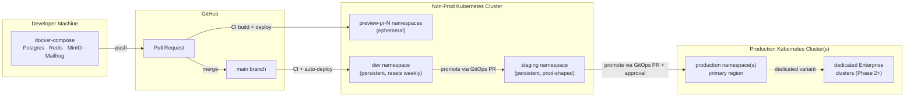
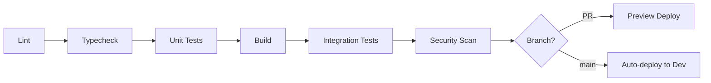
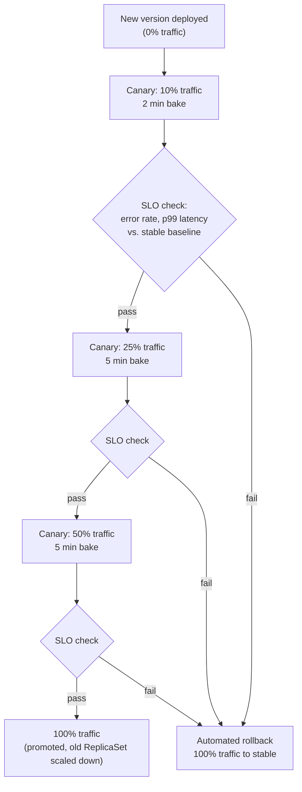

# Sutram — Document 12: DevOps, CI/CD & Infrastructure

**Company:** Pragyaan Labs
**Product:** Sutram — AI-powered, Multi-Tenant Education Operating System
**Document owner:** Platform/DevOps Engineering
**Status:** Draft v1.0 — baseline for Phase 1 implementation
**Scope:** Full web application (Next.js frontend + FastAPI modular monolith backend). Native mobile app is out of scope for this revision — the pipelines below build and deploy web artifacts only; a future mobile app would add its own build/release lane (App Store/Play Store) without changing anything described here.
**Depends on:** Document 3 (Database Design — RLS, tenant_id model), Document 7 (API Design), Document 8 (Backend Architecture — modular monolith, outbox, OpenTelemetry readiness), Document 9 (Frontend Architecture — Turborepo, Next.js), Document 1 (PRD — pricing tiers, Enterprise SLA of 99.95%, dedicated-isolation option)
**Audience:** Engineers (all levels), on-call responders, and technical leadership planning infra spend

---

## Table of Contents

1. [Environment Strategy](#1-environment-strategy)
2. [Repository Strategy](#2-repository-strategy)
3. [CI Pipeline (GitHub Actions)](#3-ci-pipeline-github-actions)
4. [CD Pipeline](#4-cd-pipeline)
5. [Infrastructure as Code](#5-infrastructure-as-code)
6. [Database Migration & Release Safety](#6-database-migration--release-safety)
7. [Secrets Management](#7-secrets-management)
8. [Container & Cluster Security](#8-container--cluster-security)
9. [Observability Stack](#9-observability-stack)
10. [Backup & Disaster Recovery](#10-backup--disaster-recovery)
11. [Cost Management](#11-cost-management)
12. [Release Process](#12-release-process)

---

## 0. Guiding Principles

Before the mechanics: four principles that every decision in this document is trying to serve, because Pragyaan Labs is a small team standing up infrastructure that must survive from "first pilot institution" to "thousands of tenants, Enterprise SLAs" without a rewrite.

1. **A bad deploy must never be a multi-tenant incident.** Sutram is shared-schema, shared-DB, multi-tenant (Document 3). One backend deploy serves every tenant simultaneously. Every rollout, migration, and rollback mechanism in this document is designed around the fact that a bug shipped at 2:14 PM affects the Starter school and the 40,000-student Enterprise university in the same instant — there is no per-tenant blast-radius containment at the deploy level (dedicated-isolation Enterprise tenants, Section 1.4, are the one exception).
2. **Small team, correct foundation, not maximal tooling.** Every tool choice below is deliberately boring and mainstream (GitHub Actions, Terraform, Argo CD, Prometheus/Grafana, Trivy) — not because more sophisticated tooling doesn't exist, but because a 3-8 person engineering team gets more reliability out of well-worn tools operated correctly than from a bespoke platform. Nothing here requires a dedicated platform team to run.
3. **Set up Phase 1 so Phase 2/3 is a scale-up, not a rewrite.** IaC modules, the CI job matrix, the GitOps repo layout, and the observability label scheme are all built assuming the module boundaries in Document 8 eventually become service boundaries. Adding a second deployable (e.g., an extracted Finance service) should mean "add a Helm release and a CI job," not "redesign the pipeline."
4. **Every environment is provisioned by the same code path.** Local, preview, staging, and production differ only in Terraform variables (`tfvars`) and Helm values, never in hand-run commands. This is what environment parity means in practice (Section 1.5) and it's what makes "works in staging" a trustworthy statement.

---

## 1. Environment Strategy

### 1.1 Environment inventory

| Environment | Purpose | Lifetime | Data | Infra | Access |
|---|---|---|---|---|---|
| **Local** | Individual developer inner loop | Persistent (developer's machine) | Synthetic seed data, fixtures | `docker-compose` (Postgres, Redis, MinIO as S3-compatible stand-in, Mailhog/mock SMS) | Developer only |
| **Preview** | Review a specific PR's behavior before merge | Ephemeral — created on PR open, destroyed on PR close/merge | Freshly seeded synthetic data per preview, reset on every push to the PR | Shared low-tier K8s namespace per PR, shared Postgres cluster with a per-PR schema/database | PR author + reviewers (URL posted as a PR comment), protected behind basic auth |
| **Dev/Integration** | Continuous integration target for `main`; shared team sandbox for cross-team manual testing | Persistent, reset weekly | Synthetic, regenerated | Small persistent K8s namespace | Whole engineering team |
| **Staging** | Final pre-production validation; release candidate soak; demo environment for sales/CS | Persistent | Anonymized production-shaped data (synthetic scale, not real tenant PII — see Section 1.6) | Production-topology-equivalent K8s namespace, scaled down | Engineering + QA + Product + CS (read-only for non-eng) |
| **Production** | Live tenant traffic | Persistent | Real tenant data | Full production K8s cluster(s) | Least-privilege — see Document 4 (RBAC) applied to infra access too |
| **Enterprise dedicated (Phase 2+)** | Isolated deployment for Enterprise customers who contract for dedicated infrastructure (PRD Document 1, Section 7.3) | Persistent, one per contracted tenant | Real data for that tenant only | Dedicated VPC/cluster, same Terraform modules with `deployment_mode = "dedicated"` | Same as production, scoped to that tenant's on-call |

### 1.2 Preview environments (per pull request)

Preview environments are the highest-leverage investment in this document for a fast-moving small team: they turn "does this actually work" from a question answered in staging (hours after the PR, batched with other changes) into a question answered on every PR, in isolation, before merge.

**Mechanics:**

- On `pull_request: opened/synchronize`, a GitHub Actions workflow builds the frontend and backend images tagged `pr-<number>-<sha>`, provisions a Kubernetes namespace `preview-pr-<number>` (via a thin Helm values overlay — same chart as staging/production, Section 5.3), points it at a per-PR logical database (`sutram_preview_pr_<number>`, created and migrated fresh, seeded with the synthetic fixture set) inside a shared non-production Postgres instance, and posts the resulting URL (`pr-<number>.preview.sutram.app`) as a PR comment/check.
- Every subsequent push to the PR branch re-deploys the same namespace (rolling update, not a fresh namespace) so the preview always reflects the PR's current head.
- On PR close (merged or abandoned), a cleanup job tears down the namespace, drops the preview database, and deletes the DNS record. A nightly sweep job additionally garbage-collects any preview environment older than 7 days as a backstop against a missed webhook.
- Preview environments run at minimal resource requests (Section 11.2) and share a small dedicated "preview" node pool with aggressive bin-packing — cost per preview environment is a few cents/hour, not a production-shaped bill.
- Preview environments are **not** a substitute for the integration-test stage in CI (Section 3) — CI's integration tests run against throwaway containers for speed and hermeticity; preview environments exist for humans (reviewers, designers, product) to click through a real, running instance.

### 1.3 Environment parity principles

Parity failures are the single most common cause of "works in staging, breaks in production" — the goal is not "staging is a smaller copy of production" but "staging and production run *identical* code paths, differing only in scale and data."

1. **Same container images across environments.** The exact image digest (not tag, digest — Section 4.1) that passes staging is the one promoted to production. Nothing is rebuilt between staging and production; promotion is a GitOps config change (Section 4.3), never a new build.
2. **Same Helm chart, different values.** One chart per deployable (backend API, frontend, workers) parameterized by environment-specific `values-{env}.yaml` — replica counts, resource limits, and feature-flag defaults differ; the Kubernetes object shapes (Deployment, Service, probes, PodDisruptionBudget) do not.
3. **Same Terraform modules, different tfvars.** VPC, database, cache, and cluster topology are defined once as reusable modules (Section 5.1); each environment is a thin root module supplying its own `terraform.tfvars`. A new AZ, subnet CIDR, or instance class change made in staging's module is structurally guaranteed to be the same change production would get, once promoted.
4. **Same managed-service class, different sizing.** Staging runs the same engine version of managed Postgres/Redis as production (e.g., Postgres 16, matching Redis version), just on smaller instance classes — version-specific behavior (query planner changes, extension availability) is caught in staging, not discovered in production.
5. **Local is the deliberate exception.** `docker-compose` Postgres/Redis/MinIO on a laptop cannot fully mirror managed-service behavior (IAM auth, read replicas, RLS role setup nuances) — CI's integration-test stage (Section 3.4), which runs against real ephemeral Postgres/Redis containers with the same migrations and RLS policies as production, is the parity backstop for anything local can't catch.

### 1.4 Dedicated-isolation environments (Enterprise)

Per the PRD (Document 1, Section 7.3), the largest Enterprise tenants may contract for dedicated infrastructure instead of the shared multi-tenant deployment. Architecturally this is **not a different codebase or a different pipeline** — it is the same container images, the same Helm charts, and the same Terraform modules, deployed into a tenant-dedicated VPC/cluster with `deployment_mode=dedicated` and a single-tenant Postgres database (RLS policies still apply, defense in depth, even though there's only one tenant_id present). This keeps dedicated deployments a configuration variant rather than a maintenance burden that diverges from the mainline product.

### 1.5 Environment topology diagram



---

## 2. Repository Strategy

### 2.1 Monorepo layout (Turborepo)

Sutram ships as a single Turborepo monorepo housing every deployable and every shared package, consistent with the frontend architecture decision (Document 9). One repo means one PR can atomically change a shared type, its backend producer, and its frontend consumer — no cross-repo version-pinning dance for a startup-speed team.

```
sutram/
├── apps/
│   ├── web/                 # Next.js App Router — main tenant-facing application
│   ├── marketing/            # Next.js — public marketing site (sutram.com), separate deploy cadence
│   └── api/                  # FastAPI backend — modular monolith (Document 8 modules as sub-packages)
├── packages/
│   ├── ui/                   # Shared React component library (design tokens consumed here)
│   ├── design-tokens/        # Single source of truth: colors, spacing, typography — exported to Tailwind config + Storybook
│   ├── api-types/             # TypeScript types generated from the FastAPI OpenAPI schema (Document 7) — no hand-written duplicate DTOs
│   ├── rbac-config/           # Shared role/permission constants consumed by both frontend (route/UI guards) and backend (authoritative enforcement, Document 4)
│   ├── config/                # Shared ESLint, TSConfig, Prettier, Tailwind base config
│   └── feature-flags/         # Typed feature-flag client wrapper (Section 12.1), shared by web + marketing
├── infra/
│   ├── terraform/             # IaC — modules/ + environments/{dev,staging,production}
│   ├── helm/                  # Helm charts — one per deployable + shared library chart
│   └── argocd/                # Argo CD Application/ApplicationSet manifests (GitOps root)
├── .github/
│   └── workflows/             # CI/CD pipeline definitions (Section 3, 4)
├── turbo.json
├── pnpm-workspace.yaml
└── package.json
```

- **`apps/api`** is one deployable (the modular monolith) but internally mirrors the Document 8 bounded-context boundaries as Python sub-packages (`api/modules/tenancy`, `api/modules/student`, `api/modules/finance`, …) — this is what keeps a Phase 2/3 extraction (e.g., pulling Finance into its own service) a matter of giving one sub-package its own `apps/finance-service` directory and Helm release, not an archaeology project.
- **`packages/api-types`** and **`packages/rbac-config`** are the contract packages: `api-types` is generated (not hand-written) from the backend's OpenAPI schema on every backend PR via a CI step, so frontend/backend type drift is structurally impossible; `rbac-config` defines role and permission enums once, imported by the backend's authoritative RBAC engine (Document 4) and by the frontend's UI-level guards (which are always a UX convenience, never the security boundary).
- Turborepo's task graph (`turbo.json`) declares dependencies between packages so `turbo run build --filter=web` only rebuilds what changed plus its dependents, and CI uses Turborepo's remote caching (Section 3.2) to skip work entirely when inputs are unchanged.

### 2.2 Branching model: trunk-based development

Sutram uses **trunk-based development with short-lived feature branches**, not GitFlow — chosen deliberately for a small, fast-moving SaaS team where long-lived branches (`develop`, `release/*`) create exactly the merge-conflict and integration-drift pain a startup can't afford.

| Aspect | Sutram's model |
|---|---|
| Trunk | `main` — always deployable, always green, continuously deployed to Dev automatically (Section 4.4) |
| Feature branches | `feat/<ticket>-short-description`, `fix/<ticket>-short-description` — branched from `main`, merged back within **1-3 days** typical, never longer than a week without being re-evaluated as too large |
| Merge mechanism | Squash-merge only, via PR, after CI passes and required reviews (Section 2.3) — keeps `main`'s history one commit per logical change |
| Long-lived branches | None. No `develop`, no `release/*` branches. Release readiness is a property of a specific commit on `main` (tagged, Section 12.2), not a separate branch. |
| Large/risky features | Built behind a feature flag (Section 12.1) and merged incrementally to `main` in small, always-shippable slices — trunk-based development's core discipline — rather than developed on a long-lived branch and merged in one large batch |
| Hotfixes | Same path as any change: branch from `main`, PR, CI, merge, deploy — no separate hotfix branch process, because CD (Section 4) makes `main → production` fast enough that a separate expedited path isn't needed for the common case. A documented emergency rollback path (Section 4.5) covers the case where forward-fixing isn't fast enough. |

### 2.3 Branch protection & merge requirements

`main` is protected: direct pushes are disabled for everyone including admins. A PR may merge only when:

- All required CI checks pass (lint, typecheck, unit tests, build, integration tests, security scan — Section 3).
- At least **one approving review** (two for changes touching `packages/rbac-config`, Alembic migrations, or `infra/`, given their blast radius).
- Branch is up to date with `main` (CI re-runs on rebase, not stale).
- No unresolved review conversations.
- Conventional Commit-formatted PR title (enforced by a CI check) — this feeds the automated changelog (Section 12.2).

---

## 3. CI Pipeline (GitHub Actions)

### 3.1 Pipeline overview

Every PR runs the same pipeline; every stage after the previous one passes, and any failure blocks merge. The pipeline is defined declaratively in `.github/workflows/ci.yml` (plus reusable workflows per app) and uses Turborepo's affected-package detection so a docs-only or frontend-only change doesn't pay for a full backend test run.



### 3.2 Job matrix

| Stage | What runs | Scope (Turborepo filter) | Tooling | Blocks merge? |
|---|---|---|---|---|
| **1. Lint** | ESLint (TS/JS), Ruff (Python), Prettier check, Stylelint (Tailwind/CSS) | Affected packages only | ESLint, Ruff, Prettier | Yes |
| **2. Typecheck** | `tsc --noEmit` across affected TS packages; `mypy` (strict mode on `apps/api`) | Affected packages only | TypeScript, mypy | Yes |
| **3. Unit tests** | Component/hook tests (Vitest + React Testing Library) for frontend; per-module unit tests (pytest) for backend, DB layer mocked/faked | Affected packages only, matrix-parallelized per package | Vitest, pytest, coverage gate (≥80% for new/changed backend code, enforced via diff-coverage) | Yes |
| **4. Build** | `next build` for `apps/web` and `apps/marketing`; Python package build + Docker image build (multi-stage, Section 4.1) for `apps/api` | Affected apps | Turborepo build, Docker Buildx | Yes |
| **5. Integration tests** | Full request-response tests against a **real, ephemeral Postgres + Redis** (via `docker compose -f docker-compose.ci.yml` in a GitHub Actions service-container job, equivalent effect to Testcontainers), migrations applied fresh via Alembic, RLS policies exercised, outbox → Redis Streams → worker flow exercised end-to-end for at least the admission-flow saga (Document 8, Section 5) | `apps/api` (backend-affecting PRs); a lighter Playwright smoke suite against the built frontend + a running API container for frontend-affecting PRs | pytest + `docker compose`, Playwright | Yes |
| **6. Security scan** | Dependency audit (`pip-audit` for Python, `pnpm audit` / `osv-scanner` for JS), SAST (Semgrep with an OWASP + FastAPI/Next.js ruleset), secret scanning (Gitleaks, also run pre-commit), container image scan (Trivy, Section 8.1) on the just-built images | Whole repo (dependency graph) + built images | pip-audit, osv-scanner, Semgrep, Gitleaks, Trivy | Yes — **Critical/High** vulnerabilities with an available fix block merge; Medium/Low are filed as tracked issues, not blockers |
| **7. Preview deploy** | Build + push `pr-<n>` images, Helm-deploy to `preview-pr-<n>` namespace, run migrations against the preview database, post URL as PR comment | PRs only, after stages 1-6 pass | GitHub Actions + Helm + `kubectl` (Section 1.2) | No (informational/review aid, not a gate) — but a failed preview *deploy* itself (as opposed to the app being deployed) is treated as a CI failure since it likely indicates a packaging/config bug |

### 3.3 What blocks a merge — summary

**Hard gates (must be green):** lint, typecheck, unit tests + coverage threshold, build, integration tests, Critical/High dependency or SAST findings, Gitleaks secret detection, branch-protection review requirements.

**Non-blocking but visible:** Medium/Low security findings (tracked, SLA'd for fix within the sprint), bundle-size regression warnings, Lighthouse/performance budget warnings on the frontend build, preview-deploy comment.

### 3.4 Ephemeral test infrastructure

Integration tests never share state with any persistent environment and never hit a real third-party API:

- **Postgres and Redis** are spun up as GitHub Actions service containers (or via `docker compose up` in a self-hosted runner for heavier suites), fresh per workflow run, torn down at the end regardless of outcome.
- **Alembic migrations run from zero** against the fresh database at the start of the integration stage — this doubles as a continuous check that the full migration history is replayable, catching a broken/irreversible migration before it ever reaches staging.
- **Third-party integrations** (payment gateway, SMS/WhatsApp, email) are exercised against sandbox/mock servers (WireMock-style stubs checked into `apps/api/tests/fixtures`), never live sandboxes with real rate limits, to keep CI deterministic and fast.
- **Test data** is generated via factory fixtures (Factory Boy for Python, matching realistic tenant/RLS shapes — multiple tenants present in the same test DB to specifically assert cross-tenant isolation holds), never copied from any real environment.

### 3.5 Caching & speed

- **Turborepo remote cache** (self-hosted, backed by the same S3-compatible object storage as the rest of the platform) means a PR that doesn't touch `apps/api` skips backend build/test entirely, and re-runs of unchanged tasks return in seconds.
- **Docker layer caching** via Buildx `--cache-to`/`--cache-from` against the registry (Section 4.1) so dependency-install layers aren't rebuilt on every push.
- **Target: PR feedback (stages 1-4) within 5 minutes; full pipeline including integration tests within 12 minutes** — fast enough that trunk-based development's "merge within a day or two" norm (Section 2.2) is realistic in practice, not just on paper.

---

## 4. CD Pipeline

### 4.1 Container images

Both deployables build multi-stage Dockerfiles, optimized for small final images and reproducible builds:

**Backend (`apps/api/Dockerfile`):**
1. `builder` stage — Python 3.12 slim base, installs dependencies via `uv`/`pip` into a virtualenv, compiles any native extensions.
2. `runtime` stage — fresh `python:3.12-slim`, copies only the built virtualenv + application code from `builder`, runs as a **non-root user** (Section 8.2), no build toolchain present in the final image.

**Frontend (`apps/web/Dockerfile`):**
1. `deps` stage — installs `pnpm` workspace dependencies.
2. `builder` stage — runs `next build` (standalone output mode) using Turborepo's pruned subset for `apps/web` only.
3. `runtime` stage — minimal `node:20-slim`, copies only the Next.js standalone output, runs as non-root, serves via `next start` behind the in-cluster ingress (static assets additionally pushed to CDN, Section 5.1).

**Image conventions:**
- Every image is tagged with the immutable **git SHA** (`ghcr.io/pragyaanlabs/sutram-api:<sha>`) — floating tags like `latest` are never deployed, only used for local convenience.
- Images are pushed to **GitHub Container Registry (GHCR)**, scanned by Trivy (Section 8.1) immediately after push, and signed with **Sigstore/cosign** — the CD pipeline (and Argo CD's admission policy, Section 8.4) refuses to deploy an unsigned or scan-failed image.
- Promotion between environments (Dev → Staging → Production) **never rebuilds** — the exact same digest is redeployed with new config, satisfying the parity principle in Section 1.5.

### 4.2 GitOps with Argo CD

**Decision: Argo CD (GitOps pull-based deployment), not a push-based `kubectl apply`/`helm upgrade` step directly from GitHub Actions.**

| | Push-based CD (Actions → cluster) | GitOps (Argo CD, chosen) |
|---|---|---|
| Cluster credentials | CI needs long-lived, broad cluster-admin-adjacent credentials sitting in GitHub Secrets | Argo CD's in-cluster credentials never leave the cluster; CI only needs write access to the GitOps config repo |
| Drift detection | None — if someone `kubectl edit`s something in prod, nobody knows until it breaks | Continuous reconciliation — Argo CD detects and (optionally) auto-heals drift from the declared state |
| Audit trail | Deploy history lives in CI logs, expires with retention policy | Every deployed state is a git commit in the GitOps repo — permanent, reviewable audit trail of "what was running when" |
| Multi-cluster | Each new cluster needs new CI credentials/logic | Argo CD's `ApplicationSet` generates one Application per environment/cluster from a single template |
| Rollback | Re-run an old CI job or manually `helm rollback` | `git revert` the GitOps commit, or one click/command in Argo CD to sync to a prior revision |

**How it works:** CI (Section 3) builds and pushes images, then a CD job opens a PR against `infra/argocd`'s environment overlay bumping the image tag/digest for that environment. For Dev, this PR is auto-merged on green CI (continuous deployment). For Staging and Production, the PR requires human approval (Section 4.4) — merging it is the deploy action. Argo CD, watching the GitOps repo, detects the change and reconciles the cluster to match within seconds.

### 4.3 Progressive rollout strategy

**Decision: canary rollout for the backend API, via Argo Rollouts; rolling update for stateless frontend pods, backed by the CDN for static assets.**

Because Sutram is shared-schema, shared-DB, multi-tenant (Document 3), a bad backend deploy is not a "some users see a bug" event — it is every tenant, simultaneously (Principle 1, Section 0). A canary strategy is chosen over blue-green for the API specifically because it limits *exposure* (a small, real slice of production traffic, auto-rolled-back on signal) rather than just enabling a fast binary switch — for a multi-tenant system, catching a bad deploy at 10% of traffic instead of 100% is the whole point.

**Backend API canary (Argo Rollouts):**



- Traffic is split at the Kubernetes Service/Ingress layer (NGINX Ingress or a service mesh, weighted routing) between the `stable` and `canary` ReplicaSets.
- **Automated analysis** at each step queries Prometheus (Section 9.2) for the canary's error rate and p99 latency against the stable baseline over the bake window; a breach beyond defined thresholds (Section 4.5) triggers Argo Rollouts' automatic abort and rollback — no human has to be watching a dashboard at 2 AM for the rollback itself to happen, though on-call is paged either way.
- **Multi-tenant fairness note:** because traffic routing is per-request, not per-tenant, a canary at 10% is a random 10% of requests across *all* tenants, not "10% of tenants." This is intentional — it avoids any one tenant (e.g., a specific Enterprise customer) becoming the de facto guinea pig, and it means the canary's traffic profile — and therefore its ability to catch a regression — matches production's real usage mix from the first step.
- Database migrations that a canary step depends on are **never** canaried themselves — schema changes are applied fully, ahead of the code deploy, via the expand/contract pattern (Section 6.2), so both `stable` and `canary` pods run against a schema that's compatible with both the old and new code during the entire rollout window.

**Frontend (Next.js) rollout:** standard Kubernetes rolling update (`maxSurge=25%, maxUnavailable=0`) is sufficient — the frontend is stateless, has no schema-coupling risk, ships behind a CDN (Section 5.1) that further insulates users from origin-level blips, and a bad frontend build is caught overwhelmingly by CI (build/typecheck/Playwright) and preview environments before it's ever a production candidate. Blue-green is reserved as an option for the rare frontend release the team explicitly flags as high-risk (e.g., a major navigation/auth-flow rework), invoked manually rather than as the default path.

### 4.4 Promotion flow & approvals

| Transition | Trigger | Approval | Rollout strategy |
|---|---|---|---|
| PR → Preview | PR opened/updated | None (automatic) | Full redeploy, no canary needed (isolated namespace) |
| `main` merge → Dev | Merge to `main`, CI green | None (automatic — continuous deployment) | Rolling update |
| Dev → Staging | Manual promotion (or nightly automatic for a fast-moving sprint) | One engineer (release owner for the week) | Rolling update |
| Staging → Production | Manual promotion after staging soak (min. 1 business day for anything touching Finance, Exam, or Auth modules; same-day permissible for low-risk frontend-only or content changes) | Release owner **+** on-call lead sign-off; Enterprise-impacting changes additionally checked against the maintenance-window calendar (Section 12.3) | **Canary (API)** / rolling (frontend) — Section 4.3 |
| Production → Dedicated Enterprise clusters (Phase 2+) | Manual, scheduled per that tenant's contracted maintenance window | Release owner + Customer Success (tenant-specific coordination) | Canary, single-tenant blast radius already |

### 4.5 Automated rollback triggers

Argo Rollouts' `AnalysisTemplate` aborts and rolls back a canary automatically — without waiting for a human — when, during any bake window:

- **Error rate** (5xx responses / total requests) on the canary exceeds the stable baseline by more than **2x**, or exceeds an absolute ceiling of **1%**, whichever is stricter.
- **p99 latency** on the canary exceeds the stable baseline by more than **50%**, or exceeds the SLO-defined absolute ceiling (Section 9.4) for that endpoint class.
- **Pod crash-loop** — any canary pod fails readiness/liveness probes repeatedly (Kubernetes-native signal, independent of the custom analysis).
- **Outbox relay lag** (Document 8, Section 5) exceeds a threshold, indicating the canary is failing to process domain events correctly even if HTTP-level metrics look fine.

On trigger, Argo Rollouts shifts 100% of traffic back to `stable`, scales the canary ReplicaSet to zero, and the GitOps repo state is left showing the aborted rollout — the on-call engineer is paged (Section 9.5) to investigate, but production is already safe by the time the page fires. Manual rollback (reverting the GitOps commit) remains available for issues that don't trip an automated threshold but are caught by a human (support ticket spike, a bug reported by an Enterprise customer's admin) — targeted to be executable within **5 minutes** of a decision to roll back.

---

## 5. Infrastructure as Code

### 5.1 Terraform — cloud resources

**Decision: Terraform, cloud-agnostic module design, remote state per environment.** Consistent with the PRD's cloud-agnostic deployment target (AWS/Azure/GCP) and the Enterprise dedicated-isolation requirement, Terraform modules are written against a thin internal abstraction so the same module set stands up equivalent resources on any of the three clouds — a provider-specific submodule (`modules/postgres/aws`, `modules/postgres/gcp`, …) implements the cloud-specific resource, while the root module and its variables stay identical across clouds.

**Core modules:**

| Module | Provisions | Notes |
|---|---|---|
| `modules/network` | VPC, public/private subnets across ≥3 AZs, NAT gateways, security groups/NSGs | Private subnets host the database, cache, and K8s worker nodes; only ingress/load-balancer resources sit in public subnets |
| `modules/database` | Managed Postgres (RDS / Cloud SQL / Azure Database for PostgreSQL), Multi-AZ in staging+, automated backups enabled (Section 10), parameter group tuned for the connection-pooling model in Document 8 | One primary + read replica(s) in production; single instance in dev |
| `modules/cache` | Managed Redis (ElastiCache / Memorystore / Azure Cache for Redis), cluster mode for production | Backs sessions, cache, and Celery broker (Document 8) |
| `modules/cluster` | Managed Kubernetes (EKS / GKE / AKS), node pools split by workload class (general, preview-ephemeral, batch/Celery-worker with different autoscaling profile) | Cluster autoscaler + node pool taints so preview workloads never crowd out production capacity |
| `modules/storage` | S3-compatible object storage buckets (documents, exports, backups — Document 8, Section 8), lifecycle policies, versioning on the backups bucket | Per-environment bucket naming + IAM scoping |
| `modules/cdn` | CDN distribution (CloudFront / Cloud CDN / Azure Front Door) in front of the frontend's static assets and the object-storage bucket for public/tenant-branded assets | Origin access restricted to the CDN, bucket never publicly readable directly |
| `modules/dns` | Route53/Cloud DNS/Azure DNS zone, wildcard record for `*.sutram.app` (subdomain tenant resolution, per Document 2/3) plus per-Enterprise-tenant CNAME automation | Automation hook so a new Enterprise custom domain is a Terraform-managed record, not a manual console click |
| `modules/observability` | Managed Prometheus/Grafana (or self-hosted Helm-deployed, Section 9) infra pieces that need cloud resources — e.g., managed log storage, alerting integration IAM | |

**Environment root modules:** `infra/terraform/environments/{dev,staging,production,dedicated-<tenant>}/` — each a thin composition of the modules above with its own `terraform.tfvars` (instance sizes, replica counts, multi-AZ on/off, backup retention). Production and dedicated-tenant environments additionally enable deletion protection on stateful resources (database, storage buckets) at the Terraform resource level, as a guardrail against an accidental `terraform destroy`.

### 5.2 State management

- **Remote state**, one state file per environment, stored in a versioned, encrypted S3-compatible bucket (or the cloud-native equivalent), never committed to git and never held only on a laptop.
- **State locking** via DynamoDB (AWS) or the equivalent native locking mechanism per cloud, preventing two concurrent `terraform apply` runs from corrupting state.
- **CI-driven applies only** for staging and production — `terraform plan` runs automatically on any PR touching `infra/terraform/`, posts the plan as a PR comment for review, and `terraform apply` runs only after merge, from CI, never from a developer's local machine against a shared environment (local `apply` is permitted only against a developer's own scratch/local-only state, if used at all).
- **Module versioning**: internal modules are referenced by git tag (`?ref=v1.4.0`), not by branch, so a module change doesn't silently ripple into every environment the moment it merges.

### 5.3 Helm — application deployment

- One chart per deployable (`infra/helm/api`, `infra/helm/web`, `infra/helm/worker`) plus a shared library chart (`infra/helm/_lib`) providing common templates (probes, PodDisruptionBudget, NetworkPolicy scaffolding, standard labels/annotations for observability scraping) so each app chart stays small and consistent.
- Values are layered: `values.yaml` (defaults) → `values-{env}.yaml` (environment overrides: replica counts, resource requests/limits, autoscaling bounds, feature-flag defaults) → Argo CD `Application`-level parameter overrides for anything environment-instance-specific (e.g., the dedicated-tenant cluster's ingress host).
- Charts are linted (`helm lint`) and rendered-and-diffed (`helm template` + `kubectl diff`) in CI as part of the `infra/` PR check, so a chart change's actual effect on the live manifest is visible in review, not just the template source.

---

## 6. Database Migration & Release Safety

### 6.1 Migrations as a pre-deploy job

Alembic migrations (Document 8, Section 3) run as a **Kubernetes Job**, not inside application pod startup — this decouples "is the schema ready" from "are application pods starting," avoids every replica racing to apply the same migration on rollout, and gives a clean, individually-logged, individually-alertable step in the pipeline.

**Sequence for any deploy touching the database:**

1. GitOps sync triggers the migration Job first (Argo CD `PreSync` hook), using the new release's image (migrations ship inside the API image, versioned with the application code) against the target environment's database.
2. The Job runs `alembic upgrade head`. Success gates the subsequent application rollout (`Sync` phase); failure blocks the deploy entirely and pages on-call — no application pods roll out against a database in an unknown migration state.
3. Only after the migration Job reports success does Argo Rollouts begin the canary rollout of application pods (Section 4.3).

### 6.2 Expand/contract pattern (zero-downtime schema changes)

Per Document 8's mandate, every breaking schema change follows expand/contract across **separate deploys**, so that at every point in a rolling/canary rollout — where old and new application code are running simultaneously against the same database — both versions of the code work correctly against whatever schema state exists at that moment:

| Step | Deploy | Schema state | Code state |
|---|---|---|---|
| 1. Expand | Deploy N | Add new column/table as **nullable** (or with a safe default), or add new table alongside old | Old code only (doesn't know new column exists) |
| 2. Backfill | Background job (Celery), post-deploy N | Existing rows populated into the new column, batched to avoid long locks/replication lag | Old code still running |
| 3. Dual-write | Deploy N+1 | Schema unchanged from step 1 | New code writes to **both** old and new column/table; reads still prefer old |
| 4. Cutover | Deploy N+2 | Schema unchanged | New code reads from new column/table; old column/table now write-only, unused for reads |
| 5. Contract | Deploy N+3, separate migration | Drop old column/table, make new column non-null if required | Only new code remains, no reference to the old shape |

This means a genuinely breaking change is deliberately **at least 3-4 releases**, never a single "add column + change code" PR when the change is destructive (rename, type change, drop, non-null tightening). Purely additive, backward-compatible changes (new nullable column with no code depending on it yet, new table) can ship in a single migration + deploy, since they don't violate the "old code must keep working" constraint.

### 6.3 Migration rollback plan

Alembic migrations are written with a working `downgrade()` wherever mechanically possible (schema-reversible changes); however, the primary rollback strategy is **forward-only with expand/contract**, not `alembic downgrade`, for a specific reason: reversing a migration that has already had application traffic (and therefore new-shape data) written against it can silently lose data. The practical rollback posture:

- **If the bad deploy hasn't reached the "contract" step:** rolling back the *application* code (Section 4.5) to the previous version is safe and sufficient — the schema still supports the old code (that's the whole point of expand/contract), no `alembic downgrade` needed.
- **If a migration itself is broken** (fails partway, or succeeds but is wrong) **before any application code depends on it:** `alembic downgrade -1` is used, restoring the prior schema state — safe specifically because no new-shape data exists yet at this point.
- **If a destructive step already ran and is wrong:** restore from the pre-migration backup (Section 6.4) into a scratch instance to recover any lost data, apply a forward-fixing migration — `alembic downgrade` is explicitly not attempted against a database that already has post-migration writes, since a naive downgrade could drop or truncate data the new shape captured.

### 6.4 Backup-before-migration (production)

Every production migration Job (Section 6.1) is preceded, in the same pipeline step, by an **on-demand snapshot** of the production database (in addition to the standing automated snapshot schedule, Section 10.1) — cheap insurance (managed Postgres snapshots are fast and incremental-cost-efficient) that guarantees a known-good restore point immediately prior to any schema change, independent of the regular backup cadence. The snapshot's completion is a hard prerequisite the migration Job waits on before proceeding; a failed/timed-out snapshot blocks the migration rather than proceeding without one.

---

## 7. Secrets Management

### 7.1 Architecture: Kubernetes Secrets backed by cloud KMS/Vault

**No secret is ever stored in plaintext in the repository, a Dockerfile, a Helm `values.yaml`, or a GitHub Actions workflow file.** The chosen pattern:

- **HashiCorp Vault** (self-hosted in the cluster, or Vault-compatible cloud secrets manager — AWS Secrets Manager / GCP Secret Manager / Azure Key Vault, selected per the target cloud to keep the "cloud-agnostic" promise at the module level, Section 5.1) is the system of record for every secret value.
- **External Secrets Operator (ESO)** runs in-cluster, watching `ExternalSecret` custom resources (checked into the GitOps repo — the *reference* to a secret is versioned, never the secret value itself) and syncing the actual value from Vault/cloud secrets manager into a native Kubernetes `Secret` object, refreshed on a poll interval (default 1 hour, or immediately on a Vault-side rotation webhook where supported).
- Application pods consume secrets the standard Kubernetes way (mounted as files or env vars sourced from the synced `Secret`) — the application code itself has no Vault-specific integration to build or maintain, keeping this operationally simple for a small team.
- The **underlying KMS** (cloud-native, e.g., AWS KMS/GCP KMS/Azure Key Vault HSM-backed keys) encrypts Vault's storage backend at rest, and etcd itself is encrypted at rest at the Kubernetes layer as a second layer, per Section 8.5.

### 7.2 Per-environment secret scoping

- Vault is namespaced per environment (`secret/dev/*`, `secret/staging/*`, `secret/production/*`, `secret/dedicated-<tenant>/*`), with access policies such that a CI job or `ExternalSecret` for one environment **cannot** read another environment's path — a compromised preview-environment credential has no path to a production secret.
- Preview environments (Section 1.2) receive only the minimal secret set needed to run against the shared non-prod database and mock third-party sandboxes — no third-party live API keys are ever synced into preview namespaces.
- Dedicated Enterprise clusters (Section 1.4) get their own fully isolated Vault namespace/instance, with no shared trust relationship to the shared multi-tenant production Vault — consistent with the isolation guarantee being sold to that tenant.

### 7.3 Rotation policy

| Secret class | Rotation cadence | Mechanism |
|---|---|---|
| **JWT signing keys** (Document 4 — access/refresh token signing) | Every **90 days**, or immediately on suspected compromise | Dual-key overlap window: new key published as a valid *verification* key alongside the old one for a full token-lifetime window before the old key stops being used for *signing*, then removed from verification after all outstanding tokens signed with it have expired — zero-downtime rotation, no forced mass logout |
| **Database credentials** (app-role Postgres users) | Every **30 days**; immediately on any engineer offboarding with prior access | Vault's dynamic database secrets engine issues short-lived, auto-expiring credentials per pod/worker rather than a single long-lived static password — rotation is largely automatic by construction |
| **Third-party API keys** (payment gateway, SMS/WhatsApp/email providers, LLM provider keys — Document 8/10) | Per provider's own rotation support, minimum **every 180 days**, immediately on provider-side breach notification | Manual rotation via provider console + Vault write, tracked on a rotation calendar (owned by Platform team) since most third parties don't support Vault-native dynamic issuance |
| **TLS certificates** (ingress) | Automatic, ~60-day cycle | `cert-manager` in-cluster with a public CA (Let's Encrypt) or the cloud's managed certificate service |
| **Encryption-at-rest KMS keys** | Per cloud provider's managed key rotation (typically annual, automatic) | Cloud-native KMS key rotation, no application-visible change |

Every rotation event is written to the audit log (Section 9.1) with actor and reason, and JWT/DB credential rotations are additionally exercised in staging on the same cadence as production, so the rotation mechanism itself is continuously validated rather than only trusted in theory.

---

## 8. Container & Cluster Security

### 8.1 Image scanning

- **Trivy** scans every built image (CI stage 6, Section 3.2) for OS package and language-dependency CVEs, and again on a **daily scheduled scan** of every image currently deployed in any environment (catching newly disclosed CVEs in an image that hasn't been rebuilt recently).
- **Policy:** Critical/High severity findings with an available fix block the CI pipeline outright; the same findings surfacing in the daily scan of a *running* image open a high-priority ticket with an SLA (Critical: 48 hours, High: 7 days) rather than an automatic kill, since forcibly stopping a running production workload is a bigger risk than a brief remediation window in most cases — Critical findings with evidence of active exploitation are the explicit exception and trigger immediate emergency patching.
- Base images are pinned to specific digests (not `:slim`/`:latest` floating tags) and refreshed on a monthly cadence via an automated dependency-update PR (Renovate/Dependabot), keeping the CVE surface small by default rather than only reactively patched.

### 8.2 Least-privilege service accounts

- Every workload (API pods, worker pods, migration Job, outbox relay) runs under its **own** Kubernetes ServiceAccount, scoped via RBAC to exactly the API resources it needs (e.g., the outbox relay's ServiceAccount has no permission to read Secrets outside its own namespace) — no workload runs as `default` ServiceAccount, and no ServiceAccount is bound to `cluster-admin`.
- Cloud-IAM-to-Kubernetes-ServiceAccount bindings (IRSA on EKS, Workload Identity on GKE, equivalent on AKS) are used so pods authenticate to cloud resources (S3-compatible storage, KMS) with short-lived, automatically-rotated cloud credentials rather than long-lived static keys baked into a Secret.
- Containers run as **non-root** (Section 4.1), with `readOnlyRootFilesystem: true` where the workload permits it, and Linux capabilities dropped to the minimum required (`drop: ["ALL"]`, adding back only what's proven necessary).

### 8.3 Network policies (namespace isolation)

- Every namespace (per environment, plus per-PR preview namespaces) has a **default-deny** `NetworkPolicy` for both ingress and egress, with explicit allow rules layered on top: frontend pods → backend API pods (ingress allowed), backend API/worker pods → database/cache/object storage endpoints (egress allowed), and nothing else by default.
- Preview namespaces (Section 1.2) are explicitly denied any network path to staging or production namespaces or to any real third-party production API — enforced at both the NetworkPolicy layer and via separate, non-production-scoped credentials (Section 7.2), defense in depth against a preview environment ever touching real tenant data.
- Cross-namespace traffic (e.g., a future extracted service in its own namespace calling into the monolith) requires an explicit allow rule naming the source namespace — nothing is reachable cluster-wide by default.

### 8.4 Pod security standards & admission control

- The cluster enforces the Kubernetes **Pod Security Standards** at the `restricted` level (via built-in Pod Security Admission, namespace-labeled) for all application namespaces — no privileged containers, no host network/PID/IPC namespace sharing, no host path mounts, `runAsNonRoot` required.
- An admission controller (Kyverno or OPA/Gatekeeper) enforces supply-chain policy at deploy time: only images from the approved registry (GHCR) are admitted, only images with a passing Trivy scan and a valid Sigstore/cosign signature (Section 4.1) are admitted, and required labels (owner, environment, cost-center — Section 11.1) must be present on every workload.
- Argo CD's own sync is additionally gated by the same admission policy, so a GitOps commit alone cannot bypass image-provenance requirements — the enforcement point is the cluster, not the CI pipeline's good behavior.

### 8.5 Defense-in-depth summary

| Layer | Control |
|---|---|
| Registry | Only GHCR, private, scanned on push |
| Admission | Signature + scan-result verification, Pod Security Standards `restricted` |
| Runtime | Non-root, dropped capabilities, read-only root filesystem where possible |
| Network | Default-deny NetworkPolicy per namespace, explicit allow-lists |
| Identity | Per-workload ServiceAccount, cloud-native workload identity, no long-lived static cloud keys |
| Secrets | Vault-backed, KMS-encrypted at rest, short-lived dynamic DB credentials |
| Data | Postgres RLS (Document 3) as the tenant-isolation backstop even if an application-layer bug existed |
| Cluster | etcd encryption at rest, private API server endpoint, audit logging enabled |

---

## 9. Observability Stack

### 9.1 Logging

- **Structured JSON logs** from every process (API pods, workers, migration Jobs, CI itself where relevant) — no unstructured `print`/free-text logging in application code, enforced by a shared logging middleware/config in `apps/api` (Document 8) and a shared logger utility in the frontend server runtime.
- Every log line carries a consistent field set: `timestamp`, `level`, `tenant_id` (where applicable — critical for the multi-tenant debugging workflow of "show me everything that happened for tenant X in the last hour"), `trace_id`/`span_id` (tying logs to the corresponding OpenTelemetry trace, Section 9.3), `request_id`, `module` (the Document 8 bounded-context module that emitted it), and `user_id`/`actor` for audit-relevant events.
- **Collection:** Promtail/Fluent Bit as a DaemonSet ships container stdout/stderr to **Grafana Loki** (chosen for its low operational overhead and tight Grafana integration, keeping one pane of glass with metrics and traces — CloudWatch Logs is the accepted substitute on AWS-only deployments or for a customer requiring cloud-native-only tooling, since the abstraction is log-shipping, not Loki-specific application behavior).
- **Retention:** 30 days hot (fast query) in Loki, 1 year cold (compressed, object-storage-backed) for compliance/audit needs (FERPA/DPDP/GDPR access-log requirements referenced in the PRD), audit-log-classified events (auth, RBAC changes, student-record access — Document 4) retained longer per the compliance requirements defined in that document.
- Log access itself is RBAC-scoped (Document 4's principle applied to infra) — most engineers can query Dev/Staging freely; production log access containing real tenant PII is scoped to on-call/senior engineers and logged as its own audit event.

### 9.2 Metrics

- **Prometheus** scrapes every workload (API, workers, Postgres exporter, Redis exporter, Kubernetes cluster metrics via `kube-state-metrics` and node-exporter) on a standard `/metrics` endpoint; **Grafana** is the single dashboarding layer for metrics, logs (via the Loki data source), and traces (via the Tempo/Jaeger data source) together.
- **Per-tenant dimensions are first-class**, not an afterthought — the API middleware chain (Document 8) emits request-count, error-count, and latency histograms labeled by `tenant_id` (cardinality-managed: bucketed/sampled for very-high-cardinality views, full-cardinality retained for a rolling recent window) alongside the usual `route`, `method`, `status_code` labels, specifically so a single noisy or struggling tenant is visible and diagnosable without grepping logs.
- **Standard Grafana dashboards** shipped from day one: (1) **Platform overview** — aggregate request rate/error rate/latency (RED metrics) per module/route; (2) **Per-tenant drill-down** — request rate, error rate, p50/p95/p99 latency, and outbox-lag for a selected tenant, used both by engineering (debugging) and indirectly informing Customer Success/support tooling; (3) **Infrastructure** — cluster capacity, node/pod resource utilization, HPA scaling events (Section 11.2); (4) **Database** — connection pool saturation (PgBouncer, Document 8), replication lag, slow-query rate; (5) **Rollout health** — live canary vs. stable comparison during a deploy (Section 4.3), used actively during every promotion.

### 9.3 Distributed tracing

Directly building on Document 8's tracing-readiness note: **OpenTelemetry instrumentation is live from Phase 1**, not deferred to a future microservices split. FastAPI request spans, SQLAlchemy query spans, Redis client spans, and Celery producer/consumer spans (trace context propagated through task headers, so an async job triggered by a request is visible as a continuation of that request's trace, not an orphan) are all exported.

- **Backend (Tempo/Jaeger)** — OpenTelemetry Collector runs as a cluster-wide DaemonSet/Deployment, receiving OTLP from every instrumented pod and exporting to Grafana Tempo (or Jaeger, same operational profile) for storage/query, correlated with logs (via `trace_id`, Section 9.1) and metrics (exemplars linking a latency-histogram bucket directly to a sample trace).
- **Why this matters now, not later:** even with one deployable today, tracing already pays for itself — it's how an on-call engineer answers "why is *this specific request* slow" across the module boundaries inside the monolith (a request that touches Student → Finance → Communication internally still produces one coherent trace with per-module spans). When Finance/Communication/AI are eventually extracted into standalone services (Document 8, Phase 2/3), the trace simply gains real network hops between spans that already existed — no retrofit, no "add tracing" project at the worst possible time (mid-migration).
- Sampling: 100% of error traces retained always; success traces sampled (head-based, ~10% default, tail-based sampling considered as a Phase 2 upgrade once trace volume justifies the added infrastructure) to control storage cost at scale.

### 9.4 Alerting

**Principle: alert on symptoms that matter to a tenant (SLO burn), not on every raw resource metric.** A CPU spike that doesn't threaten the error-rate or latency SLO is a capacity-planning input (reviewed weekly), not a 2 AM page.

- **SLOs are defined per critical user journey** (login, attendance marking, fee payment, exam result publish, AI query response), each with an error-rate objective and a latency objective, informed by the PRD's Enterprise 99.95% uptime commitment. Alerts fire on **error-budget burn rate** (a fast-burn alert pages immediately for a burn rate that would exhaust the monthly error budget in hours; a slow-burn alert opens a ticket, not a page, for a burn rate that would exhaust it over days) — the standard multi-window, multi-burn-rate SLO alerting pattern, chosen specifically to avoid both alert fatigue (from raw-threshold noise) and slow detection (from only checking budget at month-end).
- **Routing:** Prometheus Alertmanager evaluates rules and routes to **PagerDuty** (or Opsgenie-equivalent) for anything that pages a human, with severity-based routing (fast-burn SLO alerts and full-outage signals → immediate page; slow-burn and capacity-warning alerts → ticket/Slack channel, next-business-day triage).
- **On-call** is a rotating weekly schedule covering the whole engineering team at this stage (small-team reality — no dedicated 24/7 SRE org yet), with a documented escalation path (unacknowledged page after 5 minutes escalates to a secondary) and a lightweight, versioned runbook per alert type living alongside the alert rule definition itself, so the responding engineer isn't starting from zero.
- **Synthetic/uptime monitoring:** an external, out-of-cluster synthetic check (e.g., a scheduled probe hitting `/health` and one representative authenticated tenant-facing endpoint on a handful of real tenant subdomains, plus the marketing site and login page) runs every 1-2 minutes from multiple regions, independent of in-cluster Prometheus — this is what catches a full regional outage or DNS/ingress failure that would otherwise take down the very monitoring stack meant to detect it. A synthetic-check failure is always a page, unconditionally, since by definition it means real tenant traffic is failing.

### 9.5 On-call summary

| Signal | Severity | Route |
|---|---|---|
| Synthetic check failure (tenant-facing endpoint down) | Critical | Immediate page |
| Fast-burn SLO alert (error budget exhausting in hours) | Critical | Immediate page |
| Canary auto-rollback fired (Section 4.5) | High | Immediate page (investigate root cause even though the rollback already protected production) |
| Slow-burn SLO alert | Medium | Ticket + Slack, next-business-day |
| Trivy Critical/High finding on running image | High/Medium per severity | Ticket, SLA'd (Section 8.1) |
| Raw resource utilization warning (no SLO impact) | Low | Dashboard/weekly capacity review only, no alert |

---

## 10. Backup & Disaster Recovery

### 10.1 PostgreSQL backup strategy

- **Automated daily snapshots** of the production database, retained 35 days, via the managed database service's native snapshot mechanism (RDS/Cloud SQL/Azure Database for PostgreSQL automated backups).
- **Continuous WAL archiving enabled for point-in-time recovery (PITR)**, allowing restore to any point within the retention window (target: restore to any second within the last 7 days at minimum, extending toward the full 35-day snapshot window as a stretch capability) — this is the primary defense against "bad data written by a bug," distinct from the migration-specific snapshot in Section 6.4, which protects specifically against schema-change risk.
- **Pre-migration on-demand snapshots** (Section 6.4) are additional to, not a replacement for, the standing automated schedule.
- **Backup restore is tested on a schedule, not assumed to work** — a monthly automated job restores the latest production snapshot into a scratch environment and runs a data-integrity smoke check (row counts, referential-integrity spot checks, a sample tenant's data readable end-to-end) — an untested backup is treated as equivalent to no backup for planning purposes.

### 10.2 Cross-region replication (Enterprise tier)

- **Standard (shared multi-tenant) production:** backups replicated cross-region within the same cloud provider (e.g., S3 cross-region replication for the snapshot export, or the managed database's native cross-region backup replication) as the baseline DR posture for every tenant, regardless of tier.
- **Enterprise tier:** per the PRD's data-residency and dedicated-isolation commitments, Enterprise contracts may specify a particular DR region (including EU-only replication for GDPR-scoped tenants) and, where contracted, a **warm standby** read replica maintained continuously in the DR region rather than restore-from-backup-only — trading standing infrastructure cost for a materially lower RTO (Section 10.3) for customers whose contract justifies it.
- Cross-region replication of backups containing tenant PII is itself scoped to comply with the data-residency commitments in the PRD (Section 4/93 — FERPA/DPDP/GDPR readiness) — a EU-resident Enterprise tenant's backup does not silently replicate to a non-EU region.

### 10.3 RPO/RTO targets

| Tier | RPO (max acceptable data loss) | RTO (max acceptable downtime to restore) | Mechanism |
|---|---|---|---|
| Starter / Growth (shared multi-tenant) | ≤ 15 minutes | ≤ 4 hours | PITR restore from WAL archive into a fresh managed-DB instance, Terraform-provisioned |
| Enterprise (shared multi-tenant, standard) | ≤ 5 minutes | ≤ 1 hour | PITR restore, prioritized incident handling per Enterprise SLA |
| Enterprise (contracted warm standby) | ≤ 1 minute (near-continuous replication lag) | ≤ 15 minutes | Promote the warm standby replica in the DR region; DNS/traffic cutover |

These targets are deliberately tiered rather than uniform — matching the PRD's 99.95% Enterprise uptime commitment (≤21.6 min/month) requires the warm-standby path for any Enterprise customer whose contract references that SLA number specifically; the shared-tier RTO of up to 4 hours is appropriate for the Starter/Growth tiers' SLA posture and cost sensitivity (per-student pricing, Document 1) and is communicated transparently in the tier comparison, not left implicit.

### 10.4 DR runbook & drill cadence

- A versioned DR runbook (living in the same repo as infra code, so it's reviewed alongside infra changes rather than drifting silently) documents, step by step: how to declare a DR event, how to promote a standby/restore from backup, how to redirect traffic (DNS cutover procedure), how to validate data integrity post-restore, and how to communicate status to affected tenants (Section 12.3).
- **Quarterly DR drills**, alternating between a tabletop exercise (walk the runbook without executing it, primarily to onboard newer engineers and catch documentation drift) and a live drill (actually restore a snapshot into an isolated environment and validate against the smoke-check criteria in Section 10.1) — a live full-cutover drill (actually failing traffic over to a promoted standby) is run at minimum **twice a year** once the warm-standby capability (Section 10.2) is in production use for any Enterprise tenant.
- Every drill produces a short retro (what worked, what didn't, runbook updates needed) — the runbook is treated as a living document that drifts without exercise, not a one-time deliverable.

---

## 11. Cost Management

### 11.1 Per-tenant cost attribution

Because Sutram's pricing is per-student (Document 1, Section 7), infrastructure cost visibility at the tenant level is a product-economics concern, not just an engineering nicety — it's how the business validates that gross margin per tenant tier holds as the platform scales, and it's an early-warning system for a tenant whose usage pattern (e.g., an unusually large AI-feature usage volume, Document 10) is quietly eroding margin on that account.

- **Labeling/tagging discipline enforced at admission (Section 8.4):** every workload and, where the cloud API supports it, every consumable resource (e.g., object-storage requests, LLM API calls routed through the AI module) carries `tenant_id` where the request is tenant-attributable, and `module`/`cost-center` labels for shared infrastructure that isn't.
- **Shared infrastructure (cluster control plane, shared Postgres/Redis instances, observability stack) is attributed proportionally** — by request volume, storage volume, or compute-time share per tenant, computed as a scheduled batch job reading from the same metrics already collected for Section 9.2, rather than metered at the infrastructure layer directly (which isn't practical for shared-schema multi-tenancy).
- **Directly attributable costs** (LLM API spend per tenant via the AI module's usage logging, Document 10; object-storage bytes-stored and egress per tenant; SMS/WhatsApp/email send volume per tenant, Document 1's usage-based add-ons) are tracked at the point of consumption, giving an accurate cost-to-serve figure per tenant that's combined with the proportional shared-cost allocation above into a monthly per-tenant cost report.
- This cost-attribution data feeds two consumers: **Finance/leadership** (margin validation per tier, informing pricing decisions) and **Engineering** (identifying when a specific tenant's usage pattern warrants either a pricing conversation or, at large enough scale, graduation to a dedicated-isolation deployment, Section 1.4, where cost becomes directly billable rather than shared-pool-absorbed).

### 11.2 Autoscaling policies

- **Horizontal Pod Autoscaler (HPA)** on the backend API deployment, scaling on a blend of CPU utilization (baseline signal) and a custom Prometheus metric for **in-flight request count/latency** (the more meaningful signal for an I/O-bound API — CPU alone under-reacts to a database-latency-bound slowdown), with conservative scale-down stabilization windows to avoid flapping during bursty traffic (e.g., attendance-marking peak at start of school day, fee-due-date payment spikes).
- **Celery workers** scale independently via KEDA (Kubernetes Event-Driven Autoscaling), triggered on queue depth (Redis) rather than CPU — a backlog of bulk SMS/notification jobs (Document 8, Section 5) should scale worker pods directly proportional to backlog size, not wait for a CPU threshold that a mostly-I/O-bound worker may never cross.
- **Cluster autoscaler** provisions new nodes as HPA/KEDA-driven pod scaling exceeds current node capacity, with node pools split by workload class (Section 5.1) so bursty preview/batch workloads scale independently of the production-serving node pool and never contend with it for capacity during a real traffic spike.
- **Scaling floors, not just ceilings:** production API and worker deployments have a `minReplicas` set above 1 (spread across ≥2 AZs via pod anti-affinity) at all times — autoscaling handles the peak, but the floor is a deliberate availability decision, not a cost-optimization default.

### 11.3 Reserved-instance / committed-use strategy

- **Baseline load** (the `minReplicas` floor established above, plus the always-on managed Postgres/Redis primary instances) is covered by **1-year Reserved Instances / Committed Use Discounts** (cloud-provider-specific terminology, same underlying mechanism) once traffic history (post-first few paying institutions) gives enough confidence in the baseline number to commit against — deliberately **not** purchased speculatively pre-revenue, to avoid locking in capacity commitments before real usage data exists.
- **Burst/peak capacity** (HPA/KEDA/cluster-autoscaler-driven scale-out above the baseline) runs on standard on-demand pricing, since by definition it's variable and not a good RI/CUD candidate; Spot/preemptible instances are used for the **preview-environment node pool and any non-critical batch workloads only** (Section 1.2, 5.1) — never for production-serving API/worker capacity, given preemption risk is incompatible with the SLA commitments in Section 9.4/10.3.
- Reserved capacity is **re-evaluated quarterly** against actual utilization (via the same cost-attribution and Grafana capacity dashboards, Section 9.2/11.1) rather than set-and-forget — the per-student pricing model (Document 1) means infra cost should scale roughly linearly with tenant/student growth, and a growing gap between reserved-baseline and actual baseline load is a signal to true up the commitment, not an accident to discover at the annual cloud bill review.

---

## 12. Release Process

### 12.1 Feature flags

**Decision: a config-driven, self-hosted feature-flag system integrated with the tenant/tier model (Document 3's `tenant_settings`/`tenant_module_config`, referenced in Document 8), rather than adopting a third-party flag SaaS (LaunchDarkly-class) for Phase 1** — the flag needs Sutram has (per-tenant and per-tier gating, tied directly to the existing tenant/subscription data model) are close enough to data Sutram already owns that building a lightweight internal system avoids both a new vendor dependency/cost and an external service call on every flag check. The LaunchDarkly-class pattern (rules, targeting, percentage rollout) is the reference for the *shape* of the system, not necessarily the vendor.

- **Flag types:** (1) **Release flags** — temporary, wrap in-progress features merged to `main` under trunk-based development (Section 2.2), default off in production, removed from code once fully rolled out; (2) **Tier/entitlement flags** — long-lived, directly gate a feature by the tenant's subscription tier and add-on purchases (Document 1, Section 7.3 — e.g., AI Assistant Pro, Placement module), evaluated against the tenant's actual entitlement record, not an independent toggle that could drift from what was purchased; (3) **Operational kill-switches** — long-lived, allow instantly disabling a specific feature (e.g., a flaky third-party integration) platform-wide or per-tenant without a deploy, for incident response.
- **Storage & evaluation:** flag definitions and per-tenant/per-tier overrides live in Postgres (RLS-scoped like everything else, Document 3), cached in Redis for hot-path evaluation (mirroring the existing tenant-config caching pattern, Document 8, Section 7), with the shared `packages/feature-flags` TypeScript client and a Python equivalent in `apps/api` giving both frontend and backend a typed, consistent evaluation API (`isEnabled(flagKey, {tenantId, userId})`), consistent with the shared-package pattern in Section 2.1.
- **Gradual rollout:** release flags support percentage-based and explicit-allowlist rollout (e.g., "10% of tenants," "these 5 pilot tenants only") independent of the canary deploy mechanism (Section 4.3) — the canary controls *code* exposure during a deploy window (minutes), while feature flags control *feature* exposure over a longer, product-driven timeline (days to weeks), and the two are complementary rather than redundant: a feature can be code-deployed to 100% of pods via a completed canary while still being flag-gated to 10% of tenants for a controlled beta.
- Revisit trigger for graduating to a third-party flag SaaS: if Phase 2/3 needs (client-side JS SDK targeting for the marketing site's growth experiments, sophisticated multivariate/A-B statistical analysis, non-engineering stakeholders self-serving flag changes at scale) outgrow the internal system, this is an explicitly flagged future decision, not a Phase 1 commitment.

### 12.2 Changelog & release notes

- **Conventional Commits** (enforced at PR-title level, Section 2.3: `feat:`, `fix:`, `chore:`, `BREAKING CHANGE:` footer, etc.) drive an **automated changelog** generated on every production promotion (Section 4.4), categorized by type, with a link back to the originating PR for full context.
- Every production deploy is tagged (`v2026.07.31-1` date-based versioning, or semantic versioning once the API has external versioned-consumer commitments beyond internal use — Document 7 governs the actual API versioning contract) and the corresponding GitOps commit (Section 4.2) is the permanent, queryable record of exactly what was running when, satisfying both engineering's "what changed" need and any compliance audit's "what was deployed on date X" need.
- **Tenant-facing release notes** are a curated subset of the full engineering changelog — not auto-published verbatim — filtered to customer-visible changes, written in product language, and gated by feature flags (Section 12.1) so a release note for a feature only publishes to tenants who actually have that feature enabled (tier-gated features don't confuse a Starter-tier admin with an Enterprise-only feature announcement).

### 12.3 Maintenance-window communication

- **Zero-downtime is the default expectation** for routine releases (canary rollout, expand/contract migrations — Sections 4.3, 6.2 — are specifically designed so most releases need no maintenance window at all) — a maintenance window is reserved for the genuinely rare operation that can't be made zero-downtime (a major managed-database version upgrade, a contract-phase migration requiring a brief lock on a very large table, infrequent infra-provider-mandated maintenance).
- When a maintenance window is required, tenants are notified via **in-app banner** (surfaced through the same tenant-settings/notification infrastructure as any other tenant communication, Document 8) at least **7 days ahead for Starter/Growth tier**, **14 days ahead for Enterprise tier** (per typical Enterprise change-management expectations and contractual notice terms), plus **email to the tenant's designated admin contact(s)**, with a **status page** (public, e.g., a hosted status-page product or a simple self-hosted one) providing real-time updates during the window itself and a post-window summary.
- Enterprise dedicated-isolation tenants (Section 1.4) have their maintenance windows **individually scheduled** through Customer Success against that tenant's own academic calendar (e.g., never during exam result publication week), rather than bundled into the shared-tier communication cadence — consistent with the white-glove posture the PRD establishes for that segment.
- Any **unplanned incident** affecting tenant-facing availability follows a separate, faster communication path (status-page update within 15 minutes of confirmed impact, direct notification to affected Enterprise tenants' CS contacts) rather than the planned-maintenance notice-period process above — the two are deliberately different processes so an incident response is never bottlenecked by a communication template designed for planned work.

---

## Appendix A: Tooling Summary

| Concern | Tool |
|---|---|
| CI | GitHub Actions |
| CD / GitOps | Argo CD + Argo Rollouts |
| Container registry | GitHub Container Registry (GHCR) |
| Image signing | Sigstore / cosign |
| IaC (cloud resources) | Terraform |
| IaC (app deployment) | Helm |
| Container orchestration | Kubernetes (EKS/GKE/AKS, cloud-agnostic) |
| Secrets | HashiCorp Vault (or cloud-native equivalent) + External Secrets Operator |
| Image/vuln scanning | Trivy |
| SAST | Semgrep |
| Dependency audit | pip-audit, osv-scanner / pnpm audit |
| Secret scanning | Gitleaks |
| Admission policy | Kyverno / OPA Gatekeeper |
| Autoscaling | HPA (API), KEDA (workers), Cluster Autoscaler |
| Logging | Grafana Loki (or CloudWatch Logs) |
| Metrics | Prometheus + Grafana |
| Tracing | OpenTelemetry + Grafana Tempo / Jaeger |
| Alerting / on-call | Prometheus Alertmanager + PagerDuty (or Opsgenie) |
| Synthetic monitoring | External uptime/synthetic-check service |
| Feature flags | Internal config-driven system (LaunchDarkly-pattern, not vendor, for Phase 1) |
| DNS / CDN | Cloud-native DNS + CDN (Route53/CloudFront, Cloud DNS/Cloud CDN, Azure DNS/Front Door) |

## Appendix B: Decisions Deferred to Phase 2/3

- Graduating from GitHub Actions self-hosted/shared runners to dedicated runners or a different CI platform, if build volume from a larger team outgrows shared-runner throughput.
- Introducing a service mesh (Istio/Linkerd) once the monolith's first module extraction (Finance, Communication, or AI — Document 8) creates real service-to-service traffic that benefits from mesh-level mTLS/retries/observability beyond what NetworkPolicy + OpenTelemetry already provide.
- Tail-based trace sampling, once trace volume/cost justifies the added Collector infrastructure over head-based sampling.
- Third-party feature-flag SaaS migration, per the trigger conditions in Section 12.1.
- RabbitMQ/Kafka migration for the event backbone, per Document 8's Phase 2/3 note — the CD/observability patterns in this document (labels, tracing context propagation) are already designed to carry over unchanged when that migration happens.
